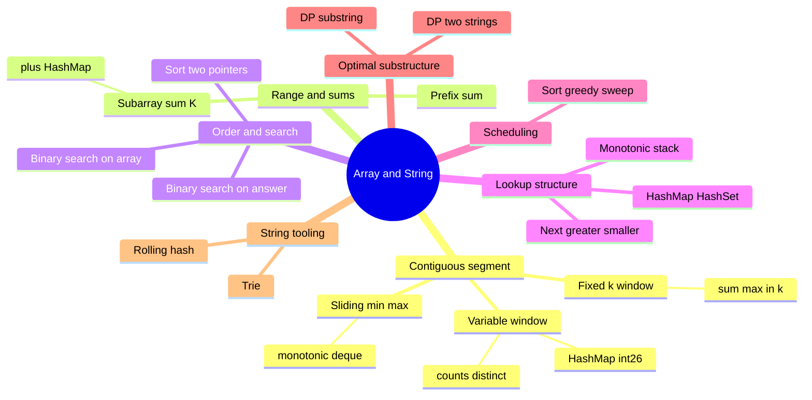
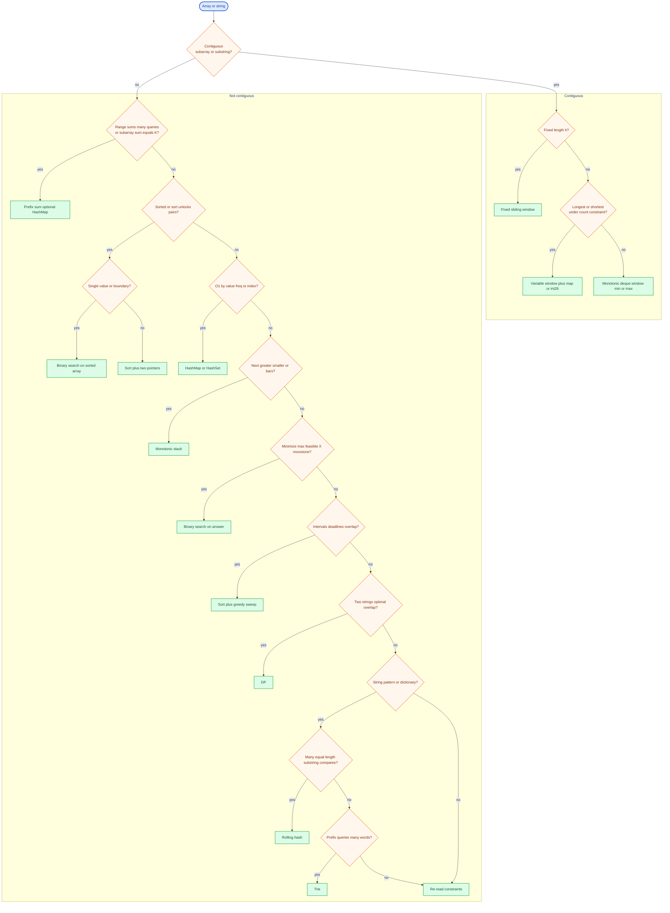

# Array & string problems — pattern decision tree

Three views: **mindmap** (families at a glance), **flowchart** (questions → pattern), **text tree** (no Mermaid). Many problems **combine** patterns (e.g. **window + hash map**). This is a **heuristic**, not a proof.

---

## 1 · Mindmap (overview)



---

## 2 · Flowchart (decisions → pattern)

Start at **Array or string** → **Contiguous?** → **yes** = left box (window family); **no** = right box (follow the chain top to bottom).



---

## 3 · Text tree (same logic as flowchart)

```
Array / string
├─ contiguous subarray or substring?
│  ├─ YES
│  │  ├─ fixed length k        → fixed sliding window
│  │  ├─ variable length + constraint
│  │  │   └─ counts / distinct  → variable window + HashMap or int[26]
│  │  └─ min/max *inside* window as you slide → monotonic deque
│  └─ NO
│     ├─ many range sums OR “subarray sum = K” / count by sum
│     │  └─ prefix sum (+ HashMap for “sum → index/count”)
│     ├─ sorted (or sort unlocks pairs / intervals)
│     │  ├─ single target / boundary     → binary search on array
│     │  └─ pairs, triplets, intervals   → sort + two pointers (or greedy)
│     ├─ O(1) by value / frequency / “complement”
│     │  └─ HashMap / HashSet
│     ├─ “next greater / smaller” or histogram bars
│     │  └─ monotonic stack
│     ├─ “minimize maximum” chunk / capacity / split (monotone feasible(mid))
│     │  └─ binary search on answer
│     ├─ intervals, deadlines, max non-overlapping
│     │  └─ sort + greedy (often sweep)
│     ├─ optimal over two strings / substring structure
│     │  └─ DP (1D/2D by problem)
│     └─ else
│        ├─ string-heavy: pattern / many substring compares → rolling hash
│        ├─ string-heavy: many prefixes / dictionary → trie
│        └─ otherwise → re-read constraints; hash / greedy / ad hoc
```

---

## Common combos

| Combo | When |
|--------|------|
| **Sliding window + HashMap** | Longest substring with at most K distinct, min window substring |
| **Prefix + HashMap** | Subarray sum equals K; count subarrays with sum |
| **Sort + greedy + (heap)** | Meeting rooms II, task scheduler style |
| **Two pointers + hash** | Dedupe or map while moving ends |

---

## Pitfalls

- Nested “every subarray” brute → **one** scan with **window** or **prefix + map**.
- Re-sorting every step → **sort once** or heap.
- Only `a`–`z` → prefer **`int[26]`** over `HashMap` when counts fit.

Re-check **`n`**, **value bounds**, **sorted?**, **mod input allowed?** before finalizing.
