# 🔹 Problem: Container With Most Water




**Difficulty:** Medium ⚡

---

## 🔹 Problem Statement
You are given an integer array `height` of length `n`.  
There are `n` vertical lines drawn such that the two endpoints of the line `i` are `(i, 0)` and `(i, height[i])`.

Find two lines that together with the x-axis form a container such that the container contains the **most water**.

Return the maximum amount of water a container can store.

---

## 🔹 Intuition
- The area between two lines is determined by the **shorter line** and the **distance** between them.
- Brute force: check all pairs of lines → O(n²).
- Optimized: use **two pointers** from both ends, moving the pointer at the shorter line inward.

---

## 🔹 Approaches

### 1. Brute Force
- Try all pairs `(i, j)`.
- Compute area = `(j - i) * min(height[i], height[j])`.
- Track max area.

**Time Complexity:** O(n²)  
**Space Complexity:** O(1)

---

### 2. Two Pointer (Optimal)
- Start with `left = 0` and `right = n - 1`.
- Compute area.
- Move the pointer pointing to the shorter line inward, because a taller line might increase the area.
- Continue until `left < right`.

**Time Complexity:** O(n)  
**Space Complexity:** O(1)

---

## 🔹 Java Code (Both Approaches)

```java
public class ContainerWithMostWater {

    // 1. Brute Force O(n^2)
    public static int maxAreaBruteForce(int[] height) {
        int maxArea = 0;
        int n = height.length;

        for (int i = 0; i < n; i++) {
            for (int j = i + 1; j < n; j++) {
                int area = (j - i) * Math.min(height[i], height[j]);
                maxArea = Math.max(maxArea, area);
            }
        }
        return maxArea;
    }

    // 2. Two Pointer O(n)
    public static int maxAreaTwoPointer(int[] height) {
        int maxArea = 0;
        int left = 0, right = height.length - 1;

        while (left < right) {
            int area = (right - left) * Math.min(height[left], height[right]);
            maxArea = Math.max(maxArea, area);

            if (height[left] < height[right]) {
                left++; // move shorter line
            } else {
                right--; // move shorter line
            }
        }
        return maxArea;
    }
}
```

---

## 🔹 Complexity Analysis

| Approach                 | Time Complexity | Space Complexity |
|--------------------------|-----------------|------------------|
| Brute Force              | O(n²)           | O(1)             |
| Two Pointer              | O(n)            | O(1)             |

---

## 🔹 Edge Cases
- `height = [1,1]` → max area = 1
- Increasing heights (e.g., `[1,2,3,4,5]`)
- Decreasing heights (e.g., `[5,4,3,2,1]`)
- Large input size → must use O(n) approach

---

## 🔹 Follow-Up Questions
1. Can this be extended to **3D containers** (trapping water in a histogram or matrix)?
2. What if the heights were **negative or zero** (does the logic still hold)?
3. Could you also return the **pair of indices** that form the max container?  
