# 🔹 Problem: Find First and Last Position of Element in Sorted Array




**Difficulty:** Medium ⚡

---

## 🔹 Problem Statement
Given an array of integers `nums` sorted in **non-decreasing order** and a target value `target`, return the **starting and ending position** of the target in the array.

- If the target is not found, return `[-1, -1]`.
- You must write an algorithm with **O(log n)** runtime complexity.

---

## 🔹 Intuition
- Since the array is **sorted**, **binary search** can be used.
- Perform **two binary searches**:
    1. First to find the **leftmost (first) occurrence**.
    2. Second to find the **rightmost (last) occurrence**.
- Classic modification of binary search to find boundaries instead of any occurrence.

---

## 🔹 Approaches

### 1. Two-pass Binary Search
- First binary search → find first occurrence.
- Second binary search → find last occurrence.
- Each binary search O(log n).

**Time Complexity:** O(log n)  
**Space Complexity:** O(1)

### 2. One-pass Binary Search (Optional)
- Use a modified binary search that searches for first and last positions in a single pass using recursion or iterative approach.
- Slightly trickier, same O(log n).

---

## 🔹 Java Code (Two-pass Binary Search)

```java
public class FirstLastPosition {

    public static int[] searchRange(int[] nums, int target) {
        int[] result = new int[]{-1, -1};

        // Find first occurrence
        int left = 0, right = nums.length - 1;
        while (left <= right) {
            int mid = left + (right - left) / 2;
            if (nums[mid] < target) {
                left = mid + 1;
            } else {
                right = mid - 1;
            }
        }
        if (left >= nums.length || nums[left] != target) return result; // target not found
        result[0] = left;

        // Find last occurrence
        right = nums.length - 1; // reset right
        while (left <= right) {
            int mid = left + (right - left) / 2;
            if (nums[mid] <= target) {
                left = mid + 1;
            } else {
                right = mid - 1;
            }
        }
        result[1] = right;

        return result;
    }
}
```

---

## 🔹 Complexity Analysis

| Approach               | Time Complexity | Space Complexity | Remarks |
|------------------------|----------------|-----------------|---------|
| Two-pass Binary Search  | O(log n)       | O(1)            | Classic approach |
| One-pass Binary Search  | O(log n)       | O(1)            | Slightly more complex |

---

## 🔹 Edge Cases
- **Empty array** → return `[-1, -1]`
- **Target not present** → return `[-1, -1]`
- **All elements are target** → return `[0, n-1]`
- **Single element array** → check if equals target
- **Array with duplicates** → correctly finds first and last positions

---

## 🔹 Follow-Up Questions
1. Can you implement using **recursion** instead of iteration?
2. Can you find first and last positions **in one pass**?
3. How would this change for **unsorted arrays**?
4. Can you generalize this for **floating point numbers** with precision issues?
5. Can you find **k-th occurrence** of the target efficiently?
