# Gas Station Problem




**Difficulty:** Medium ⚡

---

## 🔹 Problem Statement
You are given two integer arrays of length `n`:

- `gas[i]` → amount of gas available at station `i`.
- `cost[i]` → gas required to travel from station `i` to `(i + 1) % n`.

A car with an **unlimited gas tank** starts at one of the gas stations.  
Return the starting station index from which the car can **complete a full circuit**, or `-1` if it is impossible.

---

## 🔹 Logic & Intuition
- If the **total gas < total cost**, completing the circuit is impossible.
- Otherwise, there will always be **exactly one valid starting station**.
- Use a **greedy approach**:
    - Keep a running balance `tank += gas[i] - cost[i]`.
    - If `tank` becomes negative, reset the start index to the next station and reset `tank = 0`.
- This works because all stations before the reset point cannot be valid starting stations.

---

## 🔹 Approaches

### 1. Brute Force
- Try starting at each station.
- Simulate the full journey to check if it completes.

**Time Complexity:** O(n²)  
**Space Complexity:** O(1)

---

### 2. Greedy (Optimal)
- Traverse the array once.
- Track total difference and running `tank`.
- Reset starting index whenever `tank` < 0.
- At the end, if `totalGas >= 0`, return the valid start.

**Time Complexity:** O(n)  
**Space Complexity:** O(1)

---

## 🔹 Java Code

```java
public class GasStation {

    // Brute force approach - Try each starting station
    public static int canCompleteCircuitBrute(int[] gas, int[] cost) {
        int n = gas.length;
        
        // Try each station as starting point
        for (int start = 0; start < n; start++) {
            int tank = 0;
            boolean canComplete = true;
            
            // Try to complete the circuit from this starting station
            for (int count = 0; count < n; count++) {
                int current = (start + count) % n;
                tank += gas[current] - cost[current];
                
                // If tank becomes negative, can't reach next station
                if (tank < 0) {
                    canComplete = false;
                    break;
                }
            }
            
            // If we completed the circuit, return this starting station
            if (canComplete) {
                return start;
            }
        }
        
        return -1;  // No valid starting station found
    }

    // Greedy optimal solution
    public static int canCompleteCircuitGreedy(int[] gas, int[] cost) {
        int totalGas = 0, tank = 0, start = 0;
        
        for (int i = 0; i < gas.length; i++) {
            int diff = gas[i] - cost[i];
            tank += diff;
            totalGas += diff;
            
            if (tank < 0) {
                start = i + 1;
                tank = 0;
            }
        }
        
        return totalGas >= 0 ? start : -1;
    }

    public static void main(String[] args) {
        // Test Case 1
        int[] gas1 = {1, 2, 3, 4, 5};
        int[] cost1 = {3, 4, 5, 1, 2};
        System.out.println("Gas: [1,2,3,4,5], Cost: [3,4,5,1,2]");
        System.out.println("Brute Force: " + canCompleteCircuitBrute(gas1, cost1));
        System.out.println("Greedy: " + canCompleteCircuitGreedy(gas1, cost1));
        System.out.println("Expected: 3\n");

        // Test Case 2
        int[] gas2 = {2, 3, 4};
        int[] cost2 = {3, 4, 3};
        System.out.println("Gas: [2,3,4], Cost: [3,4,3]");
        System.out.println("Brute Force: " + canCompleteCircuitBrute(gas2, cost2));
        System.out.println("Greedy: " + canCompleteCircuitGreedy(gas2, cost2));
        System.out.println("Expected: -1\n");

        // Test Case 3: Single station
        int[] gas3 = {5};
        int[] cost3 = {4};
        System.out.println("Gas: [5], Cost: [4]");
        System.out.println("Brute Force: " + canCompleteCircuitBrute(gas3, cost3));
        System.out.println("Greedy: " + canCompleteCircuitGreedy(gas3, cost3));
        System.out.println("Expected: 0\n");

        // Test Case 4: Multiple valid starts (only one exists though)
        int[] gas4 = {5, 1, 2, 3, 4};
        int[] cost4 = {4, 4, 1, 5, 1};
        System.out.println("Gas: [5,1,2,3,4], Cost: [4,4,1,5,1]");
        System.out.println("Brute Force: " + canCompleteCircuitBrute(gas4, cost4));
        System.out.println("Greedy: " + canCompleteCircuitGreedy(gas4, cost4));
        System.out.println("Expected: 4\n");
    }
}
```

---

## 🔹 Complexity Analysis

| Approach    | Time Complexity | Space Complexity |
|-------------|-----------------|------------------|
| Brute Force | O(n²)           | O(1)             |
| Greedy      | O(n)            | O(1)             |

---

## 🔹 Edge Cases
- Gas equals cost at all stations → any station is valid.
- Only one station has `gas[i] < cost[i]`.
- Total gas < total cost → impossible to complete the journey.

---

## 🔹 Follow-Up Questions
1. How would you solve the problem if you were allowed to **modify the input arrays**?
2. Can this approach be extended if there were **multiple cars** with different fuel tanks?
3. How would you handle it if stations also had **different fuel prices** and you wanted to minimize cost?


