# Max Consecutive Ones




**Difficulty:** Easy ✅

---

## 🔹 Problem Statement
Given a binary array (only 0s and 1s), find the maximum number of consecutive 1s in the array.

---

## 🔹 Examples
**Example 1:**  
Input: `nums = [1,1,0,1,1,1]`  
Output: `3`  
Explanation: The maximum consecutive 1s are `[1,1,1]`.

**Example 2:**  
Input: `nums = [1,0,1,1,0,1]`  
Output: `2`

---

## 🔹 Constraints
- `1 <= nums.length <= 10^5`
- `nums[i]` is either `0` or `1`

---

## 🔹 Logic & Intuition
- Traverse the array while counting consecutive 1s.
- Reset the count to 0 whenever a `0` is encountered.
- Keep track of the maximum count of consecutive 1s seen so far.
- This can be solved in **one pass** with O(1) extra space.

---

## 🔹 Approaches

### 1. Brute Force
- For each index, if it’s `1`, count consecutive 1s starting from that index.
- Track the maximum count.

**Time Complexity:** O(n²)  
**Space Complexity:** O(1)

---

### 2. Optimized One-Pass
- Use two variables:
    - `currentCount` → counts consecutive 1s.
    - `maxCount` → stores the maximum consecutive count so far.
- Reset `currentCount = 0` whenever a `0` appears.

**Time Complexity:** O(n)  
**Space Complexity:** O(1)

---

## 🔹 Java Code

```java
public class MaxConsecutiveOnes {

    // Brute force approach
    public static int findMaxConsecutiveOnesBrute(int[] nums) {
        int maxCount = 0;
        for (int i = 0; i < nums.length; i++) {
            if (nums[i] == 1) {
                int count = 0;
                for (int j = i; j < nums.length && nums[j] == 1; j++) {
                    count++;
                }
                maxCount = Math.max(maxCount, count);
            }
        }
        return maxCount;
    }

    // Optimized approach - one pass
    public static int findMaxConsecutiveOnesOptimized(int[] nums) {
        int maxCount = 0, currentCount = 0;
        for (int num : nums) {
            if (num == 1) {
                currentCount++;
                maxCount = Math.max(maxCount, currentCount);
            } else {
                currentCount = 0;
            }
        }
        return maxCount;
    }
}
```

---

## 🔹 Complexity Analysis

| Approach            | Time Complexity | Space Complexity |
|---------------------|-----------------|------------------|
| Brute Force         | O(n²)           | O(1)             |
| Optimized One-Pass  | O(n)            | O(1)             |

---

## 🔹 Edge Cases
1. `nums = [0,0,0]` → `0`
2. `nums = [1,1,1,1]` → `4`
3. `nums = [1,0,1,1,0,1]` → `2`
4. Empty array → `0`

---

## 🔹 Interviewer Follow-ups
- **What if we are allowed to flip at most one `0` to `1`?**  
  → Then we use a **sliding window** approach (track zeros in window).

- **What if array contains large streaks of 1s (millions long)?**  
  → Still O(n) scan works, no need for extra optimization.

- **What if array is infinite stream of bits?**  
  → Use a streaming algorithm: track only current streak & max streak.  
