# 🔹 Problem: Peak Element




**Difficulty:** Medium ⚡

---

## 🔹 Problem Statement
A **peak element** in an array `nums` is an element that is **strictly greater than its neighbors**.  
Given an integer array `nums`, find **any peak element** and return its index.  
You may assume `nums[-1] = nums[n] = -∞` (virtual boundaries).

**Example:**  
Input: `nums = [1,2,3,1]`  
Output: `2`

Explanation:
- `nums[2] = 3` is a peak because `3 > 2` and `3 > 1`.

**Example:**  
Input: `nums = [1,2,1,3,5,6,4]`  
Output: `1` or `5`

---

## 🔹 Intuition
- A peak element is greater than its neighbors.
- Multiple peaks may exist; any one is valid.
- **Linear scan** is simple.
- **Binary search** can optimize to O(log n).

---

## 🔹 Approaches

### 1. Linear Scan
- Traverse the array.
- If `nums[i] > nums[i-1]` and `nums[i] > nums[i+1]` → return `i`.
- Handle boundaries carefully.

**Time Complexity:** O(n)  
**Space Complexity:** O(1)

---

### 2. Binary Search (Optimal)
- Pick mid element `nums[mid]`.
- Compare with neighbor `nums[mid+1]`:
    - If `nums[mid] < nums[mid+1]` → peak is on the **right**.
    - Else → peak is on the **left or at mid**.
- Repeat until search space reduces to one element.

**Time Complexity:** O(log n)  
**Space Complexity:** O(1)

---

## 🔹 Java Code

```java
public class PeakElement {

    // Binary Search Approach
    public static int findPeakElement(int[] nums) {
        int left = 0, right = nums.length - 1;

        while (left < right) {
            int mid = left + (right - left) / 2;
            if (nums[mid] < nums[mid + 1]) {
                left = mid + 1;
            } else {
                right = mid;
            }
        }

        return left; // left == right
    }

    public static void main(String[] args) {
        int[] nums1 = {1,2,3,1};
        int[] nums2 = {1,2,1,3,5,6,4};

        System.out.println(findPeakElement(nums1)); // Output: 2
        System.out.println(findPeakElement(nums2)); // Output: 1 or 5
    }
}
```

---

## 🔹 Complexity Analysis

| Approach           | Time Complexity | Space Complexity |
|-------------------|----------------|-----------------|
| Linear Scan       | O(n)           | O(1)            |
| Binary Search     | O(log n)       | O(1)            |

---

## 🔹 Edge Cases
- Single element → always peak → return 0
- Multiple peaks → return any
- Strictly increasing → last element is peak
- Strictly decreasing → first element is peak

---

## 🔹 Follow-Up Questions
1. Can you **find all peak elements** instead of any one?
2. How would you modify it for **2D matrices**?
3. Can you solve it **recursively using binary search**?
