# 🔹 Problem: Subarray with At Most K Distinct Elements




**Difficulty:** Medium ⚡

---

## 🔹 Problem Statement
Given an integer array `nums` and an integer `k`, return the **number of subarrays** with **at most k distinct elements**.

A subarray is a contiguous part of the array.

---

## 🔹 Intuition
- We can use a **sliding window** approach.
- Maintain a window `[left, right]` and a **hash map** to count frequency of elements in the window.
- If the number of distinct elements exceeds `k`, shrink the window from the left.
- Count all valid subarrays ending at `right`.

---

## 🔹 Approaches

### 1. Brute Force (O(n²))
- Generate all subarrays.
- Count the number of distinct elements in each.
- Include subarray if distinct count ≤ k.

**Time Complexity:** O(n²)  
**Space Complexity:** O(n) for distinct element tracking

### 2. Sliding Window + HashMap (Optimal)
- Use two pointers (`left` and `right`) to maintain the window.
- Use a hash map to track element counts.
- When distinct elements > k → shrink window from left.
- For each `right`, add `(right - left + 1)` to result.

**Time Complexity:** O(n)  
**Space Complexity:** O(k)

---

## 🔹 Java Code (Both Approaches)

```java
import java.util.*;

public class SubarrayAtMostKDistinct {

    // 1. Brute Force O(n^2)
    public static int subarraysAtMostKDistinctBrute(int[] nums, int k) {
        int n = nums.length;
        int count = 0;

        for (int i = 0; i < n; i++) {
            Set<Integer> set = new HashSet<>();
            for (int j = i; j < n; j++) {
                set.add(nums[j]);
                if (set.size() <= k) {
                    count++;
                } else {
                    break;
                }
            }
        }
        return count;
    }

    // 2. Sliding Window + HashMap O(n)
    public static int subarraysAtMostKDistinct(int[] nums, int k) {
        Map<Integer, Integer> freq = new HashMap<>();
        int left = 0, count = 0;

        for (int right = 0; right < nums.length; right++) {
            freq.put(nums[right], freq.getOrDefault(nums[right], 0) + 1);

            while (freq.size() > k) {
                freq.put(nums[left], freq.get(nums[left]) - 1);
                if (freq.get(nums[left]) == 0) {
                    freq.remove(nums[left]);
                }
                left++;
            }

            count += right - left + 1; // all subarrays ending at right
        }

        return count;
    }
}
```

---

## 🔹 Complexity Analysis

| Approach                  | Time Complexity | Space Complexity |
|---------------------------|-----------------|------------------|
| Brute Force               | O(n²)           | O(n)             |
| Sliding Window + HashMap  | O(n)            | O(k)             |

---

## 🔹 Edge Cases
- Empty array → result = 0
- `k = 0` → no valid subarray exists
- All elements distinct and `k >= n` → entire array counts as one subarray
- Large input size → must use O(n) approach

---

## 🔹 Follow-Up Questions
1. How would you modify the solution for **at least k distinct elements**?
2. Can this logic be adapted to **longest subarray with exactly k distinct elements**?
3. How would you handle **streaming data** where the array is too large to store entirely in memory?  
