# Subarray with Given Sum




**Difficulty:** Easy ✅

---

## 🔹 Problem Statement
Given an array of **positive integers** and a target sum, find a continuous subarray that sums up to the target sum.  
Return the **start and end indices** of such subarray.  
If none exists, return `[-1, -1]`.

---

## 🔹 Examples
**Example 1:**  
Input: `nums = [1, 4, 20, 3, 10, 5], target = 33`  
Output: `[2, 4]`  
(20 + 3 + 10 = 33)

**Example 2:**  
Input: `nums = [1, 2, 3, 7, 5], target = 12`  
Output: `[1, 3]`  
(2 + 3 + 7 = 12)

**Example 3:**  
Input: `nums = [1, 2, 3], target = 7`  
Output: `[-1, -1]`

---

## 🔹 Constraints
- `1 <= nums.length <= 10^5`
- `1 <= nums[i] <= 10^9`
- `1 <= target <= 10^14`

---

## 🔹 Logic & Intuition
- Since the array contains **only positive integers**, we can use the **sliding window technique**.
- Maintain a window `[start...end]` and track the `currentSum`.
- Expand the window by moving `end` and adding elements.
- If `currentSum > target`, shrink the window by moving `start`.
- Stop when `currentSum == target`.

---

## 🔹 Approaches

### 1. Brute Force
- Check every possible subarray using **nested loops**.
- For each subarray, calculate the sum and compare with the target.
- Stop when a match is found.

**Time Complexity:** O(n²)  
**Space Complexity:** O(1)

---

### 2. Optimized (Sliding Window)
- Use **two pointers** (`start`, `end`) and a variable `sum`.
- Iterate over array with `end` pointer and add elements to `sum`.
- If `sum > target`, move `start` forward (shrink window).
- If `sum == target`, return `[start, end]`.

**Time Complexity:** O(n)  
**Space Complexity:** O(1)

---

## 🔹 Java Code

```java
public class SubarrayWithGivenSum {

    // Brute force approach
    public static int[] subarraySumBrute(int[] nums, int target) {
        int n = nums.length;
        for (int start = 0; start < n; start++) {
            int sum = 0;
            for (int end = start; end < n; end++) {
                sum += nums[end];
                if (sum == target) {
                    return new int[] {start, end};
                } else if (sum > target) {
                    break;
                }
            }
        }
        return new int[] {-1, -1};
    }

    // Optimized sliding window approach
    public static int[] subarraySumSlidingWindow(int[] nums, int target) {
        int start = 0, sum = 0;
        for (int end = 0; end < nums.length; end++) {
            sum += nums[end];

            // Shrink window if sum exceeds target
            while (sum > target && start <= end) {
                sum -= nums[start];
                start++;
            }

            if (sum == target) {
                return new int[] {start, end};
            }
        }
        return new int[] {-1, -1};
    }
}
```

---

## 🔹 Complexity Analysis

| Approach       | Time Complexity | Space Complexity |
|----------------|-----------------|------------------|
| Brute Force    | O(n²)           | O(1)             |
| Sliding Window | O(n)            | O(1)             |

---

## 🔹 Edge Cases
1. `nums = [5], target = 5` → `[0, 0]`
2. `nums = [5], target = 10` → `[-1, -1]`
3. `nums = [1, 2, 3], target = 6` → `[0, 2]`
4. Large array with no valid subarray → return `[-1, -1]`

---

## 🔹 Interviewer Follow-ups
- How would you handle **negative numbers** in the array?  
  → Sliding window won’t work. Use **prefix sum + HashMap** (O(n)).
- How to find **all such subarrays** instead of just one?  
  → Modify the loop to continue searching after finding one.
- What if the array is **circular**?  
  → Use modular arithmetic with prefix sums.  

