# Subarray Sum Equals K




**Difficulty:** Medium ⚡

---

## 🔹 Problem Statement
Given an array of integers `nums` and an integer `k`, return the total number of continuous subarrays whose sum equals to `k`.

---

## 🔹 Logic & Intuition
- Brute force: check all possible subarrays and calculate their sums.
- Optimized: Use **prefix sum + HashMap**.
    - Keep running sum (`prefixSum`).
    - At each step, check if `(prefixSum - k)` exists in the map → this means a subarray ending at current index has sum = `k`.
    - Count all such occurrences.

---

## 🔹 Approaches

### 1. Brute Force
- Generate all subarrays `(i, j)` and compute their sum.
- If sum = `k`, increment count.

**Time Complexity:** O(n²)  
**Space Complexity:** O(1)

---

### 2. Prefix Sum + HashMap (Optimal)
- Maintain `prefixSum` while iterating.
- Use HashMap to store frequency of each prefix sum **seen so far** (before extending with the current element’s contribution at end of iteration — order matters).
- **`count += frequency(prefixSum − k)`** counts subarrays ending at the current index with sum `k` (each earlier prefix equal to `prefixSum − k` is a valid start).
- **`map.put(0, 1)`** is **not optional**: it means “prefix sum **0** has appeared **once** before any elements” (the **empty prefix**). Without it, subarrays that **start at index 0** (where `prefixSum == k`) are missed.
- Update map with current `prefixSum`.

**Same asymptotics — no other fundamentally faster algorithm** for arbitrary integers (positive and negative): you must remember prior prefix sums; HashMap gives **O(n)** average time and **O(n)** space. Alternatives are **equivalent rearrangements**:
- **`Long` / boxed keys** if sums overflow `int` (use `long` prefix sum + `HashMap<Long,Integer>`).
- **Dense array instead of HashMap** if prefix sums fall in a **small known range** — still **O(n)** time, space becomes **O(range)**.

**Positive-only array:** **Sliding window** (two pointers) is also **O(n)** time and **O(1)** extra space — see Follow-Up 1.

**“Without” `put(0, 1)`:** You cannot drop the empty-prefix idea — only move it. One equivalent is to skip seeding and add **`if (prefixSum == k) count++`** inside the loop (covers subarrays that **start at index 0**). That duplicates what **`frequency(0) = 1`** already represents; **`freq.put(0, 1)`** stays the usual, least error-prone version.

**Time Complexity:** O(n)  
**Space Complexity:** O(n)

---

## 🔹 Java Code

```java
import java.util.HashMap;

public class SubarraySumEqualsK {

    // Brute force
    public static int subarraySumBrute(int[] nums, int k) {
        int count = 0;
        for (int i = 0; i < nums.length; i++) {
            int sum = 0;
            for (int j = i; j < nums.length; j++) {
                sum += nums[j];
                if (sum == k) {
                    count++;
                }
            }
        }
        return count;
    }

    /** Prefix sum + frequencies — O(n) time, O(n) space */
    public static int subarraySumOptimal(int[] nums, int k) {
        HashMap<Integer, Integer> freq = new HashMap<>();
        freq.put(0, 1); // empty prefix has sum 0 once

        int prefixSum = 0;
        int count = 0;

        for (int num : nums) {
            prefixSum += num;
            count += freq.getOrDefault(prefixSum - k, 0);
            freq.put(prefixSum, freq.getOrDefault(prefixSum, 0) + 1);
        }
        return count;
    }
}
```

---

## 🔹 Complexity Analysis

| Approach                 | Time Complexity | Space Complexity |
|--------------------------|-----------------|------------------|
| Brute Force              | O(n²)           | O(1)             |
| Prefix Sum + HashMap     | O(n)            | O(n)             |

---

## 🔹 Edge Cases
- `nums = [1], k = 0` → result = 0
- Negative numbers in array (works fine with prefix sums).
- Large arrays (must use O(n) approach).

---

## 🔹 Follow-Up Questions
1. How would you solve it if the array contained **only positive numbers**? (Sliding window possible).
2. Can this logic be extended to count subarrays with sum **less than or equal to k**?
3. How to return the actual **subarrays**, not just the count?
