# Two Sum




**Difficulty:** Easy ✅

---

## 🔹 Problem Statement
Given an array of integers and a target sum, find indices of the two numbers such that they add up to the target.  
Assume exactly one solution exists, and you can’t use the same element twice.

---

## 🔹 Examples
**Example 1:**  
Input: `nums = [2, 7, 11, 15], target = 9`  
Output: `[0, 1]`  
(2 + 7 = 9)

**Example 2:**  
Input: `nums = [3, 2, 4], target = 6`  
Output: `[1, 2]`  
(2 + 4 = 6)

**Example 3:**  
Input: `nums = [3, 3], target = 6`  
Output: `[0, 1]`

---

## 🔹 Constraints
- `2 <= nums.length <= 10^5`
- `-10^9 <= nums[i] <= 10^9`
- `-10^9 <= target <= 10^9`
- Exactly **one valid solution exists**

---

## 🔹 Logic & Intuition
- For each number, check if the **complement** `(target - current)` exists.
- **Brute Force:** Check every pair using two loops.
- **Optimized:** Use a **HashMap** to store numbers → indices for O(1) lookups.
- If complement is already in the map, return indices.

---

## 🔹 Approaches

### 1. Brute Force
- Use two nested loops to check all pairs.
- Return indices if a pair matches the target.

**Time Complexity:** O(n²)  
**Space Complexity:** O(1)

---

### 2. Optimized (Hash Map)
- Use a HashMap to store `nums[i] → index`.
- For each number, compute `complement = target - nums[i]`.
- If complement exists in map → return indices.
- Otherwise, add current number to map.

**Time Complexity:** O(n)  
**Space Complexity:** O(n)

---

## 🔹 Java Code

```java
import java.util.HashMap;
import java.util.Map;

public class TwoSum {

    // Brute force approach
    public static int[] twoSumBrute(int[] nums, int target) {
        int n = nums.length;
        for (int i = 0; i < n; i++) {
            for (int j = i + 1; j < n; j++) {
                if (nums[i] + nums[j] == target) {
                    return new int[] {i, j};
                }
            }
        }
        return new int[] {-1, -1};
    }

    // Optimized approach using HashMap
    public static int[] twoSumOptimized(int[] nums, int target) {
        Map<Integer, Integer> map = new HashMap<>();
        for (int i = 0; i < nums.length; i++) {
            int complement = target - nums[i];
            if (map.containsKey(complement)) {
                return new int[] {map.get(complement), i};
            }
            map.put(nums[i], i);
        }
        return new int[] {-1, -1};
    }
}
```

---

## 🔹 Complexity Analysis

| Approach            | Time Complexity | Space Complexity |
|---------------------|-----------------|------------------|
| Brute Force         | O(n²)           | O(1)             |
| HashMap (Optimized) | O(n)            | O(n)             |

---

## 🔹 Edge Cases
1. Smallest case → `nums = [1, 2], target = 3` → `[0, 1]`
2. Negative numbers → `nums = [-3, 4, 3, 90], target = 0` → `[0, 2]`
3. Duplicate numbers → `nums = [3, 3], target = 6` → `[0, 1]`
4. Large input size (10^5 elements) → HashMap ensures efficiency.

---

## 🔹 Interviewer Follow-ups
- **What if the array is sorted?**  
  → Use a **Two Pointers** approach (O(n), O(1)).

- **What if there are multiple valid pairs?**  
  → Modify logic to collect all pairs instead of stopping at the first.

- **What if extra space is not allowed?**  
  → Only viable for sorted arrays (two pointers).

- **What if numbers are streamed (online)?**  
  → Maintain a HashMap while processing input in real-time.

---

## 🔹 Alternative Approach (Two Pointers for Sorted Array)

```java
public class TwoSumSorted {

    public static int[] twoSumSorted(int[] nums, int target) {
        int left = 0, right = nums.length - 1;
        while (left < right) {
            int sum = nums[left] + nums[right];
            if (sum == target) {
                return new int[] {left, right};
            } else if (sum < target) {
                left++;
            } else {
                right--;
            }
        }
        return new int[] {-1, -1};
    }
}
