# Climbing Stairs Problem – Detailed Explanation and Approaches




**Difficulty:** Easy ✅

---

## 🔹 Problem Statement

You are climbing a staircase. It takes `n` steps to reach the top.

Each time you can either climb **1 step** or **2 steps**.

**In how many distinct ways can you climb to the top?**

---

## 🔹 Examples

**Example 1:**  
Input: `n = 2`  
Output: `2`  
Explanation: There are two ways to climb to the top:
1. 1 step + 1 step
2. 2 steps

**Example 2:**  
Input: `n = 3`  
Output: `3`  
Explanation: There are three ways to climb to the top:
1. 1 step + 1 step + 1 step
2. 1 step + 2 steps
3. 2 steps + 1 step

**Example 3:**  
Input: `n = 5`  
Output: `8`  
Explanation: There are 8 distinct ways to reach step 5.

---

## 🔹 Constraints
- `1 <= n <= 45`

---

## 🔹 Core Intuition

To reach step `n`, you can arrive from either:
- Step `n-1` (by taking 1 step), or
- Step `n-2` (by taking 2 steps)

Therefore: **f(n) = f(n-1) + f(n-2)**

This is the **Fibonacci sequence pattern**!

**Base cases:**
- `f(0) = 1` → 1 way to stay on ground
- `f(1) = 1` → 1 way to reach first step

---

## 1️⃣ Recursive Approach (Brute Force)

### Explanation
To reach step `n`, you can come from step `n-1` or `n-2`.  
Thus, number of ways to reach `n` is the sum of ways to reach `n-1` and `n-2`.

**Base cases:**
- `f(0) = 1` (1 way to stand on ground)
- `f(1) = 1` (1 way to reach first step)

### Code (Java)

```java
public class ClimbingStairs {
    
    // Approach 1: Recursive (Brute Force)
    public int climbStairs(int n) {
        if (n == 0 || n == 1) {
            return 1;
        }
        return climbStairs(n - 1) + climbStairs(n - 2);
    }
}
```

### Drawbacks
- **Time Complexity:** O(2^n) — exponential, very inefficient for large n
- Recomputes many states multiple times (overlapping subproblems)
- **Space Complexity:** O(n) due to recursion stack

### Visualization
```
climbStairs(5)
├── climbStairs(4)
│   ├── climbStairs(3)
│   │   ├── climbStairs(2)  [computed]
│   │   └── climbStairs(1)  [computed]
│   └── climbStairs(2)      [RECOMPUTED]
└── climbStairs(3)          [RECOMPUTED]
    └── ...
```

---

## 2️⃣ Recursive with Memoization (Top-Down DP)

### Explanation
Use a `memo` array to store results of subproblems.  
Before computing ways for step `n`, check if already computed.  
This avoids repeated calculations and speeds up the recursion.

### Code (Java)

```java
public class ClimbingStairs {
    
    // Approach 2: Memoization (Top-Down DP)
    public int climbStairs(int n) {
        int[] memo = new int[n + 1];
        return climb(n, memo);
    }
    
    private int climb(int n, int[] memo) {
        if (n == 0 || n == 1) {
            return 1;
        }
        
        if (memo[n] != 0) {
            return memo[n];  // Return cached result
        }
        
        memo[n] = climb(n - 1, memo) + climb(n - 2, memo);
        return memo[n];
    }
}
```

### Complexity
- **Time Complexity:** O(n) — each state computed only once
- **Space Complexity:** O(n) for memo array + O(n) for recursion stack = O(n)

---

## 3️⃣ Dynamic Programming – Bottom-Up Approach

### Explanation
Iteratively build up the solution from base cases.  
Use a `dp` array where `dp[i]` = number of ways to reach step `i`.

**Formula:**
```
dp[i] = dp[i-1] + dp[i-2]
```

**Initialization:**
```
dp[0] = 1
dp[1] = 1
```

### Code (Java)

```java
public class ClimbingStairs {
    
    // Approach 3: Bottom-Up DP
    public int climbStairs(int n) {
        if (n == 0 || n == 1) {
            return 1;
        }
        
        int[] dp = new int[n + 1];
        dp[0] = 1;
        dp[1] = 1;
        
        for (int i = 2; i <= n; i++) {
            dp[i] = dp[i - 1] + dp[i - 2];
        }
        
        return dp[n];
    }
}
```

### Complexity
- **Time Complexity:** O(n)
- **Space Complexity:** O(n) for dp array

### DP Table Example (n=5)
| Step | 0 | 1 | 2 | 3 | 4 | 5 |
|------|---|---|---|---|---|---|
| Ways | 1 | 1 | 2 | 3 | 5 | 8 |

---

## 4️⃣ Dynamic Programming – Space Optimized ⭐

### Explanation
Only last two values are required to compute current state.  
Use two variables to keep track of these and update iteratively.

**This is the OPTIMAL solution!**

### Code (Java)

```java
public class ClimbingStairs {
    
    // Approach 4: Space Optimized DP (OPTIMAL)
    public int climbStairs(int n) {
        if (n == 0 || n == 1) {
            return 1;
        }
        
        int prev2 = 1;  // dp[0]
        int prev1 = 1;  // dp[1]
        int current = 0;
        
        for (int i = 2; i <= n; i++) {
            current = prev1 + prev2;
            prev2 = prev1;
            prev1 = current;
        }
        
        return current;
    }
}
```

### Complexity
- **Time Complexity:** O(n)
- **Space Complexity:** O(1) ⭐

---

## 📊 Complexity Comparison

| Approach | Time | Space | Recommended |
|----------|------|-------|-------------|
| Recursive (Brute Force) | O(2^n) | O(n) | ❌ No |
| Memoization (Top-Down) | O(n) | O(n) | ✅ Good |
| Bottom-Up DP | O(n) | O(n) | ✅ Good |
| Space Optimized DP | O(n) | O(1) | ⭐ Best |

---

## 🎯 Extra Insights

### Connection to Fibonacci Sequence
The number of ways to climb `n` steps follows the **Fibonacci sequence** pattern shifted by one index:

| n | 0 | 1 | 2 | 3 | 4 | 5 | 6 | 7 | 8 |
|---|---|---|---|---|---|---|---|---|---|
| Ways | 1 | 1 | 2 | 3 | 5 | 8 | 13 | 21 | 34 |

This is exactly: **F(n+1)** where F is the Fibonacci sequence!

### Fundamental DP Concepts
This problem highlights two **core dynamic programming principles**:

1. **Optimal Substructure:** The solution to `n` depends on smaller subproblems (`n-1` and `n-2`)
2. **Overlapping Subproblems:** Naive recursion recomputes the same results many times

Mastering this problem provides a foundation for solving many counting and sequence problems efficiently.

---

## 🔄 Additional Variations with Code

### Variation 1: Climbing Stairs with K Steps at a Time

**Problem:** Instead of just 1 or 2 steps, you can climb from 1 up to `k` steps in one move.

**Recurrence:**
```
f(n) = f(n-1) + f(n-2) + ... + f(n-k)
```

#### Code (Java)

```java
public class ClimbingStairsVariations {
    
    // Variation 1: K Steps at a Time
    public int climbStairsKSteps(int n, int k) {
        int[] dp = new int[n + 1];
        dp[0] = 1;
        
        for (int i = 1; i <= n; i++) {
            for (int j = 1; j <= k && i - j >= 0; j++) {
                dp[i] += dp[i - j];
            }
        }
        
        return dp[n];
    }
    
    // Variation 1: K Steps (Space Optimized using Sliding Window)
    public int climbStairsKStepsOptimized(int n, int k) {
        if (n == 0) return 1;
        
        int[] dp = new int[n + 1];
        dp[0] = 1;
        int windowSum = 1;
        
        for (int i = 1; i <= n; i++) {
            dp[i] = windowSum;
            windowSum += dp[i];
            
            // Remove element that falls out of window
            if (i >= k) {
                windowSum -= dp[i - k];
            }
        }
        
        return dp[n];
    }
}
```

**Example:** n=5, k=3
- From step 5, you can arrive from steps 4, 3, or 2
- Ways = f(4) + f(3) + f(2)

**Complexity:**
- Basic: O(n × k) time, O(n) space
- Optimized: O(n) time, O(n) space

---

### Variation 2: Climbing Stairs with Forbidden Steps

**Problem:** Some steps may be broken or forbidden to step on.

#### Code (Java)

```java
public class ClimbingStairsVariations {
    
    // Variation 2: Forbidden Steps
    public int climbStairsWithForbidden(int n, int[] forbidden) {
        boolean[] isForbidden = new boolean[n + 1];
        for (int step : forbidden) {
            if (step <= n) {
                isForbidden[step] = true;
            }
        }
        
        int[] dp = new int[n + 1];
        dp[0] = 1;
        
        for (int i = 1; i <= n; i++) {
            if (isForbidden[i]) {
                dp[i] = 0;  // Can't step on forbidden step
                continue;
            }
            
            dp[i] = dp[i - 1];
            if (i >= 2) {
                dp[i] += dp[i - 2];
            }
        }
        
        return dp[n];
    }
}
```

**Example:** n=5, forbidden=[2,4]
```
Step:  0  1  2  3  4  5
Ways:  1  1  0  1  0  1
```

**Key Insight:** Assign zero ways to forbidden steps to exclude paths.

---

### Variation 3: Minimum Cost Climbing Stairs

**Problem:** Each step has a cost; find the minimum total cost to reach the top.

#### Code (Java)

```java
public class ClimbingStairsVariations {
    
    // Variation 3: Minimum Cost
    public int minCostClimbingStairs(int[] cost) {
        int n = cost.length;
        
        // dp[i] = minimum cost to reach step i
        int[] dp = new int[n + 1];
        dp[0] = 0;  // Start at ground or first step
        dp[1] = 0;
        
        for (int i = 2; i <= n; i++) {
            // Come from i-1 or i-2, add respective costs
            dp[i] = Math.min(
                dp[i - 1] + cost[i - 1],
                dp[i - 2] + cost[i - 2]
            );
        }
        
        return dp[n];
    }
    
    // Space Optimized Version
    public int minCostClimbingStairsOptimized(int[] cost) {
        int n = cost.length;
        int prev2 = 0;
        int prev1 = 0;
        
        for (int i = 2; i <= n; i++) {
            int current = Math.min(
                prev1 + cost[i - 1],
                prev2 + cost[i - 2]
            );
            prev2 = prev1;
            prev1 = current;
        }
        
        return prev1;
    }
}
```

**Example:** cost = [10, 15, 20]
- Reach top: min(cost[2] + dp[2], cost[1] + dp[1])
- Minimum cost = 15

---

### Variation 4: Counting Ways with Variable Jumps per Step

**Problem:** At step `i`, you can jump up to `arr[i]` steps forward.

#### Code (Java)

```java
public class ClimbingStairsVariations {
    
    // Variation 4: Variable Jumps
    public int climbStairsVariableJumps(int n, int[] maxJumps) {
        // maxJumps[i] = maximum steps you can jump from position i
        int[] dp = new int[n + 1];
        dp[0] = 1;
        
        for (int i = 0; i < n; i++) {
            if (dp[i] == 0) continue;  // Can't reach this step
            
            // From step i, try all possible jumps
            for (int jump = 1; jump <= maxJumps[i] && i + jump <= n; jump++) {
                dp[i + jump] += dp[i];
            }
        }
        
        return dp[n];
    }
    
    // Can also be solved with memoization
    public int climbStairsVariableJumpsMemo(int n, int[] maxJumps) {
        int[] memo = new int[n + 1];
        return countWays(0, n, maxJumps, memo);
    }
    
    private int countWays(int curr, int target, int[] maxJumps, int[] memo) {
        if (curr == target) return 1;
        if (curr > target) return 0;
        
        if (memo[curr] != 0) return memo[curr];
        
        int ways = 0;
        for (int jump = 1; jump <= maxJumps[curr] && curr + jump <= target; jump++) {
            ways += countWays(curr + jump, target, maxJumps, memo);
        }
        
        memo[curr] = ways;
        return ways;
    }
}
```

**Example:** n=5, maxJumps=[3,2,1,1,1,0]
- From position 0, can jump 1, 2, or 3 steps
- Count all valid paths to position 5

---

### Variation 5: Climbing Stairs in Minimum Jumps

**Problem:** Find the minimum number of jumps needed to reach the top.

#### Code (Java)

```java
public class ClimbingStairsVariations {
    
    // Variation 5: Minimum Jumps
    public int minJumpsToReachTop(int n, int[] maxJumps) {
        int[] dp = new int[n + 1];
        Arrays.fill(dp, Integer.MAX_VALUE);
        dp[0] = 0;
        
        for (int i = 0; i < n; i++) {
            if (dp[i] == Integer.MAX_VALUE) continue;
            
            for (int jump = 1; jump <= maxJumps[i] && i + jump <= n; jump++) {
                dp[i + jump] = Math.min(dp[i + jump], dp[i] + 1);
            }
        }
        
        return dp[n] == Integer.MAX_VALUE ? -1 : dp[n];
    }
}
```

---

## 🎓 Complete Implementation with All Approaches

```java
public class ClimbingStairsComplete {
    
    // ==================== MAIN PROBLEM ====================
    
    // 1. Recursive (Brute Force)
    public int climbStairsRecursive(int n) {
        if (n == 0 || n == 1) return 1;
        return climbStairsRecursive(n - 1) + climbStairsRecursive(n - 2);
    }
    
    // 2. Memoization (Top-Down DP)
    public int climbStairsMemo(int n) {
        int[] memo = new int[n + 1];
        return climbMemo(n, memo);
    }
    
    private int climbMemo(int n, int[] memo) {
        if (n == 0 || n == 1) return 1;
        if (memo[n] != 0) return memo[n];
        memo[n] = climbMemo(n - 1, memo) + climbMemo(n - 2, memo);
        return memo[n];
    }
    
    // 3. Bottom-Up DP
    public int climbStairsDP(int n) {
        if (n == 0 || n == 1) return 1;
        int[] dp = new int[n + 1];
        dp[0] = 1;
        dp[1] = 1;
        for (int i = 2; i <= n; i++) {
            dp[i] = dp[i - 1] + dp[i - 2];
        }
        return dp[n];
    }
    
    // 4. Space Optimized (BEST)
    public int climbStairsOptimized(int n) {
        if (n == 0 || n == 1) return 1;
        int prev2 = 1, prev1 = 1, current = 0;
        for (int i = 2; i <= n; i++) {
            current = prev1 + prev2;
            prev2 = prev1;
            prev1 = current;
        }
        return current;
    }
    
    // ==================== VARIATIONS ====================
    // (All variation codes from above sections)
    
    public static void main(String[] args) {
        ClimbingStairsComplete cs = new ClimbingStairsComplete();
        
        System.out.println("=== Main Problem ===");
        int n = 5;
        System.out.println("Ways to climb " + n + " stairs: " + cs.climbStairsOptimized(n));
        
        System.out.println("\n=== Variations ===");
        // Test variations here
    }
}
```

---

## 🎯 Key Takeaways

1. **Start Simple:** Understand the recursive solution first
2. **Optimize Gradually:** Recursion → Memoization → DP → Space Optimization
3. **Recognize Patterns:** This is a Fibonacci-like problem
4. **Learn Core Concepts:** Optimal substructure and overlapping subproblems
5. **Master Variations:** Different constraints teach different DP techniques

This problem is a **gateway to Dynamic Programming** and mastering it will help you solve hundreds of similar problems! 🚀
