# Coin Change (Unbounded) – Detailed Explanation and Approaches




**Difficulty:** Medium ⚡

---

## 🔹 Problem Statement

You are given an integer array `coins` representing coins of different denominations and an integer `amount` representing a total amount of money.

Return the **fewest number of coins** needed to make up that amount. If that amount cannot be made up by any combination of the coins, return `-1`.

**You may assume that you have an infinite number of each kind of coin** (unbounded).

---

## 🔹 Examples

**Example 1:**  
Input: `coins = [1, 2, 5], amount = 11`  
Output: `3`  
Explanation: 11 = 5 + 5 + 1 (3 coins)

**Example 2:**  
Input: `coins = [2], amount = 3`  
Output: `-1`  
Explanation: Cannot make amount 3 with only coin 2

**Example 3:**  
Input: `coins = [1], amount = 0`  
Output: `0`  
Explanation: No coins needed for amount 0

**Example 4:**  
Input: `coins = [1, 3, 4, 5], amount = 7`  
Output: `2`  
Explanation: 7 = 3 + 4 (2 coins)

---

## 🔹 Constraints
- `1 <= coins.length <= 12`
- `1 <= coins[i] <= 2^31 - 1`
- `0 <= amount <= 10^4`

---

## 🔹 Core Intuition

This is an **Unbounded Knapsack** variant where we can use each coin unlimited times.

For each amount, we try using each coin and take the minimum:

**Recurrence Relation:**
```
dp[amount] = minimum coins needed to make 'amount'

dp[amount] = min(dp[amount], 1 + dp[amount - coin]) for each coin
```

**Base Case:**
```
dp[0] = 0  // 0 coins needed for amount 0
dp[i] = infinity for i > 0  // Initially impossible
```

---

## 1️⃣ Recursive Approach (Brute Force)

### Explanation
For each amount, try using each coin denomination.  
Recursively solve for the remaining amount after using that coin.  
Return 1 + minimum of all recursive calls.

### Code (Java)

```java
public class CoinChange {
    
    // Approach 1: Recursive (Brute Force)
    public int coinChangeRecursive(int[] coins, int amount) {
        if (amount == 0) return 0;
        if (amount < 0) return -1;
        
        int minCoins = Integer.MAX_VALUE;
        
        for (int coin : coins) {
            int result = coinChangeRecursive(coins, amount - coin);
            if (result != -1) {
                minCoins = Math.min(minCoins, 1 + result);
            }
        }
        
        return minCoins == Integer.MAX_VALUE ? -1 : minCoins;
    }
}
```

### Drawbacks
- **Time Complexity:** O(amount^n) where n = number of coins — exponential
- **Space Complexity:** O(amount) — recursion depth
- Massive redundant computation

### Recursion Tree Example
```
coinChange([1,2,5], amount=5)
                    5
        /           |           \
    use 1       use 2       use 5
       4           3           0 ✓
    /  |  \     /  |  \
   3   2   0   2   1   0
  ...  ... ✓  ... ... ✓
```

---

## 2️⃣ Recursive with Memoization (Top-Down DP)

### Explanation
Cache results for each amount to avoid recomputation.  
Use a memo array where `memo[amount]` = minimum coins for that amount.

### Code (Java)

```java
public class CoinChange {
    
    // Approach 2: Memoization (Top-Down DP)
    public int coinChangeMemo(int[] coins, int amount) {
        int[] memo = new int[amount + 1];
        Arrays.fill(memo, -2);  // -2 means not computed, -1 means impossible
        return coinChangeMemoHelper(coins, amount, memo);
    }
    
    private int coinChangeMemoHelper(int[] coins, int amount, int[] memo) {
        if (amount == 0) return 0;
        if (amount < 0) return -1;
        
        if (memo[amount] != -2) {
            return memo[amount];  // Return cached result
        }
        
        int minCoins = Integer.MAX_VALUE;
        
        for (int coin : coins) {
            int result = coinChangeMemoHelper(coins, amount - coin, memo);
            if (result >= 0 && result < minCoins) {
                minCoins = 1 + result;
            }
        }
        
        memo[amount] = (minCoins == Integer.MAX_VALUE) ? -1 : minCoins;
        return memo[amount];
    }
}
```

### Complexity
- **Time Complexity:** O(amount × n) where n = number of coins
- **Space Complexity:** O(amount) for memo + O(amount) for recursion stack

---

## 3️⃣ Dynamic Programming – Bottom-Up Approach (Tabulation)

### Explanation
Build solution iteratively from amount 0 to target amount.  
For each amount, try each coin and take minimum.

Initialize dp array with `amount + 1` (impossible value).

### Code (Java)

```java
public class CoinChange {
    
    // Approach 3: Bottom-Up DP (Tabulation)
    public int coinChangeDP(int[] coins, int amount) {
        int[] dp = new int[amount + 1];
        Arrays.fill(dp, amount + 1);  // Initialize with impossible value
        dp[0] = 0;  // Base case
        
        // Build up from 1 to amount
        for (int i = 1; i <= amount; i++) {
            for (int coin : coins) {
                if (coin <= i) {
                    dp[i] = Math.min(dp[i], 1 + dp[i - coin]);
                }
            }
        }
        
        return dp[amount] > amount ? -1 : dp[amount];
    }
}
```

### Complexity
- **Time Complexity:** O(amount × n)
- **Space Complexity:** O(amount)

### DP Table Example

For `coins=[1,2,5]`, `amount=11`:

| Amount | 0 | 1 | 2 | 3 | 4 | 5 | 6 | 7 | 8 | 9 | 10 | 11 |
|--------|---|---|---|---|---|---|---|---|---|---|----|-----|
| **Min Coins** | 0 | 1 | 1 | 2 | 2 | 1 | 2 | 2 | 3 | 3 | 2 | **3** |

**Explanation:**
- dp[1] = 1 (use coin 1)
- dp[2] = 1 (use coin 2)
- dp[5] = 1 (use coin 5)
- dp[11] = 3 (5+5+1)

---

## 4️⃣ Dynamic Programming – Optimized (Coin Loop Outside) ⭐

### Explanation
Alternative ordering: loop through coins first, then amounts.  
This can have better cache performance in some cases.

### Code (Java)

```java
public class CoinChange {
    
    // Approach 4: Coin Loop Outside (Alternative DP)
    public int coinChangeDPOptimized(int[] coins, int amount) {
        int[] dp = new int[amount + 1];
        Arrays.fill(dp, amount + 1);
        dp[0] = 0;
        
        // For each coin
        for (int coin : coins) {
            // Update all amounts that can use this coin
            for (int i = coin; i <= amount; i++) {
                dp[i] = Math.min(dp[i], 1 + dp[i - coin]);
            }
        }
        
        return dp[amount] > amount ? -1 : dp[amount];
    }
}
```

### Complexity
- **Time Complexity:** O(amount × n)
- **Space Complexity:** O(amount)

---

## 📊 Complexity Comparison

| Approach | Time | Space | Recommended |
|----------|------|-------|-------------|
| Recursive (Brute Force) | O(amount^n) | O(amount) | ❌ Never |
| Memoization (Top-Down) | O(amount×n) | O(amount) | ✅ Good |
| Tabulation (Bottom-Up) | O(amount×n) | O(amount) | ⭐ Best |
| Optimized Order | O(amount×n) | O(amount) | ⭐ Best |

---

## 🎯 Finding Which Coins Were Used

To track which coins were selected:

### Code (Java)

```java
public class CoinChange {
    
    // Find which coins are used
    public List<Integer> findCoinsUsed(int[] coins, int amount) {
        int[] dp = new int[amount + 1];
        int[] parent = new int[amount + 1];  // Track which coin was used
        
        Arrays.fill(dp, amount + 1);
        Arrays.fill(parent, -1);
        dp[0] = 0;
        
        for (int i = 1; i <= amount; i++) {
            for (int coin : coins) {
                if (coin <= i && dp[i - coin] + 1 < dp[i]) {
                    dp[i] = dp[i - coin] + 1;
                    parent[i] = coin;  // Track which coin led to this state
                }
            }
        }
        
        if (dp[amount] > amount) {
            return new ArrayList<>();  // Impossible
        }
        
        // Backtrack to find coins
        List<Integer> result = new ArrayList<>();
        int curr = amount;
        while (curr > 0) {
            int coin = parent[curr];
            result.add(coin);
            curr -= coin;
        }
        
        return result;
    }
}
```

---

## 🔄 Additional Variations with Code

### Variation 1: Coin Change II (Count Ways)

**Problem:** Count the number of ways to make the amount.

#### Code (Java)

```java
public class CoinChangeVariations {
    
    // Variation 1: Count Ways to Make Amount
    public int change(int amount, int[] coins) {
        int[] dp = new int[amount + 1];
        dp[0] = 1;  // One way to make 0 (use no coins)
        
        // For each coin
        for (int coin : coins) {
            // Update ways for all amounts
            for (int i = coin; i <= amount; i++) {
                dp[i] += dp[i - coin];
            }
        }
        
        return dp[amount];
    }
}
```

**Example:** coins=[1,2,5], amount=5  
Output: 4 ways (5, 2+2+1, 2+1+1+1, 1+1+1+1+1)

**Key Difference:** Loop coins outside to avoid counting permutations.

---

### Variation 2: Coin Change with Limited Coins

**Problem:** Each coin has a limited quantity.

#### Code (Java)

```java
public class CoinChangeVariations {
    
    // Variation 2: Limited Coin Quantities
    public int coinChangeWithLimit(int[] coins, int[] quantities, int amount) {
        int[] dp = new int[amount + 1];
        Arrays.fill(dp, amount + 1);
        dp[0] = 0;
        
        for (int i = 0; i < coins.length; i++) {
            int coin = coins[i];
            int qty = quantities[i];
            
            // Use this coin up to qty times
            for (int count = 0; count < qty; count++) {
                for (int amt = amount; amt >= coin; amt--) {
                    dp[amt] = Math.min(dp[amt], 1 + dp[amt - coin]);
                }
            }
        }
        
        return dp[amount] > amount ? -1 : dp[amount];
    }
}
```

---

### Variation 3: Minimum Cost Coin Change

**Problem:** Each coin has a cost, minimize total cost (not count).

#### Code (Java)

```java
public class CoinChangeVariations {
    
    // Variation 3: Minimum Cost (not just count)
    public int minCostCoinChange(int[] coins, int[] costs, int amount) {
        int[] dp = new int[amount + 1];
        Arrays.fill(dp, Integer.MAX_VALUE);
        dp[0] = 0;
        
        for (int i = 1; i <= amount; i++) {
            for (int j = 0; j < coins.length; j++) {
                if (coins[j] <= i && dp[i - coins[j]] != Integer.MAX_VALUE) {
                    dp[i] = Math.min(dp[i], dp[i - coins[j]] + costs[j]);
                }
            }
        }
        
        return dp[amount] == Integer.MAX_VALUE ? -1 : dp[amount];
    }
}
```

**Example:** coins=[1,5,10], costs=[1,3,5], amount=15  
Output: 6 (use 1×10 + 1×5 = cost 5+3=8, or 3×5 = cost 9, best is 10+5)

---

### Variation 4: Maximum Ways to Change

**Problem:** Find which combination uses maximum coins (not minimum).

#### Code (Java)

```java
public class CoinChangeVariations {
    
    // Variation 4: Maximum Coins Used
    public int maxCoinChange(int[] coins, int amount) {
        int[] dp = new int[amount + 1];
        Arrays.fill(dp, Integer.MIN_VALUE);
        dp[0] = 0;
        
        for (int i = 1; i <= amount; i++) {
            for (int coin : coins) {
                if (coin <= i && dp[i - coin] != Integer.MIN_VALUE) {
                    dp[i] = Math.max(dp[i], 1 + dp[i - coin]);
                }
            }
        }
        
        return dp[amount] == Integer.MIN_VALUE ? -1 : dp[amount];
    }
}
```

---

### Variation 5: Coin Change with Target and Order Matters

**Problem:** Count permutations (order matters: [1,2] and [2,1] are different).

#### Code (Java)

```java
public class CoinChangeVariations {
    
    // Variation 5: Count Permutations (Order Matters)
    public int combinationSum4(int[] coins, int amount) {
        int[] dp = new int[amount + 1];
        dp[0] = 1;
        
        // Loop amount outside (key difference!)
        for (int i = 1; i <= amount; i++) {
            for (int coin : coins) {
                if (coin <= i) {
                    dp[i] += dp[i - coin];
                }
            }
        }
        
        return dp[amount];
    }
}
```

**Example:** coins=[1,2,3], amount=4  
Output: 7 permutations ([1,1,1,1], [1,1,2], [1,2,1], [2,1,1], [2,2], [1,3], [3,1])

**Key:** Amount loop outside = permutations, Coin loop outside = combinations

---

### Variation 6: Coin Change with Exactly K Coins

**Problem:** Use exactly k coins to make amount.

#### Code (Java)

```java
public class CoinChangeVariations {
    
    // Variation 6: Use Exactly K Coins
    public int coinChangeExactK(int[] coins, int amount, int k) {
        // dp[i][j] = can we make amount i using exactly j coins?
        boolean[][] dp = new boolean[amount + 1][k + 1];
        dp[0][0] = true;  // 0 amount with 0 coins
        
        for (int coin : coins) {
            for (int amt = amount; amt >= coin; amt--) {
                for (int count = k; count >= 1; count--) {
                    if (dp[amt - coin][count - 1]) {
                        dp[amt][count] = true;
                    }
                }
            }
        }
        
        return dp[amount][k] ? k : -1;
    }
    
    // Version to find minimum value of coins used with exactly k coins
    public int minValueWithKCoins(int[] coins, int amount, int k) {
        int[][] dp = new int[amount + 1][k + 1];
        for (int[] row : dp) {
            Arrays.fill(row, Integer.MAX_VALUE);
        }
        dp[0][0] = 0;
        
        for (int coin : coins) {
            for (int amt = coin; amt <= amount; amt++) {
                for (int count = 1; count <= k; count++) {
                    if (dp[amt - coin][count - 1] != Integer.MAX_VALUE) {
                        dp[amt][count] = Math.min(
                            dp[amt][count],
                            dp[amt - coin][count - 1] + coin
                        );
                    }
                }
            }
        }
        
        return dp[amount][k] == Integer.MAX_VALUE ? -1 : dp[amount][k];
    }
}
```

---

## 🎓 Complete Implementation

```java
import java.util.*;

public class CoinChangeComplete {
    
    // ==================== MAIN PROBLEM ====================
    
    // 1. Recursive
    public int coinChangeRecursive(int[] coins, int amount) {
        if (amount == 0) return 0;
        if (amount < 0) return -1;
        
        int minCoins = Integer.MAX_VALUE;
        for (int coin : coins) {
            int result = coinChangeRecursive(coins, amount - coin);
            if (result >= 0 && result < minCoins) {
                minCoins = 1 + result;
            }
        }
        return minCoins == Integer.MAX_VALUE ? -1 : minCoins;
    }
    
    // 2. Memoization
    public int coinChangeMemo(int[] coins, int amount) {
        int[] memo = new int[amount + 1];
        Arrays.fill(memo, -2);
        return coinChangeMemoHelper(coins, amount, memo);
    }
    
    private int coinChangeMemoHelper(int[] coins, int amount, int[] memo) {
        if (amount == 0) return 0;
        if (amount < 0) return -1;
        if (memo[amount] != -2) return memo[amount];
        
        int minCoins = Integer.MAX_VALUE;
        for (int coin : coins) {
            int result = coinChangeMemoHelper(coins, amount - coin, memo);
            if (result >= 0 && result < minCoins) {
                minCoins = 1 + result;
            }
        }
        memo[amount] = (minCoins == Integer.MAX_VALUE) ? -1 : minCoins;
        return memo[amount];
    }
    
    // 3. Tabulation (BEST)
    public int coinChangeDP(int[] coins, int amount) {
        int[] dp = new int[amount + 1];
        Arrays.fill(dp, amount + 1);
        dp[0] = 0;
        
        for (int i = 1; i <= amount; i++) {
            for (int coin : coins) {
                if (coin <= i) {
                    dp[i] = Math.min(dp[i], 1 + dp[i - coin]);
                }
            }
        }
        return dp[amount] > amount ? -1 : dp[amount];
    }
    
    public static void main(String[] args) {
        CoinChangeComplete cc = new CoinChangeComplete();
        
        int[] coins = {1, 2, 5};
        int amount = 11;
        
        System.out.println("=== Coin Change ===");
        System.out.println("Minimum coins needed: " + cc.coinChangeDP(coins, amount));
    }
}
```

---

## 🎯 Key Takeaways

1. **Unbounded vs 0/1:** Can reuse items → loop forward in 1D DP
2. **Combinations vs Permutations:** Coin loop outside vs amount loop outside
3. **Initialization:** Use amount+1 or MAX_VALUE to represent "impossible"
4. **Variations:** Count ways, limited quantities, exact k coins
5. **Order Matters:** Loop structure determines combinations vs permutations

---

## 💡 Common Pitfalls

1. **Wrong initialization:** Don't use 0 or -1 for impossible states
2. **Loop order:** Affects whether order matters in counting
3. **Overflow:** Use long or check before adding for large amounts
4. **Base case:** Remember dp[0] = 0 or 1 depending on problem

---

## 🌟 Interview Tips

1. **Clarify:** Limited or unlimited coins? Count ways or find minimum?
2. **Start simple:** Explain recursive approach first
3. **Optimize:** Show DP transition clearly
4. **Handle edge cases:** amount=0, no solution exists
5. **Know variations:** Be ready to adapt to different versions

This is a **classic unbounded knapsack problem** and appears frequently in interviews! 🚀
