# Jump Game (Min Jumps to Reach End) – Detailed Explanation




**Difficulty:** Medium ⚡

---

## 🔹 Problem Statement

Given an array of non-negative integers `nums`, you are initially positioned at the **first index** of the array. Each element in the array represents your **maximum** jump length at that position.

Your goal is to reach the last index in the **minimum number of jumps**.

You can assume that you can always reach the last index.

---

## 🔹 Examples

**Example 1:**  
Input: `nums = [2,3,1,1,4]`  
Output: `2`  
Explanation: Jump 1 step from index 0 to 1, then 3 steps to the last index

**Example 2:**  
Input: `nums = [2,3,0,1,4]`  
Output: `2`  
Explanation: Jump 1 step from index 0 to 1, then 3 steps to index 4

**Example 3:**  
Input: `nums = [1,2,3]`  
Output: `2`  
Explanation: Jump from 0→1→3

---

## 🔹 Core Intuition

**Greedy Approach:** At each jump, go to the position that allows furthest reach.

**BFS Approach:** Each level represents jumps, find minimum levels to reach end.

**DP Recurrence:**
```
dp[i] = minimum jumps to reach index i

dp[i] = min(dp[j] + 1) for all j where j < i and j + nums[j] >= i
```

---

## 1️⃣ Dynamic Programming – O(n²)

### Code (Java)

```java
public class JumpGame {
    
    public int jumpDP(int[] nums) {
        int n = nums.length;
        int[] dp = new int[n];
        Arrays.fill(dp, Integer.MAX_VALUE);
        dp[0] = 0;
        
        for (int i = 1; i < n; i++) {
            for (int j = 0; j < i; j++) {
                if (j + nums[j] >= i) {
                    dp[i] = Math.min(dp[i], dp[j] + 1);
                }
            }
        }
        
        return dp[n - 1];
    }
}
```

### Complexity
- **Time:** O(n²)
- **Space:** O(n)

---

## 2️⃣ Greedy Approach – O(n) ⭐ OPTIMAL

### Code (Java)

```java
public class JumpGame {
    
    public int jump(int[] nums) {
        int n = nums.length;
        if (n <= 1) return 0;
        
        int jumps = 0;
        int currentEnd = 0;
        int farthest = 0;
        
        for (int i = 0; i < n - 1; i++) {
            farthest = Math.max(farthest, i + nums[i]);
            
            if (i == currentEnd) {
                jumps++;
                currentEnd = farthest;
                
                if (currentEnd >= n - 1) {
                    break;
                }
            }
        }
        
        return jumps;
    }
}
```

### How It Works

For `nums = [2,3,1,1,4]`:

| i | nums[i] | i+nums[i] | farthest | currentEnd | jumps |
|---|---------|-----------|----------|------------|-------|
| 0 | 2 | 2 | 2 | 0 | 0 |
| 0 (end) | - | - | 2 | **2** | **1** |
| 1 | 3 | 4 | 4 | 2 | 1 |
| 2 | 1 | 3 | 4 | 2 | 1 |
| 2 (end) | - | - | 4 | **4** | **2** |

**Answer:** **2** jumps

### Complexity
- **Time:** O(n) ⭐
- **Space:** O(1)

---

## 3️⃣ BFS Approach

### Code (Java)

```java
public class JumpGame {
    
    public int jumpBFS(int[] nums) {
        int n = nums.length;
        if (n <= 1) return 0;
        
        int jumps = 0;
        int currentLevelEnd = 0;
        int nextLevelEnd = 0;
        
        for (int i = 0; i < n; i++) {
            nextLevelEnd = Math.max(nextLevelEnd, i + nums[i]);
            
            if (i == currentLevelEnd) {
                jumps++;
                currentLevelEnd = nextLevelEnd;
                
                if (currentLevelEnd >= n - 1) {
                    return jumps;
                }
            }
        }
        
        return jumps;
    }
}
```

---

## 🔄 Variations

### Variation 1: Jump Game I (Can Reach End?)

**Problem:** Determine if you can reach the last index.

```java
public class JumpGameVariations {
    
    // Variation 1: Can reach end?
    public boolean canJump(int[] nums) {
        int maxReach = 0;
        
        for (int i = 0; i < nums.length; i++) {
            if (i > maxReach) {
                return false;
            }
            
            maxReach = Math.max(maxReach, i + nums[i]);
            
            if (maxReach >= nums.length - 1) {
                return true;
            }
        }
        
        return true;
    }
}
```

### Variation 2: Jump Game III (Reach Zero)

```java
public boolean canReach(int[] arr, int start) {
    if (start < 0 || start >= arr.length || arr[start] < 0) {
        return false;
    }
    
    if (arr[start] == 0) {
        return true;
    }
    
    int val = arr[start];
    arr[start] = -val;  // Mark visited
    
    return canReach(arr, start + val) || canReach(arr, start - val);
}
```

### Variation 3: Jump Game IV (BFS with Same Values)

```java
public int minJumps(int[] arr) {
    int n = arr.length;
    if (n == 1) return 0;
    
    Map<Integer, List<Integer>> graph = new HashMap<>();
    for (int i = 0; i < n; i++) {
        graph.computeIfAbsent(arr[i], k -> new ArrayList<>()).add(i);
    }
    
    Queue<Integer> queue = new LinkedList<>();
    boolean[] visited = new boolean[n];
    
    queue.offer(0);
    visited[0] = true;
    int steps = 0;
    
    while (!queue.isEmpty()) {
        int size = queue.size();
        
        for (int i = 0; i < size; i++) {
            int curr = queue.poll();
            
            if (curr == n - 1) {
                return steps;
            }
            
            // Jump to i+1
            if (curr + 1 < n && !visited[curr + 1]) {
                visited[curr + 1] = true;
                queue.offer(curr + 1);
            }
            
            // Jump to i-1
            if (curr - 1 >= 0 && !visited[curr - 1]) {
                visited[curr - 1] = true;
                queue.offer(curr - 1);
            }
            
            // Jump to same value
            for (int next : graph.get(arr[curr])) {
                if (!visited[next]) {
                    visited[next] = true;
                    queue.offer(next);
                }
            }
            
            graph.get(arr[curr]).clear();  // Clear to avoid revisiting
        }
        
        steps++;
    }
    
    return -1;
}
```

### Variation 4: Jump Game V (Can Jump Within Boundaries)

```java
public int maxJumps(int[] arr, int d) {
    int n = arr.length;
    int[] dp = new int[n];
    Arrays.fill(dp, 1);
    
    Integer[] indices = new Integer[n];
    for (int i = 0; i < n; i++) {
        indices[i] = i;
    }
    
    Arrays.sort(indices, (a, b) -> arr[a] - arr[b]);
    
    for (int idx : indices) {
        // Jump right
        for (int j = idx + 1; j <= Math.min(idx + d, n - 1) && arr[j] < arr[idx]; j++) {
            dp[idx] = Math.max(dp[idx], dp[j] + 1);
        }
        
        // Jump left
        for (int j = idx - 1; j >= Math.max(idx - d, 0) && arr[j] < arr[idx]; j--) {
            dp[idx] = Math.max(dp[idx], dp[j] + 1);
        }
    }
    
    int maxJumps = 0;
    for (int jumps : dp) {
        maxJumps = Math.max(maxJumps, jumps);
    }
    
    return maxJumps;
}
```

### Variation 5: Frog Jump

```java
public boolean canCross(int[] stones) {
    Map<Integer, Set<Integer>> map = new HashMap<>();
    
    for (int stone : stones) {
        map.put(stone, new HashSet<>());
    }
    
    map.get(0).add(0);
    
    for (int stone : stones) {
        for (int k : map.get(stone)) {
            for (int step = k - 1; step <= k + 1; step++) {
                if (step > 0 && map.containsKey(stone + step)) {
                    map.get(stone + step).add(step);
                }
            }
        }
    }
    
    return !map.get(stones[stones.length - 1]).isEmpty();
}
```

---

## 📊 Complexity

| Approach | Time | Space |
|----------|------|-------|
| DP | O(n²) | O(n) |
| Greedy | O(n) | O(1) ⭐ |
| BFS | O(n) | O(1) ⭐ |

---

## 🎯 Key Takeaways

1. **Greedy is optimal:** Track farthest reach per jump
2. **BFS interpretation:** Each level is one jump
3. **Can reach vs Min jumps:** Different problems
4. **Many variations:** Different jump rules
5. **Applications:** Game AI, path optimization

**Classic greedy/BFS problem with DP alternative!** 🚀
