# Longest Bitonic Subsequence – Detailed Explanation




**Difficulty:** Medium ⚡

---

## 🔹 Problem Statement

Given an array `arr` of positive integers, find the length of the **longest bitonic subsequence**.

A subsequence is **bitonic** if it is first strictly increasing, then strictly decreasing.

**Note:** A sequence sorted in increasing order or decreasing order is NOT bitonic. Both increasing and decreasing parts must have at least one element each.

---

## 🔹 Examples

**Example 1:**  
Input: `arr = [1, 11, 2, 10, 4, 5, 2, 1]`  
Output: `6`  
Explanation: [1, 2, 10, 4, 2, 1] is a bitonic subsequence

**Example 2:**  
Input: `arr = [12, 11, 40, 5, 3, 1]`  
Output: `5`  
Explanation: [12, 40, 5, 3, 1] or [11, 40, 5, 3, 1]

**Example 3:**  
Input: `arr = [80, 60, 30, 40, 20, 10]`  
Output: `5`  
Explanation: [80, 60, 40, 20, 10]

---

## 🔹 Core Intuition

Combine two LIS problems:
1. LIS ending at each index (increasing part)
2. LIS starting from each index in reverse (decreasing part)

**Formula:**
```
Bitonic length at i = LIS[i] + LDS[i] - 1
```

Subtract 1 because element at index i is counted twice.

---

## 1️⃣ Dynamic Programming – O(n²)

### Code (Java)

```java
public class LongestBitonicSubsequence {
    
    public int longestBitonicSubsequence(int[] arr) {
        int n = arr.length;
        if (n == 0) return 0;
        
        // Compute LIS ending at each index
        int[] lis = new int[n];
        Arrays.fill(lis, 1);
        
        for (int i = 1; i < n; i++) {
            for (int j = 0; j < i; j++) {
                if (arr[j] < arr[i]) {
                    lis[i] = Math.max(lis[i], lis[j] + 1);
                }
            }
        }
        
        // Compute LDS starting from each index (reverse LIS)
        int[] lds = new int[n];
        Arrays.fill(lds, 1);
        
        for (int i = n - 2; i >= 0; i--) {
            for (int j = n - 1; j > i; j--) {
                if (arr[j] < arr[i]) {
                    lds[i] = Math.max(lds[i], lds[j] + 1);
                }
            }
        }
        
        // Find maximum bitonic length
        int maxLength = 0;
        for (int i = 0; i < n; i++) {
            // Both LIS and LDS should be > 1 for valid bitonic
            if (lis[i] > 1 && lds[i] > 1) {
                maxLength = Math.max(maxLength, lis[i] + lds[i] - 1);
            }
        }
        
        return maxLength;
    }
}
```

### Example Walkthrough

For `arr = [1, 11, 2, 10, 4, 5, 2, 1]`:

| Index | 0 | 1 | 2 | 3 | 4 | 5 | 6 | 7 |
|-------|---|---|---|---|---|---|---|---|
| **arr** | 1 | 11 | 2 | 10 | 4 | 5 | 2 | 1 |
| **LIS** | 1 | 2 | 2 | 3 | 3 | 4 | 2 | 2 |
| **LDS** | 1 | 2 | 2 | 3 | 3 | 3 | 2 | 1 |
| **Bitonic** | - | 3 | 3 | 5 | 5 | **6** | 3 | - |

**Answer:** **6** at index 5

---

## 2️⃣ Optimized with Binary Search – O(n log n)

### Code (Java)

```java
public class LongestBitonicSubsequence {
    
    public int longestBitonicOptimized(int[] arr) {
        int n = arr.length;
        
        // Compute LIS using binary search
        int[] lis = computeLISBinary(arr);
        
        // Compute LDS by reversing array
        int[] reversed = new int[n];
        for (int i = 0; i < n; i++) {
            reversed[i] = arr[n - 1 - i];
        }
        int[] ldsReversed = computeLISBinary(reversed);
        
        // Convert back LDS
        int[] lds = new int[n];
        for (int i = 0; i < n; i++) {
            lds[i] = ldsReversed[n - 1 - i];
        }
        
        // Find max bitonic
        int maxLength = 0;
        for (int i = 0; i < n; i++) {
            if (lis[i] > 1 && lds[i] > 1) {
                maxLength = Math.max(maxLength, lis[i] + lds[i] - 1);
            }
        }
        
        return maxLength;
    }
    
    private int[] computeLISBinary(int[] arr) {
        int n = arr.length;
        int[] lis = new int[n];
        List<Integer> tails = new ArrayList<>();
        
        for (int i = 0; i < n; i++) {
            int pos = Collections.binarySearch(tails, arr[i]);
            if (pos < 0) pos = -(pos + 1);
            
            if (pos == tails.size()) {
                tails.add(arr[i]);
            } else {
                tails.set(pos, arr[i]);
            }
            
            lis[i] = pos + 1;
        }
        
        return lis;
    }
}
```

---

## 🔄 Variations

### Variation 1: Print Bitonic Subsequence

```java
public List<Integer> printBitonicSubsequence(int[] arr) {
    int n = arr.length;
    
    // Compute LIS and LDS with parent tracking
    int[] lis = new int[n];
    int[] lisParent = new int[n];
    Arrays.fill(lis, 1);
    Arrays.fill(lisParent, -1);
    
    for (int i = 1; i < n; i++) {
        for (int j = 0; j < i; j++) {
            if (arr[j] < arr[i] && lis[j] + 1 > lis[i]) {
                lis[i] = lis[j] + 1;
                lisParent[i] = j;
            }
        }
    }
    
    int[] lds = new int[n];
    int[] ldsParent = new int[n];
    Arrays.fill(lds, 1);
    Arrays.fill(ldsParent, -1);
    
    for (int i = n - 2; i >= 0; i--) {
        for (int j = n - 1; j > i; j--) {
            if (arr[j] < arr[i] && lds[j] + 1 > lds[i]) {
                lds[i] = lds[j] + 1;
                ldsParent[i] = j;
            }
        }
    }
    
    // Find peak
    int peak = 0;
    int maxLen = 0;
    for (int i = 0; i < n; i++) {
        if (lis[i] > 1 && lds[i] > 1 && lis[i] + lds[i] - 1 > maxLen) {
            maxLen = lis[i] + lds[i] - 1;
            peak = i;
        }
    }
    
    // Build increasing part
    List<Integer> result = new ArrayList<>();
    int curr = peak;
    List<Integer> inc = new ArrayList<>();
    
    while (curr != -1) {
        inc.add(arr[curr]);
        curr = lisParent[curr];
    }
    Collections.reverse(inc);
    result.addAll(inc);
    
    // Build decreasing part
    curr = ldsParent[peak];
    while (curr != -1) {
        result.add(arr[curr]);
        curr = ldsParent[curr];
    }
    
    return result;
}
```

### Variation 2: Longest Alternating Subsequence

```java
public int longestAlternating(int[] arr) {
    if (arr.length == 0) return 0;
    
    int inc = 1;  // Ending with increase
    int dec = 1;  // Ending with decrease
    
    for (int i = 1; i < arr.length; i++) {
        if (arr[i] > arr[i - 1]) {
            inc = dec + 1;
        } else if (arr[i] < arr[i - 1]) {
            dec = inc + 1;
        }
    }
    
    return Math.max(inc, dec);
}
```

---

## 📊 Complexity

| Approach | Time | Space |
|----------|------|-------|
| DP O(n²) | O(n²) | O(n) |
| Binary Search | O(n log n) | O(n) ⭐ |

---

## 🎯 Key Takeaways

1. **Combine LIS and LDS:** Two independent problems
2. **Peak element:** Where bitonic sequence changes direction
3. **Subtract 1:** Peak counted in both LIS and LDS
4. **Validation:** Both LIS and LDS must be > 1
5. **Optimization:** Use binary search for O(n log n)

**Classic combination of LIS problems!** 🚀
