# Longest Increasing Subsequence (LIS) – Detailed Explanation and Approaches




**Difficulty:** Medium ⚡

---

## 🔹 Problem Statement

Given an integer array `nums`, return the **length of the longest strictly increasing subsequence**.

A **subsequence** is a sequence that can be derived from an array by deleting some or no elements without changing the order of the remaining elements.

---

## 🔹 Examples

**Example 1:**  
Input: `nums = [10,9,2,5,3,7,101,18]`  
Output: `4`  
Explanation: LIS is [2,3,7,101], length = 4

**Example 2:**  
Input: `nums = [0,1,0,3,2,3]`  
Output: `4`  
Explanation: LIS is [0,1,2,3], length = 4

**Example 3:**  
Input: `nums = [7,7,7,7,7,7,7]`  
Output: `1`  
Explanation: LIS is [7], length = 1

**Example 4:**  
Input: `nums = [1,3,6,7,9,4,10,5,6]`  
Output: `6`  
Explanation: LIS is [1,3,6,7,9,10], length = 6

---

## 🔹 Constraints
- `1 <= nums.length <= 2500`
- `-10^4 <= nums[i] <= 10^4`

---

## 🔹 Core Intuition

For each position, find LIS ending at that position:

**Recurrence:**
```
dp[i] = length of LIS ending at index i

For each i:
    dp[i] = 1 + max(dp[j]) where j < i and nums[j] < nums[i]
    
If no such j exists: dp[i] = 1
```

**Answer:** `max(dp[0], dp[1], ..., dp[n-1])`

---

## 1️⃣ Recursive Approach (Brute Force)

### Explanation
Try including/excluding each element and find max.

### Code (Java)

```java
public class LongestIncreasingSubsequence {
    
    // Approach 1: Recursive (Brute Force)
    public int lengthOfLIS(int[] nums) {
        return lisRecursive(nums, 0, Integer.MIN_VALUE);
    }
    
    private int lisRecursive(int[] nums, int index, int prev) {
        if (index == nums.length) {
            return 0;
        }
        
        // Exclude current element
        int exclude = lisRecursive(nums, index + 1, prev);
        
        // Include current element (if valid)
        int include = 0;
        if (nums[index] > prev) {
            include = 1 + lisRecursive(nums, index + 1, nums[index]);
        }
        
        return Math.max(include, exclude);
    }
}
```

### Complexity
- **Time:** O(2^n) — exponential
- **Space:** O(n) — recursion depth

---

## 2️⃣ Recursive with Memoization

### Explanation
Cache results based on current index and previous value.

### Code (Java)

```java
public class LongestIncreasingSubsequence {
    
    // Approach 2: Memoization
    public int lengthOfLISMemo(int[] nums) {
        int n = nums.length;
        Map<String, Integer> memo = new HashMap<>();
        return lisMemo(nums, 0, -1, memo);
    }
    
    private int lisMemo(int[] nums, int curr, int prev, Map<String, Integer> memo) {
        if (curr == nums.length) {
            return 0;
        }
        
        String key = curr + "," + prev;
        if (memo.containsKey(key)) {
            return memo.get(key);
        }
        
        // Exclude
        int exclude = lisMemo(nums, curr + 1, prev, memo);
        
        // Include (if valid)
        int include = 0;
        if (prev == -1 || nums[curr] > nums[prev]) {
            include = 1 + lisMemo(nums, curr + 1, curr, memo);
        }
        
        int result = Math.max(include, exclude);
        memo.put(key, result);
        return result;
    }
}
```

### Complexity
- **Time:** O(n²)
- **Space:** O(n²)

---

## 3️⃣ Dynamic Programming – O(n²) Solution

### Explanation
For each element, check all previous elements to find LIS ending at current.

### Code (Java)

```java
public class LongestIncreasingSubsequence {
    
    // Approach 3: DP O(n²)
    public int lengthOfLISDP(int[] nums) {
        int n = nums.length;
        int[] dp = new int[n];
        Arrays.fill(dp, 1);  // Each element is LIS of length 1
        
        int maxLen = 1;
        
        for (int i = 1; i < n; i++) {
            for (int j = 0; j < i; j++) {
                if (nums[j] < nums[i]) {
                    dp[i] = Math.max(dp[i], dp[j] + 1);
                }
            }
            maxLen = Math.max(maxLen, dp[i]);
        }
        
        return maxLen;
    }
}
```

### DP Array Example

For `nums = [10,9,2,5,3,7,101,18]`:

| Index | 0 | 1 | 2 | 3 | 4 | 5 | 6 | 7 |
|-------|---|---|---|---|---|---|---|---|
| **Value** | 10 | 9 | 2 | 5 | 3 | 7 | 101 | 18 |
| **dp[]** | 1 | 1 | 1 | 2 | 2 | 3 | 4 | 4 |

**Answer:** max(dp) = **4**

### Complexity
- **Time:** O(n²)
- **Space:** O(n)

---

## 4️⃣ Binary Search + DP – O(n log n) ⭐ OPTIMAL

### Explanation
Maintain an array `tails` where `tails[i]` = smallest ending value of LIS of length i+1.

Use binary search to find position for each element.

### Code (Java)

```java
public class LongestIncreasingSubsequence {
    
    // Approach 4: Binary Search + DP (OPTIMAL)
    public int lengthOfLISOptimal(int[] nums) {
        List<Integer> tails = new ArrayList<>();
        
        for (int num : nums) {
            int pos = binarySearch(tails, num);
            
            if (pos == tails.size()) {
                tails.add(num);  // Extend LIS
            } else {
                tails.set(pos, num);  // Replace to maintain smallest tail
            }
        }
        
        return tails.size();
    }
    
    // Find leftmost position where num can be placed
    private int binarySearch(List<Integer> tails, int target) {
        int left = 0, right = tails.size();
        
        while (left < right) {
            int mid = left + (right - left) / 2;
            if (tails.get(mid) < target) {
                left = mid + 1;
            } else {
                right = mid;
            }
        }
        
        return left;
    }
}
```

### How It Works

For `nums = [10,9,2,5,3,7,101,18]`:

| Step | num | tails | Action |
|------|-----|-------|--------|
| 1 | 10 | [10] | Add |
| 2 | 9 | [9] | Replace 10 |
| 3 | 2 | [2] | Replace 9 |
| 4 | 5 | [2,5] | Add |
| 5 | 3 | [2,3] | Replace 5 |
| 6 | 7 | [2,3,7] | Add |
| 7 | 101 | [2,3,7,101] | Add |
| 8 | 18 | [2,3,7,18] | Replace 101 |

**Answer:** tails.size() = **4**

### Complexity
- **Time:** O(n log n) ⭐
- **Space:** O(n)

---

## 🎯 Printing the LIS

To find the actual LIS sequence:

### Code (Java)

```java
public class LongestIncreasingSubsequence {
    
    // Print actual LIS
    public List<Integer> printLIS(int[] nums) {
        int n = nums.length;
        int[] dp = new int[n];
        int[] parent = new int[n];
        
        Arrays.fill(dp, 1);
        Arrays.fill(parent, -1);
        
        int maxLen = 1;
        int maxIndex = 0;
        
        for (int i = 1; i < n; i++) {
            for (int j = 0; j < i; j++) {
                if (nums[j] < nums[i] && dp[j] + 1 > dp[i]) {
                    dp[i] = dp[j] + 1;
                    parent[i] = j;
                }
            }
            
            if (dp[i] > maxLen) {
                maxLen = dp[i];
                maxIndex = i;
            }
        }
        
        // Backtrack to find LIS
        List<Integer> lis = new ArrayList<>();
        int curr = maxIndex;
        
        while (curr != -1) {
            lis.add(nums[curr]);
            curr = parent[curr];
        }
        
        Collections.reverse(lis);
        return lis;
    }
}
```

---

## 🔄 Variations with Code

### Variation 1: Longest Decreasing Subsequence

**Problem:** Find longest strictly decreasing subsequence.

#### Code (Java)

```java
public class LISVariations {
    
    // Variation 1: Longest Decreasing Subsequence
    public int lengthOfLDS(int[] nums) {
        int n = nums.length;
        int[] dp = new int[n];
        Arrays.fill(dp, 1);
        int maxLen = 1;
        
        for (int i = 1; i < n; i++) {
            for (int j = 0; j < i; j++) {
                if (nums[j] > nums[i]) {  // Change to >
                    dp[i] = Math.max(dp[i], dp[j] + 1);
                }
            }
            maxLen = Math.max(maxLen, dp[i]);
        }
        
        return maxLen;
    }
}
```

---

### Variation 2: Number of LIS

**Problem:** Count how many distinct LIS exist.

#### Code (Java)

```java
public class LISVariations {
    
    // Variation 2: Number of LIS
    public int findNumberOfLIS(int[] nums) {
        int n = nums.length;
        int[] dp = new int[n];      // Length of LIS ending at i
        int[] count = new int[n];   // Count of LIS ending at i
        
        Arrays.fill(dp, 1);
        Arrays.fill(count, 1);
        
        int maxLen = 1;
        
        for (int i = 1; i < n; i++) {
            for (int j = 0; j < i; j++) {
                if (nums[j] < nums[i]) {
                    if (dp[j] + 1 > dp[i]) {
                        dp[i] = dp[j] + 1;
                        count[i] = count[j];
                    } else if (dp[j] + 1 == dp[i]) {
                        count[i] += count[j];
                    }
                }
            }
            maxLen = Math.max(maxLen, dp[i]);
        }
        
        int result = 0;
        for (int i = 0; i < n; i++) {
            if (dp[i] == maxLen) {
                result += count[i];
            }
        }
        
        return result;
    }
}
```

---

### Variation 3: Maximum Sum Increasing Subsequence

**Problem:** Find increasing subsequence with maximum sum.

#### Code (Java)

```java
public class LISVariations {
    
    // Variation 3: Maximum Sum Increasing Subsequence
    public int maxSumIS(int[] nums) {
        int n = nums.length;
        int[] dp = new int[n];
        
        // Initialize with element values
        for (int i = 0; i < n; i++) {
            dp[i] = nums[i];
        }
        
        int maxSum = nums[0];
        
        for (int i = 1; i < n; i++) {
            for (int j = 0; j < i; j++) {
                if (nums[j] < nums[i]) {
                    dp[i] = Math.max(dp[i], dp[j] + nums[i]);
                }
            }
            maxSum = Math.max(maxSum, dp[i]);
        }
        
        return maxSum;
    }
}
```

**Example:** nums = [1,101,2,3,100,4,5] → Output: 106 (1+2+3+100)

---

### Variation 4: Longest Increasing Path in Matrix

**Problem:** Find longest increasing path in a matrix (can move in 4 directions).

#### Code (Java)

```java
public class LISVariations {
    
    // Variation 4: Longest Increasing Path in Matrix
    private int[][] dirs = {{0,1}, {1,0}, {0,-1}, {-1,0}};
    
    public int longestIncreasingPath(int[][] matrix) {
        if (matrix == null || matrix.length == 0) return 0;
        
        int m = matrix.length;
        int n = matrix[0].length;
        int[][] memo = new int[m][n];
        int maxLen = 0;
        
        for (int i = 0; i < m; i++) {
            for (int j = 0; j < n; j++) {
                maxLen = Math.max(maxLen, dfs(matrix, i, j, memo));
            }
        }
        
        return maxLen;
    }
    
    private int dfs(int[][] matrix, int i, int j, int[][] memo) {
        if (memo[i][j] != 0) return memo[i][j];
        
        int maxLen = 1;
        
        for (int[] dir : dirs) {
            int ni = i + dir[0];
            int nj = j + dir[1];
            
            if (ni >= 0 && ni < matrix.length && nj >= 0 && nj < matrix[0].length 
                && matrix[ni][nj] > matrix[i][j]) {
                maxLen = Math.max(maxLen, 1 + dfs(matrix, ni, nj, memo));
            }
        }
        
        memo[i][j] = maxLen;
        return maxLen;
    }
}
```

---

### Variation 5: Russian Doll Envelopes

**Problem:** Find maximum number of envelopes that can fit inside each other.

**Full write-up:** [Russian Doll Envelopes](russian_doll_envelopes.md)

#### Code (Java)

```java
public class LISVariations {
    
    // Variation 5: Russian Doll Envelopes (2D LIS)
    public int maxEnvelopes(int[][] envelopes) {
        // Sort by width ascending, height descending
        Arrays.sort(envelopes, (a, b) -> {
            if (a[0] != b[0]) {
                return a[0] - b[0];
            }
            return b[1] - a[1];
        });
        
        // Find LIS on heights
        int[] heights = new int[envelopes.length];
        for (int i = 0; i < envelopes.length; i++) {
            heights[i] = envelopes[i][1];
        }
        
        return lengthOfLISOptimal(heights);
    }
    
    private int lengthOfLISOptimal(int[] nums) {
        List<Integer> tails = new ArrayList<>();
        
        for (int num : nums) {
            int pos = Collections.binarySearch(tails, num);
            if (pos < 0) pos = -(pos + 1);
            
            if (pos == tails.size()) {
                tails.add(num);
            } else {
                tails.set(pos, num);
            }
        }
        
        return tails.size();
    }
}
```

---

### Variation 6: Building Bridges

**Problem:** Maximum non-crossing bridges between two banks.

#### Code (Java)

```java
public class LISVariations {
    
    // Variation 6: Building Bridges
    static class Bridge {
        int north, south;
        Bridge(int n, int s) {
            north = n;
            south = s;
        }
    }
    
    public int maxBridges(int[] north, int[] south) {
        int n = north.length;
        Bridge[] bridges = new Bridge[n];
        
        for (int i = 0; i < n; i++) {
            bridges[i] = new Bridge(north[i], south[i]);
        }
        
        // Sort by north position
        Arrays.sort(bridges, (a, b) -> a.north - b.north);
        
        // Find LIS on south positions
        int[] southPos = new int[n];
        for (int i = 0; i < n; i++) {
            southPos[i] = bridges[i].south;
        }
        
        return lengthOfLISDP(southPos);
    }
    
    private int lengthOfLISDP(int[] nums) {
        int n = nums.length;
        int[] dp = new int[n];
        Arrays.fill(dp, 1);
        int maxLen = 1;
        
        for (int i = 1; i < n; i++) {
            for (int j = 0; j < i; j++) {
                if (nums[j] < nums[i]) {
                    dp[i] = Math.max(dp[i], dp[j] + 1);
                }
            }
            maxLen = Math.max(maxLen, dp[i]);
        }
        
        return maxLen;
    }
}
```

---

## 📊 Complexity Comparison

| Approach | Time | Space | Recommended |
|----------|------|-------|-------------|
| Recursive | O(2^n) | O(n) | ❌ Never |
| Memoization | O(n²) | O(n²) | ⚠️ OK |
| DP O(n²) | O(n²) | O(n) | ✅ Good |
| Binary Search | O(n log n) | O(n) | ⭐ Best |

---

## 🎓 Complete Implementation

```java
import java.util.*;

public class LISComplete {
    
    // Optimal O(n log n) solution
    public int lengthOfLIS(int[] nums) {
        List<Integer> tails = new ArrayList<>();
        
        for (int num : nums) {
            int pos = Collections.binarySearch(tails, num);
            if (pos < 0) pos = -(pos + 1);
            
            if (pos == tails.size()) {
                tails.add(num);
            } else {
                tails.set(pos, num);
            }
        }
        
        return tails.size();
    }
    
    public static void main(String[] args) {
        LISComplete lis = new LISComplete();
        
        int[] nums = {10,9,2,5,3,7,101,18};
        System.out.println("LIS Length: " + lis.lengthOfLIS(nums));
    }
}
```

---

## 🎯 Key Takeaways

1. **O(n²) DP:** Check all previous elements
2. **O(n log n):** Binary search on tails array
3. **Tails Array:** Maintains smallest ending values
4. **Many Variations:** Sum, count, 2D, paths
5. **Pattern Recognition:** Reduces to LIS in many problems

---

## 💡 Pattern Recognition

**Problems that reduce to LIS:**
- [Russian Doll Envelopes](russian_doll_envelopes.md)
- Building Bridges
- Box Stacking
- Activity Selection variants
- Maximum Height by Stacking Cuboids

---

## 🌟 Interview Tips

1. **Start with O(n²)** solution, explain clearly
2. **Optimize to O(n log n)** if time permits
3. **Explain tails array** concept well
4. **Know variations** (count, sum, 2D)
5. **Binary search** implementation matters
6. **Parent tracking** for printing sequence

**LIS is a classic DP problem** with elegant binary search optimization! 🚀
