# Matrix Chain Multiplication – Detailed Explanation




**Difficulty:** Hard 🔥

---

## 🔹 Problem Statement

Given a sequence of matrices, find the most efficient way to multiply these matrices together. The problem is not actually to perform the multiplications, but merely to decide in which order to perform the multiplications to minimize the total number of scalar multiplications.

Given an array `arr` which represents the chain of matrices such that the i-th matrix has dimensions `arr[i-1] x arr[i]`.

---

## 🔹 Examples

**Example 1:**  
Input: `arr = [40, 20, 30, 10, 30]`  
Output: `26000`  
Explanation: 4 matrices with dimensions:
- A: 40×20
- B: 20×30
- C: 30×10
- D: 10×30

Optimal order: ((A×B)×C)×D = 26000 operations

**Example 2:**  
Input: `arr = [10, 20, 30, 40, 30]`  
Output: `30000`  

**Example 3:**  
Input: `arr = [10, 20, 30]`  
Output: `6000`  
Explanation: Only 2 matrices (10×20) × (20×30) = 6000

---

## 🔹 Core Intuition

**Key Insight:** Try all possible ways to split the chain and pick the minimum.

**Recurrence:**
```
dp[i][j] = min cost to multiply matrices from i to j

dp[i][j] = min{
    dp[i][k] + dp[k+1][j] + arr[i-1] × arr[k] × arr[j]
} for k in [i, j-1]
```

**Base Case:**
```
dp[i][i] = 0  // Single matrix, no multiplication
```

---

## 1️⃣ Recursive Approach

### Code (Java)

```java
public class MatrixChainMultiplication {
    
    public int matrixChainRecursive(int[] arr) {
        return mcmHelper(arr, 1, arr.length - 1);
    }
    
    private int mcmHelper(int[] arr, int i, int j) {
        if (i == j) return 0;
        
        int minCost = Integer.MAX_VALUE;
        
        for (int k = i; k < j; k++) {
            int cost = mcmHelper(arr, i, k) + 
                       mcmHelper(arr, k + 1, j) + 
                       arr[i - 1] * arr[k] * arr[j];
            
            minCost = Math.min(minCost, cost);
        }
        
        return minCost;
    }
}
```

### Complexity
- **Time:** O(2^n) — exponential
- **Space:** O(n) — recursion depth

---

## 2️⃣ Memoization (Top-Down DP)

### Code (Java)

```java
public class MatrixChainMultiplication {
    
    public int matrixChainMemo(int[] arr) {
        int n = arr.length;
        int[][] memo = new int[n][n];
        
        for (int[] row : memo) {
            Arrays.fill(row, -1);
        }
        
        return mcmMemo(arr, 1, n - 1, memo);
    }
    
    private int mcmMemo(int[] arr, int i, int j, int[][] memo) {
        if (i == j) return 0;
        
        if (memo[i][j] != -1) {
            return memo[i][j];
        }
        
        int minCost = Integer.MAX_VALUE;
        
        for (int k = i; k < j; k++) {
            int cost = mcmMemo(arr, i, k, memo) + 
                       mcmMemo(arr, k + 1, j, memo) + 
                       arr[i - 1] * arr[k] * arr[j];
            
            minCost = Math.min(minCost, cost);
        }
        
        memo[i][j] = minCost;
        return minCost;
    }
}
```

---

## 3️⃣ Dynamic Programming – Bottom-Up ⭐ OPTIMAL

### Code (Java)

```java
public class MatrixChainMultiplication {
    
    public int matrixChainDP(int[] arr) {
        int n = arr.length;
        int[][] dp = new int[n][n];
        
        // len = 1: single matrix, cost = 0
        for (int i = 1; i < n; i++) {
            dp[i][i] = 0;
        }
        
        // len = 2 to n: increasing chain length
        for (int len = 2; len < n; len++) {
            for (int i = 1; i < n - len + 1; i++) {
                int j = i + len - 1;
                dp[i][j] = Integer.MAX_VALUE;
                
                for (int k = i; k < j; k++) {
                    int cost = dp[i][k] + dp[k + 1][j] + 
                               arr[i - 1] * arr[k] * arr[j];
                    
                    dp[i][j] = Math.min(dp[i][j], cost);
                }
            }
        }
        
        return dp[1][n - 1];
    }
}
```

### DP Table Example

For `arr = [40, 20, 30, 10, 30]`:

|  | 1 | 2 | 3 | 4 |
|---|---|---|---|---|
| **1** | 0 | 24000 | 18000 | **26000** |
| **2** | - | 0 | 6000 | 10800 |
| **3** | - | - | 0 | 9000 |
| **4** | - | - | - | 0 |

**Answer:** dp[1][4] = **26000**

### Complexity
- **Time:** O(n³)
- **Space:** O(n²)

---

## 4️⃣ Print Optimal Parenthesization

### Code (Java)

```java
public class MatrixChainMultiplication {
    
    public String printOptimalParens(int[] arr) {
        int n = arr.length;
        int[][] dp = new int[n][n];
        int[][] split = new int[n][n];
        
        for (int len = 2; len < n; len++) {
            for (int i = 1; i < n - len + 1; i++) {
                int j = i + len - 1;
                dp[i][j] = Integer.MAX_VALUE;
                
                for (int k = i; k < j; k++) {
                    int cost = dp[i][k] + dp[k + 1][j] + 
                               arr[i - 1] * arr[k] * arr[j];
                    
                    if (cost < dp[i][j]) {
                        dp[i][j] = cost;
                        split[i][j] = k;
                    }
                }
            }
        }
        
        return printParens(split, 1, n - 1);
    }
    
    private String printParens(int[][] split, int i, int j) {
        if (i == j) {
            return "A" + i;
        }
        
        int k = split[i][j];
        String left = printParens(split, i, k);
        String right = printParens(split, k + 1, j);
        
        return "(" + left + " × " + right + ")";
    }
}
```

---

## 🔄 Variations

### Variation 1: Minimum Cost to Merge Stones

```java
public int mergeStonesMinCost(int[] stones, int k) {
    int n = stones.length;
    if ((n - 1) % (k - 1) != 0) return -1;
    
    int[] prefixSum = new int[n + 1];
    for (int i = 0; i < n; i++) {
        prefixSum[i + 1] = prefixSum[i] + stones[i];
    }
    
    int[][][] dp = new int[n][n][k + 1];
    
    for (int[][] matrix : dp) {
        for (int[] row : matrix) {
            Arrays.fill(row, Integer.MAX_VALUE);
        }
    }
    
    for (int i = 0; i < n; i++) {
        dp[i][i][1] = 0;
    }
    
    for (int len = 2; len <= n; len++) {
        for (int i = 0; i <= n - len; i++) {
            int j = i + len - 1;
            
            for (int m = 2; m <= k; m++) {
                for (int mid = i; mid < j; mid += k - 1) {
                    if (dp[i][mid][1] != Integer.MAX_VALUE && 
                        dp[mid + 1][j][m - 1] != Integer.MAX_VALUE) {
                        dp[i][j][m] = Math.min(dp[i][j][m], 
                                               dp[i][mid][1] + dp[mid + 1][j][m - 1]);
                    }
                }
            }
            
            if (dp[i][j][k] != Integer.MAX_VALUE) {
                dp[i][j][1] = dp[i][j][k] + prefixSum[j + 1] - prefixSum[i];
            }
        }
    }
    
    return dp[0][n - 1][1];
}
```

### Variation 2: Burst Balloons

```java
public int maxCoins(int[] nums) {
    int n = nums.length;
    int[] arr = new int[n + 2];
    arr[0] = 1;
    arr[n + 1] = 1;
    
    for (int i = 0; i < n; i++) {
        arr[i + 1] = nums[i];
    }
    
    int[][] dp = new int[n + 2][n + 2];
    
    for (int len = 1; len <= n; len++) {
        for (int left = 1; left <= n - len + 1; left++) {
            int right = left + len - 1;
            
            for (int k = left; k <= right; k++) {
                int coins = arr[left - 1] * arr[k] * arr[right + 1];
                coins += dp[left][k - 1] + dp[k + 1][right];
                dp[left][right] = Math.max(dp[left][right], coins);
            }
        }
    }
    
    return dp[1][n];
}
```

### Variation 3: Boolean Parenthesization

```java
public int booleanParenthesization(String expr, String operators) {
    int n = expr.length();
    int[][][] dp = new int[n][n][2];  // [i][j][0=F, 1=T]
    
    for (int i = 0; i < n; i++) {
        if (expr.charAt(i) == 'T') {
            dp[i][i][1] = 1;
        } else {
            dp[i][i][0] = 1;
        }
    }
    
    for (int len = 2; len <= n; len++) {
        for (int i = 0; i <= n - len; i++) {
            int j = i + len - 1;
            
            for (int k = i; k < j; k++) {
                char op = operators.charAt(k);
                
                int leftT = dp[i][k][1];
                int leftF = dp[i][k][0];
                int rightT = dp[k + 1][j][1];
                int rightF = dp[k + 1][j][0];
                
                if (op == '&') {
                    dp[i][j][1] += leftT * rightT;
                    dp[i][j][0] += leftT * rightF + leftF * rightT + leftF * rightF;
                } else if (op == '|') {
                    dp[i][j][1] += leftT * rightT + leftT * rightF + leftF * rightT;
                    dp[i][j][0] += leftF * rightF;
                } else if (op == '^') {
                    dp[i][j][1] += leftT * rightF + leftF * rightT;
                    dp[i][j][0] += leftT * rightT + leftF * rightF;
                }
            }
        }
    }
    
    return dp[0][n - 1][1];
}
```

---

## 📊 Complexity

| Approach | Time | Space |
|----------|------|-------|
| Recursive | O(2^n) | O(n) |
| Memoization | O(n³) | O(n²) |
| DP Bottom-Up | O(n³) | O(n²) ⭐ |

---

## 🎯 Key Takeaways

1. **Interval DP:** Process ranges from small to large
2. **Try all splits:** Find optimal partition point
3. **Multiplication cost:** rows_left × cols_split × cols_right
4. **Parenthesization:** Can be reconstructed from split points
5. **Many applications:** Polynomial multiplication, expression optimization

**Classic interval DP problem!** 🚀
