# Maximum Product Subarray – Detailed Explanation




**Difficulty:** Medium ⚡

---

## 🔹 Problem Statement

Given an integer array `nums`, find a contiguous non-empty subarray within the array that has the largest product, and return the product.

---

## 🔹 Examples

**Example 1:**  
Input: `nums = [2,3,-2,4]`  
Output: `6`  
Explanation: [2,3] has the largest product 6

**Example 2:**  
Input: `nums = [-2,0,-1]`  
Output: `0`  

**Example 3:**  
Input: `nums = [-2,3,-4]`  
Output: `24`  
Explanation: [-2,3,-4] has product 24

---

## 🔹 Core Intuition

Unlike sum, product can be affected by negative numbers:
- Negative × Negative = Positive
- Need to track both **max** and **min** products

**Recurrence:**
```
maxProduct = max(nums[i], maxProduct * nums[i], minProduct * nums[i])
minProduct = min(nums[i], maxProduct * nums[i], minProduct * nums[i])
```

---

## 1️⃣ Brute Force – O(n²)

### Code (Java)

```java
public class MaximumProductSubarray {
    
    public int maxProductBrute(int[] nums) {
        int maxProduct = Integer.MIN_VALUE;
        
        for (int i = 0; i < nums.length; i++) {
            int product = 1;
            for (int j = i; j < nums.length; j++) {
                product *= nums[j];
                maxProduct = Math.max(maxProduct, product);
            }
        }
        
        return maxProduct;
    }
}
```

---

## 2️⃣ Dynamic Programming – O(n) ⭐ OPTIMAL

### Code (Java)

```java
public class MaximumProductSubarray {
    
    // Track both max and min products
    public int maxProduct(int[] nums) {
        if (nums == null || nums.length == 0) return 0;
        
        int maxProduct = nums[0];
        int minProduct = nums[0];
        int result = nums[0];
        
        for (int i = 1; i < nums.length; i++) {
            // Negative number swaps max and min
            if (nums[i] < 0) {
                int temp = maxProduct;
                maxProduct = minProduct;
                minProduct = temp;
            }
            
            maxProduct = Math.max(nums[i], maxProduct * nums[i]);
            minProduct = Math.min(nums[i], minProduct * nums[i]);
            
            result = Math.max(result, maxProduct);
        }
        
        return result;
    }
}
```

### Example Walkthrough

For `nums = [2,3,-2,4]`:

| i | nums[i] | maxProduct | minProduct | result |
|---|---------|------------|------------|--------|
| 0 | 2 | 2 | 2 | 2 |
| 1 | 3 | 6 | 3 | **6** |
| 2 | -2 | -2 | -12 | 6 |
| 3 | 4 | 4 | -48 | 6 |

**Answer:** **6**

---

## 3️⃣ Alternative Approach (Two Passes)

### Code (Java)

```java
public class MaximumProductSubarray {
    
    // Forward and backward pass
    public int maxProductTwoPass(int[] nums) {
        int n = nums.length;
        int maxProduct = nums[0];
        
        // Forward pass
        int product = 1;
        for (int i = 0; i < n; i++) {
            product *= nums[i];
            maxProduct = Math.max(maxProduct, product);
            if (product == 0) product = 1;
        }
        
        // Backward pass
        product = 1;
        for (int i = n - 1; i >= 0; i--) {
            product *= nums[i];
            maxProduct = Math.max(maxProduct, product);
            if (product == 0) product = 1;
        }
        
        return maxProduct;
    }
}
```

---

## 🔄 Variations

### Variation 1: Minimum Product Subarray

```java
public int minProduct(int[] nums) {
    int maxProduct = nums[0];
    int minProduct = nums[0];
    int result = nums[0];
    
    for (int i = 1; i < nums.length; i++) {
        if (nums[i] < 0) {
            int temp = maxProduct;
            maxProduct = minProduct;
            minProduct = temp;
        }
        
        maxProduct = Math.max(nums[i], maxProduct * nums[i]);
        minProduct = Math.min(nums[i], minProduct * nums[i]);
        
        result = Math.min(result, minProduct);
    }
    
    return result;
}
```

### Variation 2: Count Subarrays with Product Less Than K

```java
public int numSubarrayProductLessThanK(int[] nums, int k) {
    if (k <= 1) return 0;
    
    int count = 0;
    int product = 1;
    int left = 0;
    
    for (int right = 0; right < nums.length; right++) {
        product *= nums[right];
        
        while (product >= k) {
            product /= nums[left];
            left++;
        }
        
        count += right - left + 1;
    }
    
    return count;
}
```

---

## 📊 Complexity

| Approach | Time | Space |
|----------|------|-------|
| Brute Force | O(n²) | O(1) |
| DP (Max/Min) | O(n) | O(1) ⭐ |
| Two Pass | O(n) | O(1) ⭐ |

---

## 🎯 Key Takeaways

1. **Track min and max:** Negative numbers can flip them
2. **Reset on zero:** Product becomes 0
3. **Swap on negative:** Min becomes max, max becomes min
4. **Similar to Kadane's:** But with product semantics

**Master this variation of Kadane's algorithm!** 🚀
