# Maximum Subarray Sum (Kadane's Algorithm) – Detailed Explanation




**Difficulty:** Medium ⚡

---

## 🔹 Problem Statement

Given an integer array `nums`, find the **contiguous subarray** (containing at least one number) which has the largest sum and return its sum.

A **subarray** is a contiguous part of an array.

---

## 🔹 Examples

**Example 1:**  
Input: `nums = [-2,1,-3,4,-1,2,1,-5,4]`  
Output: `6`  
Explanation: [4,-1,2,1] has the largest sum = 6

**Example 2:**  
Input: `nums = [1]`  
Output: `1`  

**Example 3:**  
Input: `nums = [5,4,-1,7,8]`  
Output: `23`  
Explanation: Entire array has the largest sum

**Example 4:**  
Input: `nums = [-1]`  
Output: `-1`  

---

## 🔹 Constraints
- `1 <= nums.length <= 10^5`
- `-10^4 <= nums[i] <= 10^4`

---

## 🔹 Core Intuition

**Kadane's Algorithm:**
- At each position, decide: extend current subarray or start new one
- Keep track of maximum sum seen so far

**Recurrence:**
```
maxEndingHere = max(nums[i], maxEndingHere + nums[i])
maxSoFar = max(maxSoFar, maxEndingHere)
```

---

## 1️⃣ Brute Force – O(n²)

### Code (Java)

```java
public class MaximumSubarraySum {
    
    // Approach 1: Brute Force
    public int maxSubArrayBrute(int[] nums) {
        int n = nums.length;
        int maxSum = Integer.MIN_VALUE;
        
        for (int i = 0; i < n; i++) {
            int currentSum = 0;
            for (int j = i; j < n; j++) {
                currentSum += nums[j];
                maxSum = Math.max(maxSum, currentSum);
            }
        }
        
        return maxSum;
    }
}
```

### Complexity
- **Time:** O(n²)
- **Space:** O(1)

---

## 2️⃣ Kadane's Algorithm – O(n) ⭐ OPTIMAL

### Code (Java)

```java
public class MaximumSubarraySum {
    
    // Approach 2: Kadane's Algorithm (OPTIMAL)
    public int maxSubArray(int[] nums) {
        int maxSoFar = nums[0];
        int maxEndingHere = nums[0];
        
        for (int i = 1; i < nums.length; i++) {
            maxEndingHere = Math.max(nums[i], maxEndingHere + nums[i]);
            maxSoFar = Math.max(maxSoFar, maxEndingHere);
        }
        
        return maxSoFar;
    }
}
```

### Example Walkthrough

For `nums = [-2,1,-3,4,-1,2,1,-5,4]`:

| i | nums[i] | maxEndingHere | maxSoFar |
|---|---------|---------------|----------|
| 0 | -2 | -2 | -2 |
| 1 | 1 | 1 | 1 |
| 2 | -3 | -2 | 1 |
| 3 | 4 | 4 | 4 |
| 4 | -1 | 3 | 4 |
| 5 | 2 | 5 | 5 |
| 6 | 1 | **6** | **6** |
| 7 | -5 | 1 | 6 |
| 8 | 4 | 5 | 6 |

**Answer:** **6**

### Complexity
- **Time:** O(n) ⭐
- **Space:** O(1)

---

## 3️⃣ Print Subarray Indices

### Code (Java)

```java
public class MaximumSubarraySum {
    
    // Print start and end indices
    public int[] maxSubArrayWithIndices(int[] nums) {
        int maxSoFar = nums[0];
        int maxEndingHere = nums[0];
        
        int start = 0, end = 0, tempStart = 0;
        
        for (int i = 1; i < nums.length; i++) {
            if (nums[i] > maxEndingHere + nums[i]) {
                maxEndingHere = nums[i];
                tempStart = i;
            } else {
                maxEndingHere = maxEndingHere + nums[i];
            }
            
            if (maxEndingHere > maxSoFar) {
                maxSoFar = maxEndingHere;
                start = tempStart;
                end = i;
            }
        }
        
        return new int[]{maxSoFar, start, end};
    }
}
```

---

## 4️⃣ Divide and Conquer – O(n log n)

### Code (Java)

```java
public class MaximumSubarraySum {
    
    // Approach 4: Divide and Conquer
    public int maxSubArrayDC(int[] nums) {
        return maxSubArrayHelper(nums, 0, nums.length - 1);
    }
    
    private int maxSubArrayHelper(int[] nums, int left, int right) {
        if (left == right) {
            return nums[left];
        }
        
        int mid = left + (right - left) / 2;
        
        int leftMax = maxSubArrayHelper(nums, left, mid);
        int rightMax = maxSubArrayHelper(nums, mid + 1, right);
        int crossMax = maxCrossingSum(nums, left, mid, right);
        
        return Math.max(crossMax, Math.max(leftMax, rightMax));
    }
    
    private int maxCrossingSum(int[] nums, int left, int mid, int right) {
        int sum = 0;
        int leftSum = Integer.MIN_VALUE;
        
        for (int i = mid; i >= left; i--) {
            sum += nums[i];
            leftSum = Math.max(leftSum, sum);
        }
        
        sum = 0;
        int rightSum = Integer.MIN_VALUE;
        
        for (int i = mid + 1; i <= right; i++) {
            sum += nums[i];
            rightSum = Math.max(rightSum, sum);
        }
        
        return leftSum + rightSum;
    }
}
```

### Complexity
- **Time:** O(n log n)
- **Space:** O(log n) — recursion stack

---

## 🔄 Variations with Code

### Variation 1: Circular Array Maximum Sum

**Problem:** Array is circular (can wrap around).

#### Code (Java)

```java
public class KadaneVariations {
    
    // Variation 1: Circular Array
    public int maxSubarraySumCircular(int[] nums) {
        int totalSum = 0;
        int maxKadane = kadane(nums);
        
        // Find min subarray sum
        for (int i = 0; i < nums.length; i++) {
            totalSum += nums[i];
            nums[i] = -nums[i];
        }
        
        int minKadane = kadane(nums);
        int maxWrap = totalSum + minKadane;
        
        // If all numbers are negative
        if (maxWrap == 0) return maxKadane;
        
        return Math.max(maxKadane, maxWrap);
    }
    
    private int kadane(int[] nums) {
        int maxSoFar = nums[0];
        int maxEndingHere = nums[0];
        
        for (int i = 1; i < nums.length; i++) {
            maxEndingHere = Math.max(nums[i], maxEndingHere + nums[i]);
            maxSoFar = Math.max(maxSoFar, maxEndingHere);
        }
        
        return maxSoFar;
    }
}
```

---

### Variation 2: Maximum Subarray Sum with At Least K Elements

#### Code (Java)

```java
public class KadaneVariations {
    
    // Variation 2: At Least K Elements
    public int maxSubarrayAtLeastK(int[] nums, int k) {
        int n = nums.length;
        int[] prefixSum = new int[n];
        prefixSum[0] = nums[0];
        
        for (int i = 1; i < n; i++) {
            prefixSum[i] = prefixSum[i - 1] + nums[i];
        }
        
        int maxSum = Integer.MIN_VALUE;
        int minPrefixSum = 0;
        
        for (int i = k - 1; i < n; i++) {
            if (i >= k) {
                minPrefixSum = Math.min(minPrefixSum, prefixSum[i - k]);
            }
            
            maxSum = Math.max(maxSum, prefixSum[i] - minPrefixSum);
        }
        
        return maxSum;
    }
}
```

---

### Variation 3: Best Time to Buy and Sell Stock

#### Code (Java)

```java
public class KadaneVariations {
    
    // Variation 3: Best Time to Buy and Sell Stock
    public int maxProfit(int[] prices) {
        int maxProfit = 0;
        int minPrice = Integer.MAX_VALUE;
        
        for (int price : prices) {
            minPrice = Math.min(minPrice, price);
            maxProfit = Math.max(maxProfit, price - minPrice);
        }
        
        return maxProfit;
    }
}
```

---

### Variation 4: Maximum Sum of Two Non-Overlapping Subarrays

#### Code (Java)

```java
public class KadaneVariations {
    
    // Variation 4: Two Non-Overlapping Subarrays
    public int maxSumTwoNoOverlap(int[] nums, int L, int M) {
        int n = nums.length;
        int[] prefixSum = new int[n + 1];
        
        for (int i = 0; i < n; i++) {
            prefixSum[i + 1] = prefixSum[i] + nums[i];
        }
        
        return Math.max(
            maxSumHelper(prefixSum, L, M),
            maxSumHelper(prefixSum, M, L)
        );
    }
    
    private int maxSumHelper(int[] prefix, int L, int M) {
        int maxL = 0, maxSum = 0;
        
        for (int i = L + M; i < prefix.length; i++) {
            maxL = Math.max(maxL, prefix[i - M] - prefix[i - M - L]);
            maxSum = Math.max(maxSum, maxL + prefix[i] - prefix[i - M]);
        }
        
        return maxSum;
    }
}
```

---

### Variation 5: Maximum Sum Rectangle in 2D Array

#### Code (Java)

```java
public class KadaneVariations {
    
    // Variation 5: Maximum Sum Rectangle in 2D Matrix
    public int maxSumRectangle(int[][] matrix) {
        int rows = matrix.length;
        int cols = matrix[0].length;
        int maxSum = Integer.MIN_VALUE;
        
        for (int left = 0; left < cols; left++) {
            int[] temp = new int[rows];
            
            for (int right = left; right < cols; right++) {
                // Add column right to temp
                for (int i = 0; i < rows; i++) {
                    temp[i] += matrix[i][right];
                }
                
                // Apply Kadane's on temp
                int currentMax = kadane(temp);
                maxSum = Math.max(maxSum, currentMax);
            }
        }
        
        return maxSum;
    }
    
    private int kadane(int[] nums) {
        int maxSoFar = nums[0];
        int maxEndingHere = nums[0];
        
        for (int i = 1; i < nums.length; i++) {
            maxEndingHere = Math.max(nums[i], maxEndingHere + nums[i]);
            maxSoFar = Math.max(maxSoFar, maxEndingHere);
        }
        
        return maxSoFar;
    }
}
```

---

## 📊 Complexity Comparison

| Approach | Time | Space | Recommended |
|----------|------|-------|-------------|
| Brute Force | O(n²) | O(1) | ❌ Slow |
| Kadane's Algorithm | O(n) | O(1) | ⭐ Best |
| Divide & Conquer | O(n log n) | O(log n) | ⚠️ Academic |

---

## 🎓 Complete Implementation

```java
public class KadaneComplete {
    
    // Optimal Kadane's Algorithm
    public int maxSubArray(int[] nums) {
        int maxSoFar = nums[0];
        int maxEndingHere = nums[0];
        
        for (int i = 1; i < nums.length; i++) {
            maxEndingHere = Math.max(nums[i], maxEndingHere + nums[i]);
            maxSoFar = Math.max(maxSoFar, maxEndingHere);
        }
        
        return maxSoFar;
    }
    
    public static void main(String[] args) {
        KadaneComplete kad = new KadaneComplete();
        
        int[] nums = {-2,1,-3,4,-1,2,1,-5,4};
        System.out.println("Max Subarray Sum: " + kad.maxSubArray(nums));
    }
}
```

---

## 🎯 Key Takeaways

1. **Kadane's Algorithm:** Simple, elegant O(n) solution
2. **Key Decision:** Extend current or start new subarray
3. **All Negative:** Works correctly (returns max element)
4. **Many Applications:** Stock prices, profit optimization
5. **Extends to 2D:** Maximum sum rectangle

---

## 💡 Real-World Applications

1. **Stock Trading:** Maximum profit calculation
2. **Resource Allocation:** Optimal time period selection
3. **Signal Processing:** Maximum signal strength detection
4. **Financial Analysis:** Best investment period

---

## 🌟 Interview Tips

1. **Start simple:** Explain brute force first
2. **Kadane's intuition:** Extend vs start new
3. **Handle negatives:** Algorithm works for all-negative arrays
4. **Track indices:** Often asked as follow-up
5. **Know variations:** Circular, K elements, 2D matrix
6. **Related problems:** Stock buy/sell reduces to this

**Kadane's Algorithm is a must-know classic!** 🚀
