# Min Cost Climbing Stairs – Detailed Explanation




**Difficulty:** Easy ✅

---

## 🔹 Problem Statement

You are given an integer array `cost` where `cost[i]` is the cost of i-th step on a staircase. Once you pay the cost, you can either climb one or two steps.

You can either start from the step with index `0`, or the step with index `1`.

Return the **minimum cost** to reach the top of the floor.

---

## 🔹 Examples

**Example 1:**  
Input: `cost = [10,15,20]`  
Output: `15`  
Explanation: Start at index 1, pay 15, climb two steps to reach the top

**Example 2:**  
Input: `cost = [1,100,1,1,1,100,1,1,1,1]`  
Output: `6`  
Explanation: Start at index 0, pay 1, climb two steps to index 2, pay 1, climb two steps to index 4, pay 1, climb two steps to index 6, pay 1, climb one step to index 7, pay 1, climb two steps to index 9, pay 1, climb one step to reach the top. Total cost = 6

---

## 🔹 Core Intuition

**Recurrence:**
```
dp[i] = cost[i] + min(dp[i-1], dp[i-2])

Final answer: min(dp[n-1], dp[n-2])
```

---

## 1️⃣ Recursive Approach

### Code (Java)

```java
public class MinCostClimbingStairs {
    
    public int minCostClimbingStairsRecursive(int[] cost) {
        int n = cost.length;
        return Math.min(
            minCost(cost, n - 1),
            minCost(cost, n - 2)
        );
    }
    
    private int minCost(int[] cost, int i) {
        if (i < 0) return 0;
        if (i == 0 || i == 1) return cost[i];
        
        return cost[i] + Math.min(minCost(cost, i - 1), minCost(cost, i - 2));
    }
}
```

---

## 2️⃣ Dynamic Programming – O(n)

### Code (Java)

```java
public class MinCostClimbingStairs {
    
    public int minCostClimbingStairsDP(int[] cost) {
        int n = cost.length;
        int[] dp = new int[n];
        
        dp[0] = cost[0];
        dp[1] = cost[1];
        
        for (int i = 2; i < n; i++) {
            dp[i] = cost[i] + Math.min(dp[i - 1], dp[i - 2]);
        }
        
        return Math.min(dp[n - 1], dp[n - 2]);
    }
}
```

---

## 3️⃣ Space Optimized – O(1) ⭐ OPTIMAL

### Code (Java)

```java
public class MinCostClimbingStairs {
    
    public int minCostClimbingStairs(int[] cost) {
        int n = cost.length;
        int prev2 = cost[0];
        int prev1 = cost[1];
        
        for (int i = 2; i < n; i++) {
            int current = cost[i] + Math.min(prev1, prev2);
            prev2 = prev1;
            prev1 = current;
        }
        
        return Math.min(prev1, prev2);
    }
}
```

### Example Walkthrough

For `cost = [10,15,20]`:

| i | cost[i] | dp[i] | Calculation |
|---|---------|-------|-------------|
| 0 | 10 | 10 | Base |
| 1 | 15 | 15 | Base |
| 2 | 20 | 30 | 20 + min(15, 10) |

**Answer:** min(30, 15) = **15**

---

## 🔄 Variations

### Variation 1: Print Path

```java
public List<Integer> printPath(int[] cost) {
    int n = cost.length;
    int[] dp = new int[n];
    int[] parent = new int[n];
    
    dp[0] = cost[0];
    dp[1] = cost[1];
    parent[0] = -1;
    parent[1] = -1;
    
    for (int i = 2; i < n; i++) {
        if (dp[i - 1] < dp[i - 2]) {
            dp[i] = cost[i] + dp[i - 1];
            parent[i] = i - 1;
        } else {
            dp[i] = cost[i] + dp[i - 2];
            parent[i] = i - 2;
        }
    }
    
    int start = (dp[n - 1] < dp[n - 2]) ? n - 1 : n - 2;
    
    List<Integer> path = new ArrayList<>();
    while (start != -1) {
        path.add(start);
        start = parent[start];
    }
    
    Collections.reverse(path);
    return path;
}
```

---

## 📊 Complexity

| Approach | Time | Space |
|----------|------|-------|
| Recursive | O(2^n) | O(n) |
| DP Array | O(n) | O(n) |
| Space Optimized | O(n) | O(1) ⭐ |

---

## 🎯 Key Takeaways

1. **Similar to Climbing Stairs:** But with cost involved
2. **Two choices:** Come from 1 step or 2 steps back
3. **Final answer:** Minimum of last two positions
4. **Space optimization:** Only need last two values

**Variant of the classic climbing stairs problem!** 🚀
