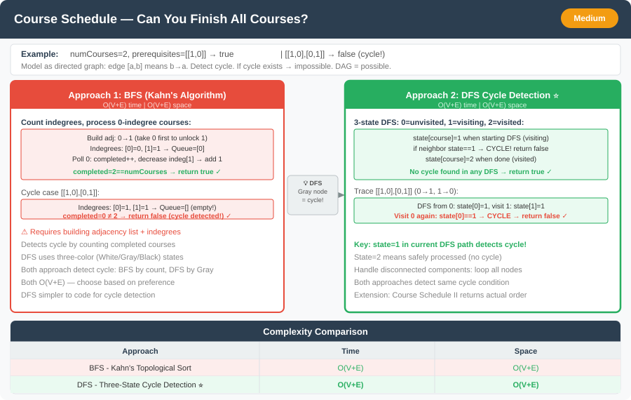

# Course Schedule




**Difficulty:** Medium ⚡

---

## 🔹 Problem Statement
There are a total of `numCourses` courses you have to take, labeled from `0` to `numCourses - 1`.  
Some courses may have **prerequisites**, given as pairs `[a, b]`, meaning you must take course `b` before course `a`.

Return **true** if it is possible to finish all courses**, otherwise return **false**.

---

## 🔹 Examples

**Example 1:**  
Input: `numCourses = 2, prerequisites = [[1,0]]`  
Output: `true`  
Explanation: There are 2 courses. To take course 1 you should have finished course 0. So it is possible.

**Example 2:**  
Input: `numCourses = 2, prerequisites = [[1,0],[0,1]]`  
Output: `false`  
Explanation: There are 2 courses. To take course 1 you should have finished course 0, and to take course 0 you should also have finished course 1. So it is impossible.

---

## 🔹 Constraints
- `1 <= numCourses <= 2000`
- `0 <= prerequisites.length <= 5000`
- `prerequisites[i].length == 2`
- `0 <= ai, bi < numCourses`
- All the pairs prerequisites[i] are **unique**

---

## 🔹 Intuition & Logic
This is a **cycle detection problem** in a **directed graph**.

- Each course is a **node**.
- Each prerequisite pair `[a, b]` represents a **directed edge** from `b → a`.
- The problem reduces to checking if this directed graph contains a **cycle**.
    - If there is a cycle → impossible to complete all courses.
    - If there is no cycle → all courses can be finished.

We can solve this using:
- **Topological Sort (BFS using Kahn’s Algorithm)**
- **DFS with cycle detection**

---

## 🔹 Approaches

### 1. BFS Approach (Topological Sort)
- Count **indegrees** (number of prerequisites) for each course.
- Add all courses with **indegree = 0** to a queue (these have no prerequisites).
- Process them one by one, reducing the indegree of their dependent courses.
- If all courses are processed, it means no cycle exists.

**Time Complexity:** O(V + E)  
**Space Complexity:** O(V + E)

---

### 2. DFS Approach (Cycle Detection)
- Perform DFS on every node.
- Maintain a **state array** to mark each course as:
    - `0` → unvisited
    - `1` → visiting
    - `2` → visited
- If a node marked `visiting` is encountered again during DFS, a **cycle** exists.

**Time Complexity:** O(V + E)  
**Space Complexity:** O(V + E)

---

## 🔹 Java Code (Both Approaches)

```java
public class CourseSchedule {

    // 1. BFS Approach (Topological Sort)
    public static boolean canFinishBFS(int numCourses, int[][] prerequisites) {
        List<List<Integer>> adj = new ArrayList<>();
        for (int i = 0; i < numCourses; i++)
            adj.add(new ArrayList<>());

        int[] indegree = new int[numCourses];
        for (int[] pre : prerequisites) {
            adj.get(pre[1]).add(pre[0]);
            indegree[pre[0]]++;
        }

        Queue<Integer> queue = new ArrayDeque<>();
        for (int i = 0; i < numCourses; i++) {
            if (indegree[i] == 0)
                queue.add(i);
        }

        int completed = 0;
        while (!queue.isEmpty()) {
            int course = queue.poll();
            completed++;

            for (int next : adj.get(course)) {
                indegree[next]--;
                if (indegree[next] == 0)
                    queue.add(next);
            }
        }

        return completed == numCourses;
    }

    // 2. DFS Approach (Cycle Detection)
    public static boolean canFinishDFS(int numCourses, int[][] prerequisites) {
        List<List<Integer>> adj = new ArrayList<>();
        for (int i = 0; i < numCourses; i++)
            adj.add(new ArrayList<>());

        for (int[] pre : prerequisites)
            adj.get(pre[1]).add(pre[0]);

        int[] state = new int[numCourses]; // 0 = unvisited, 1 = visiting, 2 = visited
        for (int i = 0; i < numCourses; i++) {
            if (state[i] == 0 && hasCycle(adj, state, i))
                return false;
        }

        return true;
    }

    private static boolean hasCycle(List<List<Integer>> adj, int[] state, int course) {
        state[course] = 1; // visiting

        for (int next : adj.get(course)) {
            if (state[next] == 1) return true; // found cycle
            if (state[next] == 0 && hasCycle(adj, state, next))
                return true;
        }

        state[course] = 2; // visited
        return false;
    }
}
```

---

## 🔹 Complexity Analysis

| Approach | Time Complexity | Space Complexity |
|-----------|-----------------|------------------|
| BFS (Kahn’s) | O(V + E) | O(V + E) |
| DFS          | O(V + E) | O(V + E) |

---

## 🔹 Edge Cases
- No prerequisites → always `true`
- Single course → always `true`
- Cycle in dependencies → `false`
- Disconnected components → handle each separately
- Duplicate prerequisite pairs → ignore duplicates safely

---

## 🔹 Follow-Up Questions
1. How to **return the actual order** of course completion?
2. How to detect **all cycles** in the graph instead of just existence?
3. Can you optimize memory for sparse dependency graphs?
4. What if some courses have **multiple independent paths** — how would that affect the solution?


