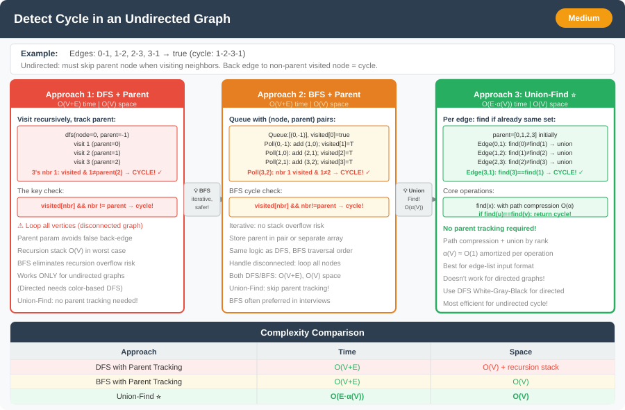

# Detect Cycle in Undirected Graph




**Difficulty:** Medium ⚡

---

## 🔹 Problem Statement
Given an undirected graph with `V` vertices and `E` edges, check whether the graph contains any cycle or not. 

A cycle exists if you can start from any vertex and return to the same vertex by traversing edges without reusing any edge.

---

## 🔹 Examples

**Example 1:**  
Input: `V = 5, edges = [[0,1], [1,2], [2,3], [3,4]]`  
Output: `false`  
Explanation: No cycle exists in this graph (it's a tree).

**Example 2:**  
Input: `V = 4, edges = [[0,1], [1,2], [2,3], [3,0]]`  
Output: `true`  
Explanation: There is a cycle 0 → 1 → 2 → 3 → 0.

**Example 3:**  
Input: `V = 3, edges = [[0,1], [1,2]]`  
Output: `false`  
Explanation: No cycle exists (tree structure).

---

## 🔹 Constraints
- `1 <= V <= 10^5`
- `0 <= E <= 10^5`
- Graph doesn't contain self-loops or multiple edges between same vertices
- The graph may not be connected (multiple components)

---

## 🔹 Intuition & Logic
In an **undirected graph**, a cycle exists if during DFS/BFS traversal, we encounter a vertex that is **already visited** and is **not the immediate parent** of the current vertex.

Key insight: In undirected graphs, we can reach a vertex from its parent, so we must exclude the parent when checking for visited nodes.

**Approaches:**
1. **DFS with Parent Tracking** - Track parent to avoid false cycle detection
2. **BFS with Parent Tracking** - Level-by-level traversal with parent tracking
3. **Union-Find (Disjoint Set)** - Detect cycle during edge addition

---

## 🔹 Approaches

### 1. DFS Approach with Parent Tracking
- For each unvisited vertex, start DFS
- During DFS, mark current vertex as visited
- For each neighbor, if it's visited and not the parent → cycle found
- If neighbor is unvisited, recursively call DFS

**Time Complexity:** O(V + E)  
**Space Complexity:** O(V)

---

### 2. BFS Approach with Parent Tracking
- Similar logic to DFS but uses queue
- Store vertex along with its parent in queue
- Check visited neighbors excluding parent

**Time Complexity:** O(V + E)  
**Space Complexity:** O(V)

---

### 3. Union-Find Approach
- Process edges one by one
- If both vertices of an edge belong to same component → cycle found
- Otherwise, union the two components

**Time Complexity:** O(E * α(V)) where α is inverse Ackermann function  
**Space Complexity:** O(V)

---

## 🔹 Java Code

```java
import java.util.*;

public class CycleUndirectedGraph {
    
    // 1. DFS Approach
    public static boolean hasCycleDFS(int V, List<List<Integer>> adj) {
        boolean[] visited = new boolean[V];
        
        // Handle disconnected components
        for (int i = 0; i < V; i++) {
            if (!visited[i]) {
                if (dfs(adj, visited, i, -1)) {
                    return true;
                }
            }
        }
        return false;
    }
    
    private static boolean dfs(List<List<Integer>> adj, boolean[] visited, int node, int parent) {
        visited[node] = true;
        
        for (int neighbor : adj.get(node)) {
            if (!visited[neighbor]) {
                if (dfs(adj, visited, neighbor, node)) {
                    return true;
                }
            } else if (neighbor != parent) {
                // Found cycle: visited neighbor that's not parent
                return true;
            }
        }
        return false;
    }
    
    // 2. BFS Approach
    public static boolean hasCycleBFS(int V, List<List<Integer>> adj) {
        boolean[] visited = new boolean[V];
        
        for (int i = 0; i < V; i++) {
            if (!visited[i]) {
                if (bfs(adj, visited, i)) {
                    return true;
                }
            }
        }
        return false;
    }
    
    private static boolean bfs(List<List<Integer>> adj, boolean[] visited, int start) {
        Queue<int[]> queue = new ArrayDeque<>(); // {node, parent}
        queue.offer(new int[]{start, -1});
        visited[start] = true;
        
        while (!queue.isEmpty()) {
            int[] current = queue.poll();
            int node = current[0];
            int parent = current[1];
            
            for (int neighbor : adj.get(node)) {
                if (!visited[neighbor]) {
                    visited[neighbor] = true;
                    queue.offer(new int[]{neighbor, node});
                } else if (neighbor != parent) {
                    return true; // Cycle found
                }
            }
        }
        return false;
    }
    
    // 3. Union-Find Approach
    static class UnionFind {
        int[] parent;
        int[] rank;
        
        UnionFind(int n) {
            parent = new int[n];
            rank = new int[n];
            for (int i = 0; i < n; i++) {
                parent[i] = i;
                rank[i] = 0;
            }
        }
        
        int find(int x) {
            if (parent[x] != x) {
                parent[x] = find(parent[x]); // Path compression
            }
            return parent[x];
        }
        
        boolean union(int x, int y) {
            int rootX = find(x);
            int rootY = find(y);
            
            if (rootX == rootY) {
                return false; // Already in same component - cycle found
            }
            
            // Union by rank
            if (rank[rootX] < rank[rootY]) {
                parent[rootX] = rootY;
            } else if (rank[rootX] > rank[rootY]) {
                parent[rootY] = rootX;
            } else {
                parent[rootY] = rootX;
                rank[rootX]++;
            }
            return true;
        }
    }
    
    public static boolean hasCycleUnionFind(int V, int[][] edges) {
        UnionFind uf = new UnionFind(V);
        
        for (int[] edge : edges) {
            if (!uf.union(edge[0], edge[1])) {
                return true; // Cycle detected
            }
        }
        return false;
    }
    
    public static void main(String[] args) {
        // Test case 1: No cycle
        List<List<Integer>> adj1 = new ArrayList<>();
        for (int i = 0; i < 5; i++) adj1.add(new ArrayList<>());
        adj1.get(0).add(1); adj1.get(1).add(0);
        adj1.get(1).add(2); adj1.get(2).add(1);
        adj1.get(2).add(3); adj1.get(3).add(2);
        adj1.get(3).add(4); adj1.get(4).add(3);
        
        System.out.println("Test 1 - DFS: " + hasCycleDFS(5, adj1)); // false
        System.out.println("Test 1 - BFS: " + hasCycleBFS(5, adj1)); // false
        
        // Test case 2: Has cycle
        List<List<Integer>> adj2 = new ArrayList<>();
        for (int i = 0; i < 4; i++) adj2.add(new ArrayList<>());
        adj2.get(0).add(1); adj2.get(1).add(0);
        adj2.get(1).add(2); adj2.get(2).add(1);
        adj2.get(2).add(3); adj2.get(3).add(2);
        adj2.get(3).add(0); adj2.get(0).add(3);
        
        System.out.println("Test 2 - DFS: " + hasCycleDFS(4, adj2)); // true
        
        int[][] edges = {{0,1}, {1,2}, {2,3}, {3,0}};
        System.out.println("Test 2 - Union-Find: " + hasCycleUnionFind(4, edges)); // true
    }
}
```

---

## 🔹 Complexity Analysis

| Approach | Time Complexity | Space Complexity |
|----------|-----------------|------------------|
| DFS      | O(V + E)       | O(V)             |
| BFS      | O(V + E)       | O(V)             |
| Union-Find | O(E * α(V))   | O(V)             |

---

## 🔹 Edge Cases
- Single vertex → No cycle possible
- Two vertices with edge → No cycle (tree)
- Disconnected components → Check each component separately
- Self-loops → Not allowed in this problem
- Multiple edges between same vertices → Not allowed

---

## 🔹 Follow-Up Questions
1. How would you **find and return the actual cycle** instead of just detecting it?
2. What if the graph was **directed** instead of undirected?
3. How would you **count the total number of cycles** in the graph?
4. Can you detect cycles in a **weighted undirected graph**?
5. How would you modify this for **online cycle detection** (edges added dynamically)?
