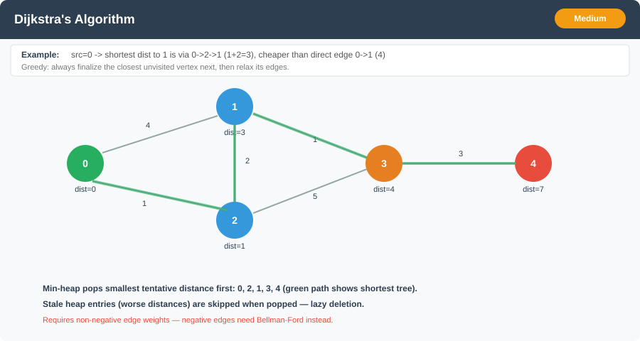

# Dijkstra's Algorithm (Single-Source Shortest Path)



**Difficulty:** Medium ⚡

---

## 🔹 Problem Statement
Given a **weighted graph** with `V` vertices and `E` edges (edge weights are **non-negative**), and a **source vertex** `src`, find the **shortest distance from `src` to every other vertex**.

The graph may be directed or undirected; represent it as an adjacency list where each edge is `[to, weight]`.

---

## 🔹 Examples

**Example 1:**
Input: `V = 5`, `edges = [[0,1,4],[0,2,1],[2,1,2],[1,3,1],[2,3,5],[3,4,3]]`, `src = 0`
Output: `dist = [0, 3, 1, 4, 7]`
Explanation: Shortest path to vertex `1` is `0 → 2 → 1` with cost `1 + 2 = 3`, cheaper than the direct edge `0 → 1` (cost `4`).

**Example 2:**
Input: `V = 3`, `edges = [[0,1,1],[1,2,1]]`, `src = 0`
Output: `dist = [0, 1, 2]`
Explanation: Simple chain, shortest distance accumulates along the only path.

**Example 3:**
Input: `V = 4`, `edges = [[0,1,1]]`, `src = 0`
Output: `dist = [0, 1, ∞, ∞]`
Explanation: Vertices `2` and `3` are unreachable from `src`.

---

## 🔹 Constraints
- `1 <= V <= 10^5`
- `0 <= E <= 2 * 10^5`
- **All edge weights are `>= 0`** (Dijkstra's correctness depends on this — see Edge Cases)
- Vertices are labeled `0` to `V - 1`

---

## 🔹 Intuition & Logic
Dijkstra's is a **greedy** algorithm: repeatedly pick the **unvisited vertex with the smallest known distance** from `src`, lock it in as final, and **relax** (try to improve) the distances of its neighbors through it.

Once a vertex is picked with the smallest tentative distance, that distance can never be improved later — because every other unvisited vertex has an equal or larger tentative distance, and edge weights are non-negative, so routing through them could only make things worse. This greedy-choice property is exactly what **breaks with negative edge weights**.

**Two ways to find "the unvisited vertex with the smallest distance" each round:**
1. **Linear scan** over all vertices — O(V) per round → O(V²) total. Simple, and actually competitive on **dense** graphs.
2. **Min-heap (priority queue)** keyed on distance — O(log V) per extraction → O((V + E) log V) total. Better on **sparse** graphs.

---

## 🔹 Approaches

### 1. Brute Force — O(V²) (no heap)
- Maintain `dist[]` (init `∞`, `dist[src] = 0`) and `visited[]`.
- Repeat `V` times: linearly scan all vertices to find the **unvisited vertex with minimum `dist`**, mark it visited, then relax all its outgoing edges.
- No heap overhead — good when the graph is dense (`E ≈ V²`) since the heap version's `log V` factor doesn't pay for itself.

**Time Complexity:** O(V²)
**Space Complexity:** O(V)

---

### 2. Priority Queue (Min-Heap, Lazy Deletion) — O((V + E) log V) ⭐
- Push `(distance, vertex)` pairs into a min-heap, starting with `(0, src)`.
- Pop the smallest-distance entry. If it's **stale** (a shorter distance to that vertex was already finalized), **skip** it — this is the "lazy deletion" trick, since Java's `PriorityQueue` has no cheap `decreaseKey`.
- Otherwise, finalize it and relax its neighbors, pushing any improved distance as a **new** heap entry (rather than updating one in place).

**Time Complexity:** O((V + E) log V) — each edge can push at most one heap entry
**Space Complexity:** O(V + E) — heap can hold up to O(E) stale entries

---

## 🔹 Java Code

```java
import java.util.*;

public class DijkstraAlgorithm {

    /** Brute force: O(V^2), no heap — competitive on dense graphs. */
    public static int[] dijkstraBruteForce(int V, List<List<int[]>> adj, int src) {
        int[] dist = new int[V];
        Arrays.fill(dist, Integer.MAX_VALUE);
        dist[src] = 0;
        boolean[] visited = new boolean[V];

        for (int iter = 0; iter < V; iter++) {
            int u = -1;
            for (int v = 0; v < V; v++) {
                if (!visited[v] && (u == -1 || dist[v] < dist[u])) {
                    u = v;
                }
            }
            if (u == -1 || dist[u] == Integer.MAX_VALUE) break; // remaining vertices unreachable
            visited[u] = true;

            for (int[] edge : adj.get(u)) {
                int to = edge[0], weight = edge[1];
                if (dist[u] + weight < dist[to]) {
                    dist[to] = dist[u] + weight;
                }
            }
        }
        return dist;
    }

    /** Optimized: min-heap with lazy deletion — O((V + E) log V). */
    public static int[] dijkstra(int V, List<List<int[]>> adj, int src) {
        int[] dist = new int[V];
        Arrays.fill(dist, Integer.MAX_VALUE);
        dist[src] = 0;

        // Entry: {distance, vertex}
        PriorityQueue<int[]> pq = new PriorityQueue<>((a, b) -> a[0] - b[0]);
        pq.offer(new int[]{0, src});

        while (!pq.isEmpty()) {
            int[] top = pq.poll();
            int d = top[0], u = top[1];

            if (d > dist[u]) continue; // stale entry, a better distance was already found

            for (int[] edge : adj.get(u)) {
                int to = edge[0], weight = edge[1];
                int newDist = d + weight;
                if (newDist < dist[to]) {
                    dist[to] = newDist;
                    pq.offer(new int[]{newDist, to});
                }
            }
        }
        return dist;
    }

    /** Builds an undirected weighted adjacency list from an edge list [u, v, weight]. */
    public static List<List<int[]>> buildGraph(int V, int[][] edges, boolean directed) {
        List<List<int[]>> adj = new ArrayList<>();
        for (int i = 0; i < V; i++) adj.add(new ArrayList<>());
        for (int[] e : edges) {
            adj.get(e[0]).add(new int[]{e[1], e[2]});
            if (!directed) adj.get(e[1]).add(new int[]{e[0], e[2]});
        }
        return adj;
    }

    public static void main(String[] args) {
        int[][] edges = {{0,1,4},{0,2,1},{2,1,2},{1,3,1},{2,3,5},{3,4,3}};
        List<List<int[]>> adj = buildGraph(5, edges, true);

        System.out.println(Arrays.toString(dijkstraBruteForce(5, adj, 0))); // [0, 3, 1, 4, 7]
        System.out.println(Arrays.toString(dijkstra(5, adj, 0)));            // [0, 3, 1, 4, 7]
    }
}
```

---

## 🔹 Complexity Analysis

| Approach                        | Time Complexity     | Space Complexity |
|----------------------------------|---------------------|-------------------|
| Brute Force (linear scan)       | O(V²)               | O(V)              |
| Priority Queue (lazy deletion)  | O((V + E) log V)    | O(V + E)          |

Use brute force on **dense** graphs (`E` close to `V²`); use the heap version on **sparse** graphs (`E` closer to `V`).

---

## 🔹 Edge Cases
- **Negative edge weight** → Dijkstra's greedy choice breaks; the algorithm can return an incorrect (too-large) distance. Use **Bellman-Ford** instead.
- **Unreachable vertices** → distance stays `Integer.MAX_VALUE` / `∞`.
- **Disconnected graph** → only the source's component gets finalized distances; the rest remain unreachable.
- **Self-loops** → never improve `dist[u]` (an edge `u → u` with weight `≥ 0` can't beat `dist[u] + 0` unless `dist[u]` is already final), safe to leave in the adjacency list.
- **Parallel edges** between the same pair → relaxation naturally keeps the cheaper one; no special handling needed.
- **`src` itself** → `dist[src] = 0` by initialization.

---

## 🔹 Follow-Up Questions
1. How would you solve this if edge weights could be **negative** (but no negative cycle)? → **Bellman-Ford**, O(V·E).
2. How would you **detect a negative cycle**? → Run Bellman-Ford for one extra round; if any distance still improves, a negative cycle exists.
3. How would you **reconstruct the actual shortest path**, not just its length? → Track a `parent[]` array during relaxation and walk it backward from the target.
4. How does this generalize to **all-pairs shortest paths**? → Run Dijkstra from every vertex (O(V · (V+E) log V) for non-negative weights), or use **Floyd-Warshall** (O(V³)) / **Johnson's algorithm** (handles negative edges via reweighting).
5. How would you adapt this for **A\* search** with a target vertex and a heuristic?
6. Why does the lazy-deletion priority queue still give the correct asymptotic complexity despite pushing duplicate entries?

---

## 🔗 Related
- [Minimum Spanning Tree (Prim's & Kruskal's)](minimum_spanning_tree.md) — Prim's reuses the same "grow via a min-heap frontier" shape as Dijkstra, but relaxes on **edge weight** instead of **cumulative distance**.
- [Topological Sort](topological_sort.md) — an alternative O(V + E) shortest-path method when the graph is a **DAG** (no cycles), since vertices can be relaxed in topological order without a heap at all.
