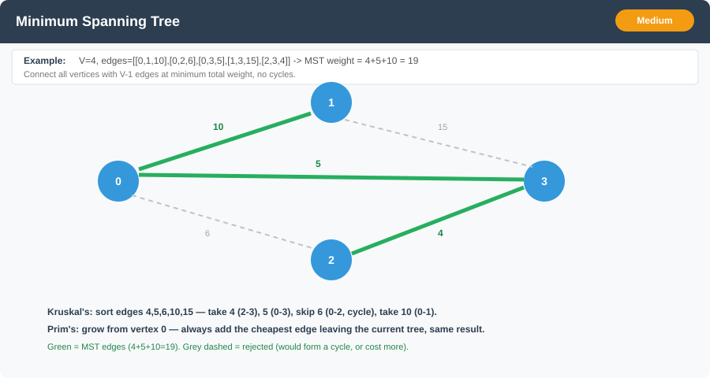

# Minimum Spanning Tree (Prim's & Kruskal's)



**Difficulty:** Medium ⚡

---

## 🔹 Problem Statement
Given a **connected, undirected, weighted graph** with `V` vertices and `E` edges, find a **Minimum Spanning Tree (MST)** — a subset of `V - 1` edges that connects all vertices with **no cycle**, such that the **total edge weight is minimized**.

If the graph is **disconnected**, no single spanning tree exists; the same algorithms produce a **Minimum Spanning Forest** — one MST per connected component.

---

## 🔹 Examples

**Example 1:**
Input: `V = 4`, `edges = [[0,1,10],[0,2,6],[0,3,5],[1,3,15],[2,3,4]]`
Output: `MST weight = 19`
Explanation: Pick edges `(2,3,4)`, `(0,3,5)`, `(0,1,10)` → total `4 + 5 + 10 = 19`, connecting all 4 vertices with 3 edges and no cycle.

**Example 2:**
Input: `V = 3`, `edges = [[0,1,1],[1,2,2],[0,2,2]]`
Output: `MST weight = 3`
Explanation: Pick the two cheapest edges that don't form a cycle: `(0,1,1)` and `(1,2,2)`.

**Example 3:**
Input: `V = 2`, `edges = [[0,1,7]]`
Output: `MST weight = 7`
Explanation: Only one edge needed to connect 2 vertices.

---

## 🔹 Constraints
- `1 <= V <= 10^5`
- `V - 1 <= E <= 2 * 10^5` (graph is connected)
- Edge weights can be any integer (unlike Dijkstra, **negative weights are fine** here — MST algorithms don't rely on a "distance can only grow" argument)
- Vertices are labeled `0` to `V - 1`

---

## 🔹 Intuition & Logic
Both classic MST algorithms are **greedy** and both are justified by the same **cut property**: for any partition of the vertices into two non-empty sets, the **minimum-weight edge crossing that cut** must be in *some* MST. Repeatedly applying this fact — safely picking the cheapest crossing edge — builds a full MST.

They differ in *which* cuts they consider and *in what order*:

- **Kruskal's**: consider edges globally, **cheapest first**, across the whole edge list. Add an edge if its two endpoints are in **different components** (checked via **Union-Find**); skip it if it would form a cycle. Naturally suited to an **edge-list** view of the graph.
- **Prim's**: grow **one connected tree** outward from an arbitrary start vertex. At each step, add the cheapest edge that connects the current tree to a vertex **outside** it — this is exactly Dijkstra's frontier-expansion shape, except the priority is **edge weight**, not **cumulative path distance**.

---

## 🔹 Approaches

### 1. Kruskal's Algorithm (Sort + Union-Find) — O(E log E)
- Sort all edges by weight ascending.
- Walk the sorted edges; for each `(u, v, w)`, use **Union-Find** to check if `u` and `v` are already connected.
  - If not connected → **union** them, add `w` to the MST total, and take the edge.
  - If already connected → **skip** (adding it would form a cycle).
- Stop early once `V - 1` edges have been added.

**Time Complexity:** O(E log E) for the sort, plus O(E · α(V)) for union-find operations (α = inverse Ackermann, effectively constant)
**Space Complexity:** O(V) for union-find + O(E) if edges are copied for sorting

---

### 2. Prim's Algorithm (Priority Queue / Min-Heap) — O(E log V) ⭐
- Start from any vertex (e.g., `0`), mark it **in the tree**.
- Push all of its edges onto a min-heap keyed by weight.
- Repeatedly pop the cheapest edge `(w, to)`:
  - If `to` is already in the tree, **skip** (lazy deletion, same trick as Dijkstra).
  - Otherwise, add `to` to the tree, add `w` to the MST total, and push all of `to`'s edges to vertices **not yet in the tree**.
- Stop once all vertices are in the tree (or the heap empties).

**Time Complexity:** O(E log V) — each edge is pushed at most once
**Space Complexity:** O(V + E)

---

## 🔹 Java Code

```java
import java.util.*;

public class MinimumSpanningTree {

    /** 1. Kruskal's: sort edges, union-find to reject cycles. */
    public static int kruskalMST(int V, int[][] edges) {
        Arrays.sort(edges, (a, b) -> a[2] - b[2]); // sort by weight ascending

        UnionFind uf = new UnionFind(V);
        int totalWeight = 0;
        int edgesUsed = 0;

        for (int[] edge : edges) {
            int u = edge[0], v = edge[1], w = edge[2];
            if (uf.union(u, v)) { // true if u and v were in different components
                totalWeight += w;
                edgesUsed++;
                if (edgesUsed == V - 1) break; // MST complete
            }
        }
        return totalWeight;
    }

    /** 2. Prim's: min-heap frontier expansion, same shape as Dijkstra but keyed on edge weight. */
    public static int primMST(int V, List<List<int[]>> adj) {
        boolean[] inTree = new boolean[V];
        // Entry: {weight, vertex}
        PriorityQueue<int[]> pq = new PriorityQueue<>((a, b) -> a[0] - b[0]);
        pq.offer(new int[]{0, 0}); // start from vertex 0 with a "free" entry edge

        int totalWeight = 0;
        int verticesInTree = 0;

        while (!pq.isEmpty() && verticesInTree < V) {
            int[] top = pq.poll();
            int w = top[0], u = top[1];

            if (inTree[u]) continue; // stale entry, already added via a cheaper edge

            inTree[u] = true;
            totalWeight += w;
            verticesInTree++;

            for (int[] edge : adj.get(u)) {
                int to = edge[0], weight = edge[1];
                if (!inTree[to]) {
                    pq.offer(new int[]{weight, to});
                }
            }
        }
        return totalWeight;
    }

    /** Union-Find (Disjoint Set Union) with path compression + union by rank. */
    static class UnionFind {
        int[] parent;
        int[] rank;

        UnionFind(int n) {
            parent = new int[n];
            rank = new int[n];
            for (int i = 0; i < n; i++) parent[i] = i;
        }

        int find(int x) {
            if (parent[x] != x) {
                parent[x] = find(parent[x]); // path compression
            }
            return parent[x];
        }

        /** Returns true if x and y were in different components (and are now merged). */
        boolean union(int x, int y) {
            int rootX = find(x), rootY = find(y);
            if (rootX == rootY) return false; // already connected — would form a cycle

            if (rank[rootX] < rank[rootY]) {
                parent[rootX] = rootY;
            } else if (rank[rootX] > rank[rootY]) {
                parent[rootY] = rootX;
            } else {
                parent[rootY] = rootX;
                rank[rootX]++;
            }
            return true;
        }
    }

    /** Builds an undirected weighted adjacency list from an edge list [u, v, weight]. */
    public static List<List<int[]>> buildGraph(int V, int[][] edges) {
        List<List<int[]>> adj = new ArrayList<>();
        for (int i = 0; i < V; i++) adj.add(new ArrayList<>());
        for (int[] e : edges) {
            adj.get(e[0]).add(new int[]{e[1], e[2]});
            adj.get(e[1]).add(new int[]{e[0], e[2]});
        }
        return adj;
    }

    public static void main(String[] args) {
        int[][] edges = {{0,1,10},{0,2,6},{0,3,5},{1,3,15},{2,3,4}};

        System.out.println(kruskalMST(4, edges));                 // 19
        System.out.println(primMST(4, buildGraph(4, edges)));      // 19
    }
}
```

---

## 🔹 Complexity Analysis

| Approach   | Time Complexity      | Space Complexity | Best For |
|------------|-----------------------|-------------------|----------|
| Kruskal's  | O(E log E)            | O(V + E)          | Sparse graphs, edge-list input |
| Prim's     | O(E log V)            | O(V + E)          | Dense graphs, adjacency-list input |

Both are asymptotically similar since `log E ≈ log V` for simple graphs (`E ≤ V²`).

---

## 🔹 Edge Cases
- **Disconnected graph** → neither algorithm produces a full spanning tree; Kruskal's stops with fewer than `V - 1` edges taken, Prim's `verticesInTree` never reaches `V`. Detect and report a **forest** instead.
- **Single vertex (`V = 1`)** → MST weight is `0`, no edges needed.
- **Parallel edges** between the same pair with different weights → both algorithms naturally prefer the cheaper one (Kruskal's via sort order, Prim's via lazy deletion).
- **Negative edge weights** → both algorithms remain correct (unlike Dijkstra).
- **All edge weights equal** → any spanning tree is an MST; the algorithms will still produce a valid (if not unique) one.

---

## 🔹 Follow-Up Questions
1. How would you return the **actual set of edges** in the MST, not just the total weight?
2. What changes for a **Maximum Spanning Tree**? (Hint: negate weights, or flip the comparator.)
3. How would you find the **second-best MST**? (Try replacing each MST edge with the cheapest valid non-MST alternative.)
4. Why does Prim's using a min-heap have the **same code shape as Dijkstra**, yet Prim's tolerates negative weights while Dijkstra does not?
5. How would you adapt Kruskal's for **online queries**: "does adding this edge create a cycle?" (Hint: this is just repeated Union-Find `union` calls — same core idea as [Cycle in Undirected Graph](cycle_in_undirected_graph.md).)
6. How many edges does an MST **always** have, in terms of `V`? What does a different count tell you about the input graph?

---

## 🔗 Related
- [Dijkstra's Algorithm](dijkstra_algorithm.md) — Prim's shares its "min-heap frontier expansion" structure, but relaxes on **edge weight** instead of **cumulative distance**, which is also why Prim's tolerates negative weights and Dijkstra doesn't.
- [Cycle in Undirected Graph](cycle_in_undirected_graph.md) — same Union-Find "would this edge form a cycle?" check that powers Kruskal's.
- [Minimum Arrows to Burst Balloons](../arrays/minimum_arrows_to_burst_balloons.md) — another classic "sort, then greedily decide per item" pattern.
