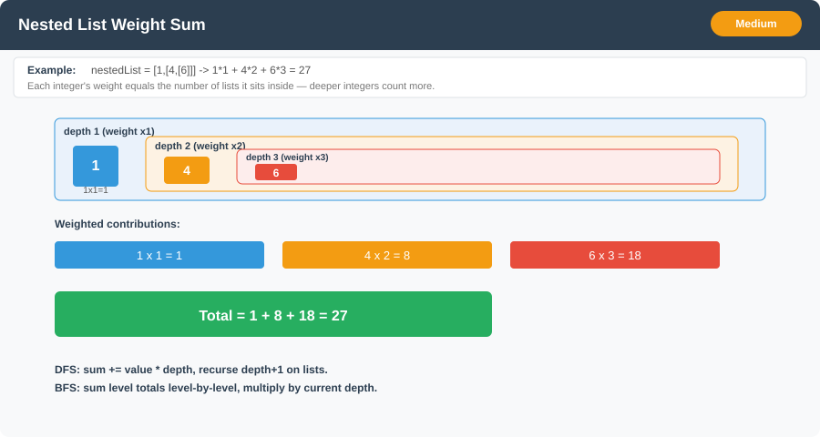

# Nested List Weight Sum



**Difficulty:** Medium ⚡

---

## 🔹 Problem Statement
You are given a nested list of integers `nestedList`. Each element is either an **integer**, or a **list** whose elements may also be integers or other lists.

The **depth** of an integer is the number of lists that it is inside of. For example, the nested list `[1,[2,2],[[3],2],1]` has each integer's value set to its depth.

Return **the sum of each integer in `nestedList` multiplied by its depth**.

The nested structure is typically exposed via an interface:
```java
public interface NestedInteger {
    boolean isInteger();          // true if this holds a single Integer
    Integer getInteger();         // the single integer, if isInteger() is true
    List<NestedInteger> getList(); // the nested list, if isInteger() is false
}
```

---

## 🔹 Examples

**Input:** `nestedList = [[1,1],2,[1,1]]`
**Output:** `10`
**Explanation:** Four `1`'s at depth `2`, one `2` at depth `1`. `1*2 + 1*2 + 2*1 + 1*2 + 1*2 = 10`

---

**Input:** `nestedList = [1,[4,[6]]]`
**Output:** `27`
**Explanation:** `1` is at depth `1`, `4` is at depth `2`, `6` is at depth `3`. `1*1 + 4*2 + 6*3 = 27`

---

## 🔹 Constraints
- `1 <= nestedList.length <= 50`
- The values of the integers in the nested list are in the range `[-100, 100]`
- The maximum **depth** of any integer is `<= 50`

---

## 🔹 Intuition & Logic
Treat `nestedList` as a tree: lists are internal nodes, integers are leaves. The answer is the sum of `leaf.value * leaf.depth`.

**DFS:** carry the current depth as a parameter. On an integer, add `value * depth`. On a list, recurse into every child with `depth + 1`.

**BFS:** process the outermost elements first (depth 1), then their children (depth 2), and so on. Sum all integers seen at the current level, multiply by the current depth, and add to the running total — no need to store depth per element.

---

## 🔹 Approaches

### 1. DFS (Recursive)
- Recurse through each `NestedInteger`, threading the depth down.
- Integer → `sum += value * depth`.
- List → recurse on each child with `depth + 1`.

**Time Complexity:** O(N) — N = total number of integers + nested lists
**Space Complexity:** O(D) recursion stack, D = max depth

---

### 2. BFS (Iterative, Level Order)
- Push all top-level elements into a queue, `depth = 1`.
- For each level: pop every element currently in the queue, add integers to `levelSum`, push children of lists into the queue.
- `total += levelSum * depth`, then `depth++` and continue until the queue is empty.

**Time Complexity:** O(N)
**Space Complexity:** O(N) queue worst case (very wide, shallow structure)

---

## 🔹 Java Code (DFS, BFS)

```java
import java.util.*;

interface NestedInteger {
    boolean isInteger();
    Integer getInteger();
    List<NestedInteger> getList();
}

public class NestedListWeightSum {

    // 1. Recursive DFS
    public static int depthSumDFS(List<NestedInteger> nestedList) {
        return dfs(nestedList, 1);
    }

    private static int dfs(List<NestedInteger> list, int depth) {
        int sum = 0;
        for (NestedInteger ni : list) {
            if (ni.isInteger()) {
                sum += ni.getInteger() * depth;
            } else {
                sum += dfs(ni.getList(), depth + 1);
            }
        }
        return sum;
    }

    // 2. Iterative BFS (level order)
    public static int depthSumBFS(List<NestedInteger> nestedList) {
        Queue<NestedInteger> queue = new ArrayDeque<>(nestedList);
        int depth = 1, total = 0;

        while (!queue.isEmpty()) {
            int levelSum = 0;
            int size = queue.size();
            for (int i = 0; i < size; i++) {
                NestedInteger ni = queue.poll();
                if (ni.isInteger()) {
                    levelSum += ni.getInteger();
                } else {
                    queue.addAll(ni.getList());
                }
            }
            total += levelSum * depth;
            depth++;
        }
        return total;
    }
}
```

---

## 🔹 Complexity Analysis

| Approach          | Time Complexity | Space Complexity     |
|-------------------|-----------------|----------------------|
| DFS (recursive)   | O(N)            | O(D) recursion stack |
| BFS (level order) | O(N)            | O(N) queue           |

`N` = total number of integers and nested lists; `D` = maximum nesting depth (`D <= 50` per constraints).

---

## 🔹 Edge Cases
- Flat list with no nesting (`[1,2,3]`) → every integer at depth `1`.
- Deeply nested single integer (`[[[[5]]]]`) → weight grows with depth.
- Empty inner lists (`[[],[1]]`) → contribute `0`, must not break traversal.
- Negative integers → sum can be negative.
- Mixed integers and lists at the same level.

---

## 🔹 Follow-Up Questions
1. How would you solve **Nested List Weight Sum II**, where the weight is *inverted* (deepest elements count least: weight = `maxDepth - depth + 1`)?
2. Could you compute the answer in a **single pass** without first finding `maxDepth`? (Hint: accumulate an unweighted running sum per level and add it every level — deeper levels get added more times.)
3. How does this relate to [Flood Fill](flood_fill.md) and [Number of Islands](number_of_islands.md) in terms of choosing DFS vs. BFS?
4. What would you change if the nesting depth could be much larger than 50 (risk of stack overflow with DFS)?
