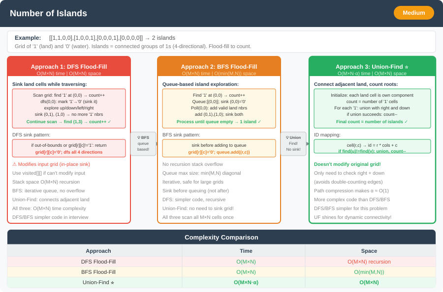

# Number of Islands




**Difficulty:** Medium ⚡

---

## 🔹 Problem Statement
You are given an `n x m` binary grid where:
- `'1'` represents **land**
- `'0'` represents **water**

An **island** is formed by connecting adjacent lands **horizontally or vertically** (no diagonal connection).

Return the **number of islands** in the given grid.

---

## 🔹 Examples

**Input:**  
```
grid = [
  ['1','1','0','0','0'],
  ['1','1','0','0','0'],
  ['0','0','1','0','0'],
  ['0','0','0','1','1']
]
```  
**Output:** `3`

**Explanation:**
- There are 3 islands:
    1. The top-left block of 1s
    2. The middle single 1
    3. The bottom-right pair of 1s

---

## 🔹 Constraints
- `m == grid.length`
- `n == grid[i].length`
- `1 <= m, n <= 300`
- `grid[i][j]` is '0' or '1'

---

## 🔹 Intuition & Logic
This problem is identical to finding the **number of connected components** in a 2D grid.

Each `'1'` is a **node**, and each connection (up, down, left, right) forms an **edge**.  
Use a **`boolean[][] visited`** (same shape as the grid) so you never revisit a land cell; the input grid can stay read-only for DFS/BFS.

We can solve this using:
- **DFS (recursive or iterative)**
- **BFS (using a queue)**
- **Union-Find (Disjoint Set Union)**

---

## 🔹 Approaches

### 1. DFS Approach
- Traverse each cell.
- When **`grid[i][j] == '1'`** and **`!visited[i][j]`**, start DFS: set **`visited`** for every reachable `'1'`.
- Increment island count once per new component.

**Time Complexity:** O(n × m)  
**Space Complexity:** O(n × m) (for recursion stack)

---

### 2. BFS Approach
- Same as DFS, but use a queue; enqueue land cells and flip **`visited[r][c]`** when you first see them (two **`Queue<Integer>`** for row/col, or one queue of encoded index).

**Time Complexity:** O(n × m)  
**Space Complexity:** O(n × m)

---

### 3. Union-Find Approach
- Treat each cell as a node.
- Union adjacent `'1'` cells.
- Count distinct roots (representing unique islands).

**Time Complexity:** O(n × m * α(nm))  
**Space Complexity:** O(n × m)

---

## 🔹 Java Code (DFS, BFS, Union-Find)

```java
import java.util.*;

public class NumberOfIslands {

    private static final int[][] DIRS = {{1, 0}, {-1, 0}, {0, 1}, {0, -1}};

    public static int numIslandsDFS(char[][] grid) {
        if (grid == null || grid.length == 0) return 0;
        int n = grid.length, m = grid[0].length;
        boolean[][] visited = new boolean[n][m];
        int count = 0;

        for (int i = 0; i < n; i++) {
            for (int j = 0; j < m; j++) {
                if (grid[i][j] == '1' && !visited[i][j]) {
                    dfs(grid, visited, i, j, n, m);
                    count++;
                }
            }
        }
        return count;
    }

    private static void dfs(char[][] grid, boolean[][] visited, int i, int j, int n, int m) {
        if (i < 0 || j < 0 || i >= n || j >= m || grid[i][j] != '1' || visited[i][j])
            return;
        visited[i][j] = true;

        for (int[] d : DIRS) {
            dfs(grid, visited, i + d[0], j + d[1], n, m);
        }
    }

    public static int numIslandsBFS(char[][] grid) {
        if (grid == null || grid.length == 0) return 0;
        int n = grid.length, m = grid[0].length;
        boolean[][] visited = new boolean[n][m];
        int count = 0;
        Queue<Integer> rowQ = new ArrayDeque<>();
        Queue<Integer> colQ = new ArrayDeque<>();

        for (int i = 0; i < n; i++) {
            for (int j = 0; j < m; j++) {
                if (grid[i][j] != '1' || visited[i][j]) continue;

                count++;
                visited[i][j] = true;
                rowQ.add(i);
                colQ.add(j);

                while (!rowQ.isEmpty()) {
                    int r = rowQ.poll();
                    int c = colQ.poll();
                    for (int[] d : DIRS) {
                        int x = r + d[0];
                        int y = c + d[1];
                        if (x >= 0 && y >= 0 && x < n && y < m && grid[x][y] == '1' && !visited[x][y]) {
                            visited[x][y] = true;
                            rowQ.add(x);
                            colQ.add(y);
                        }
                    }
                }
            }
        }
        return count;
    }

    // 3. Union-Find (Disjoint Set)
    static class UnionFind {
        int[] parent;
        int count;

        UnionFind(char[][] grid) {
            int n = grid.length, m = grid[0].length;
            parent = new int[n * m];
            count = 0;

            for (int i = 0; i < n; i++) {
                for (int j = 0; j < m; j++) {
                    if (grid[i][j] == '1') {
                        int id = i * m + j;
                        parent[id] = id;
                        count++;
                    }
                }
            }
        }

        int find(int x) {
            if (x != parent[x])
                parent[x] = find(parent[x]);
            return parent[x];
        }

        void union(int x, int y) {
            int rootX = find(x);
            int rootY = find(y);
            if (rootX != rootY) {
                parent[rootY] = rootX;
                count--;
            }
        }
    }

    public static int numIslandsUnionFind(char[][] grid) {
        if (grid == null || grid.length == 0) return 0;
        int n = grid.length, m = grid[0].length;
        UnionFind uf = new UnionFind(grid);

        for (int i = 0; i < n; i++) {
            for (int j = 0; j < m; j++) {
                if (grid[i][j] != '1') continue;
                for (int[] d : DIRS) {
                    int x = i + d[0];
                    int y = j + d[1];
                    if (x >= 0 && y >= 0 && x < n && y < m && grid[x][y] == '1') {
                        uf.union(i * m + j, x * m + y);
                    }
                }
            }
        }

        return uf.count;
    }
}
```
---

## 🔹 Complexity Analysis

| Approach        | Time Complexity | Space Complexity |
|-----------------|-----------------|------------------|
| DFS             | O(n × m)        | O(n × m) (`visited` + recursion stack) |
| BFS             | O(n × m)        | O(n × m) (`visited` + queue) |
| Union-Find (DSU)| O(n × m * α(nm))| O(n × m) (parent array) |

---

## 🔹 Edge Cases
- Empty grid → 0 islands
- All `'0'` → 0 islands
- All `'1'` → 1 island
- Single row or single column grid
- Multiple disconnected island regions

---

## 🔹 Follow-Up Questions
1. How would you modify this to support **8-directional connectivity**?
2. Can you return the **size of each island** in a list?
3. When is **`visited[][]`** preferable to **flipping `'1'` → `'0'`** in-place?
4. How can you extend this logic to **count lakes (regions of water surrounded by land)**?
