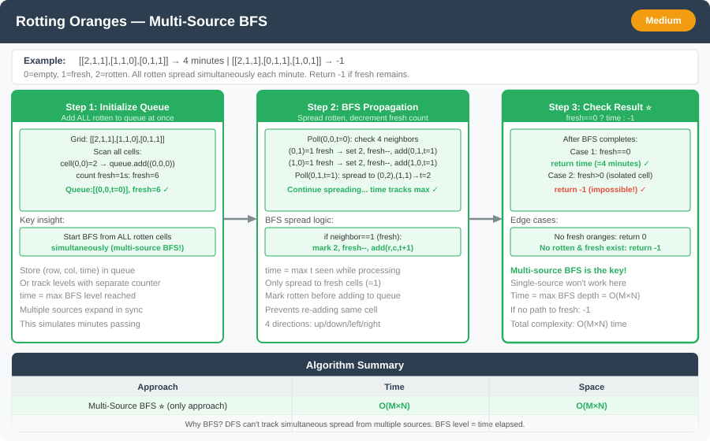

# 🔹 Problem: Rotting Oranges




**Difficulty:** Medium 🌿

---

## 🔹 Problem Statement
You are given an `m x n` grid representing a box of oranges. Each cell can have one of the following values:
- `0` → Empty cell
- `1` → Fresh orange
- `2` → Rotten orange

Every minute, **any fresh orange that is adjacent (4-directionally)** to a rotten orange becomes rotten.

You must determine the **minimum number of minutes** required for all oranges to rot.  
If it’s **impossible** for all oranges to rot, return `-1`.

---

## 🔹 Example

Input:

grid = [

[2,1,1],

[1,1,0],

[0,1,1]

]

Output: 4


**Explanation:**  
Each minute, the rot spreads to adjacent fresh oranges.  
After 4 minutes, all oranges are rotten.

---

## 🔹 Intuition
- This is a **multi-source BFS** problem.
- All initially rotten oranges are **starting points** (multiple sources).
- Use a queue to spread the rot in **layers** (each layer = 1 minute).
- The last layer processed gives the total time taken.
- If any fresh orange remains at the end → return `-1`.

---

## 🔹 Approach (BFS)

1. Traverse the grid and:
    - Enqueue each rotten orange as **two parallel queues** — **`rows`** and **`cols`** (no custom cell type).
    - Count total fresh oranges.
2. While the queue is not empty:
    - For each rotten orange, rot all its adjacent fresh neighbors.
    - Each level processed represents **1 minute passed**.
3. Keep track of how many fresh oranges got rotted.
4. If all fresh oranges are rotted → return time taken, else `-1`.

---

## 🔹 Java Code (BFS)

```java
import java.util.*;

public class RottingOranges {

    public static int orangesRotting(int[][] grid) {
        if (grid == null || grid.length == 0) return 0;

        int m = grid.length, n = grid[0].length;
        Queue<Integer> rowQ = new ArrayDeque<>();
        Queue<Integer> colQ = new ArrayDeque<>();
        int freshCount = 0;

        for (int r = 0; r < m; r++) {
            for (int c = 0; c < n; c++) {
                if (grid[r][c] == 2) {
                    rowQ.add(r);
                    colQ.add(c);
                } else if (grid[r][c] == 1) {
                    freshCount++;
                }
            }
        }

        if (freshCount == 0) return 0;

        int minutes = 0;
        int[][] directions = {{1, 0}, {-1, 0}, {0, 1}, {0, -1}};

        while (!rowQ.isEmpty()) {
            int size = rowQ.size();
            boolean rottedThisMinute = false;

            for (int i = 0; i < size; i++) {
                int r = rowQ.poll();
                int c = colQ.poll();
                for (int[] d : directions) {
                    int nr = r + d[0];
                    int nc = c + d[1];

                    if (nr >= 0 && nc >= 0 && nr < m && nc < n && grid[nr][nc] == 1) {
                        grid[nr][nc] = 2;
                        freshCount--;
                        rowQ.add(nr);
                        colQ.add(nc);
                        rottedThisMinute = true;
                    }
                }
            }

            if (rottedThisMinute) minutes++;
        }

        return freshCount == 0 ? minutes : -1;
    }
}
```
---

## 🔹 Complexity Analysis

| Operation | Time Complexity | Space Complexity |
|------------|-----------------|------------------|
| BFS Traversal | O(m × n) | O(m × n) |

---

## 🔹 Edge Cases
- No oranges at all → return `0`
- All oranges already rotten → return `0`
- Some fresh oranges completely isolated → return `-1`
- Single rotten orange with all fresh reachable → valid count

---

## 🔹 Follow-Up Questions
1. Can you modify this to handle **diagonal adjacency** as well?
2. What if the grid is extremely large — how would you **optimize space usage**?
3. Can this be solved using **DFS**? Why or why not?
4. How would you modify the logic if rot spreads **every 2 minutes** instead of 1?
