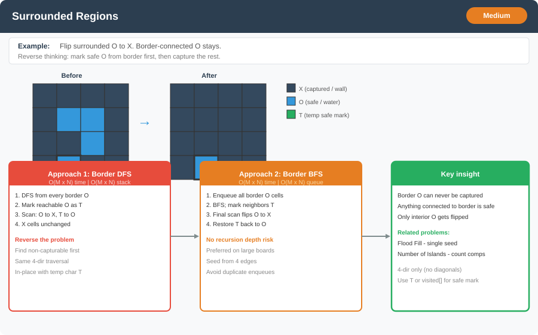

# Surrounded Regions




**Difficulty:** Medium ⚡

---

## 🔹 Problem Statement
You are given an `m x n` matrix `board` containing only `'X'` and `'O'`.

**Capture** all regions that are **fully surrounded** by `'X'`:
- A region is a group of `'O'` cells connected **4-directionally** (up, down, left, right).
- A region is **not surrounded** if any cell in it lies on the **border** of the board, or is connected to a border `'O'`.

Flip every **surrounded** `'O'` to `'X'`. Leave all other cells unchanged.

Do this **in-place** on the input board.

---

## 🔹 Examples

**Input:**
```
board = [
  ['X','X','X','X'],
  ['X','O','O','X'],
  ['X','X','O','X'],
  ['X','O','X','X']
]
```

**Output:**
```
[
  ['X','X','X','X'],
  ['X','X','X','X'],
  ['X','X','X','X'],
  ['X','O','X','X']
]
```

**Explanation:** The center `'O'` group is fully enclosed. The `'O'` at `(3,1)` touches the bottom border, so it stays.

---

**Input:**
```
board = [['X']]
```

**Output:** `[['X']]`

---

## 🔹 Constraints
- `m == board.length`
- `n == board[i].length`
- `1 <= m, n <= 200`
- `board[i][j]` is `'X'` or `'O'`

---

## 🔹 Intuition & Logic
Naive idea: for each `'O'`, check if its entire component is surrounded — expensive and tricky.

**Reverse the problem:** find `'O'` regions that **cannot** be captured — those connected to the border.

1. Start DFS/BFS from every `'O'` on the **first/last row or column**.
2. Mark all reachable `'O'` as safe (temporarily `'T'`).
3. Scan the board:
   - `'O'` → `'X'` (surrounded, not reached from border)
   - `'T'` → `'O'` (border-connected, keep)
4. `'X'` cells stay unchanged.

This is the same grid traversal as [Flood Fill](flood_fill.md) and [Number of Islands](number_of_islands.md), but seeded from **multiple border cells** and with a final cleanup pass.

---

## 🔹 Approaches

### 1. DFS from Border
- Loop over all border cells; DFS from each `'O'`, marking `'T'`.
- Second pass: flip remaining `'O'` to `'X'`, restore `'T'` to `'O'`.

**Time Complexity:** O(m × n)  
**Space Complexity:** O(m × n) recursion stack worst case

---

### 2. BFS from Border
- Same logic with a queue — avoids deep recursion on large border-connected regions.

**Time Complexity:** O(m × n)  
**Space Complexity:** O(m × n) queue worst case

---

## 🔹 Java Code (DFS, BFS)

```java
import java.util.*;

public class SurroundedRegions {

    private static final int[][] DIRS = {{1, 0}, {-1, 0}, {0, 1}, {0, -1}};

    // 1. DFS from border
    public static void solveDFS(char[][] board) {
        if (board == null || board.length == 0) return;
        int m = board.length, n = board[0].length;

        for (int c = 0; c < n; c++) {
            if (board[0][c] == 'O') dfs(board, 0, c);
            if (board[m - 1][c] == 'O') dfs(board, m - 1, c);
        }
        for (int r = 0; r < m; r++) {
            if (board[r][0] == 'O') dfs(board, r, 0);
            if (board[r][n - 1] == 'O') dfs(board, r, n - 1);
        }

        for (int r = 0; r < m; r++) {
            for (int c = 0; c < n; c++) {
                if (board[r][c] == 'O') board[r][c] = 'X';
                else if (board[r][c] == 'T') board[r][c] = 'O';
            }
        }
    }

    private static void dfs(char[][] board, int r, int c) {
        int m = board.length, n = board[0].length;
        if (r < 0 || c < 0 || r >= m || c >= n || board[r][c] != 'O') return;

        board[r][c] = 'T';
        for (int[] d : DIRS) {
            dfs(board, r + d[0], c + d[1]);
        }
    }

    // 2. BFS from border
    public static void solveBFS(char[][] board) {
        if (board == null || board.length == 0) return;
        int m = board.length, n = board[0].length;
        Queue<int[]> queue = new ArrayDeque<>();

        for (int c = 0; c < n; c++) {
            if (board[0][c] == 'O') { board[0][c] = 'T'; queue.add(new int[]{0, c}); }
            if (board[m - 1][c] == 'O') { board[m - 1][c] = 'T'; queue.add(new int[]{m - 1, c}); }
        }
        for (int r = 0; r < m; r++) {
            if (board[r][0] == 'O') { board[r][0] = 'T'; queue.add(new int[]{r, 0}); }
            if (board[r][n - 1] == 'O') { board[r][n - 1] = 'T'; queue.add(new int[]{r, n - 1}); }
        }

        while (!queue.isEmpty()) {
            int[] cell = queue.poll();
            int r = cell[0], c = cell[1];

            for (int[] d : DIRS) {
                int nr = r + d[0], nc = c + d[1];
                if (nr >= 0 && nc >= 0 && nr < m && nc < n && board[nr][nc] == 'O') {
                    board[nr][nc] = 'T';
                    queue.add(new int[]{nr, nc});
                }
            }
        }

        for (int r = 0; r < m; r++) {
            for (int c = 0; c < n; c++) {
                if (board[r][c] == 'O') board[r][c] = 'X';
                else if (board[r][c] == 'T') board[r][c] = 'O';
            }
        }
    }
}
```

---

## 🔹 Complexity Analysis

| Approach | Time Complexity | Space Complexity        |
|----------|-----------------|-------------------------|
| DFS      | O(m × n)        | O(m × n) recursion stack |
| BFS      | O(m × n)        | O(m × n) queue          |

Each cell is visited at most a constant number of times across border DFS/BFS and the final scan.

---

## 🔹 Edge Cases
- All `'X'` → no change
- All `'O'` → entire board stays `'O'` (border-connected)
- Single row or single column → every `'O'` is on the border
- Interior `'O'` fully enclosed → flipped to `'X'`
- `'O'` connected to border through a long path → entire component survives

---

## 🔹 Follow-Up Questions
1. How does this differ from [Flood Fill](flood_fill.md)?
2. Can you solve it with a **`visited`** array instead of marking `'T'` in-place?
3. What if capture requires **8-directional** connectivity?
4. How would you **count** the number of surrounded regions without flipping?
