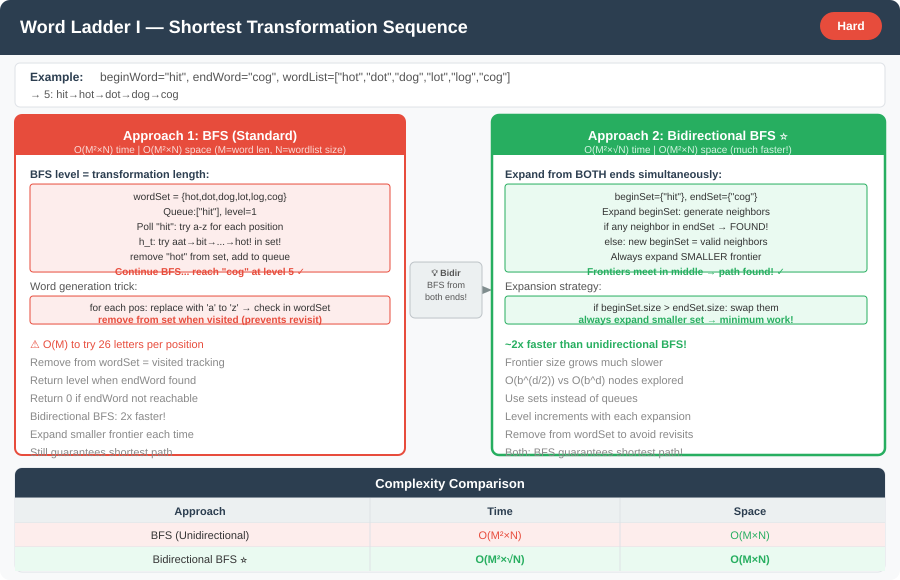

# 🔹 Problem: Word Ladder I




**Difficulty:** Hard 🌳

---

## 🔹 Problem Statement
You are given two words, `beginWord` and `endWord`, and a **dictionary** of words (`wordList`).  
You must find the **length of the shortest transformation sequence** from `beginWord` to `endWord`, such that:

1. Only **one letter can be changed** at a time.
2. Each transformed word must exist in the given word list.

If no such sequence exists, return `0`.

---

## 🔹 Example

Input:

beginWord = "hit"

endWord = "cog"

wordList = ["hot","dot","dog","lot","log","cog"]

Output: 5


**Explanation:**  
The shortest transformation is:  
`"hit" → "hot" → "dot" → "dog" → "cog"`  
Length = 5

---

## 🔹 Intuition
- Treat each word as a **node** in a graph.
- Two nodes are connected if they differ by exactly **one letter**.
- The goal is to find the **shortest path** from `beginWord` to `endWord`.
- BFS is the optimal approach since it finds the shortest path in an **unweighted graph**.

---

## 🔹 Approach (BFS)

1. Add all words from `wordList` into a **HashSet** for O(1) lookup.
2. Use a **queue** for BFS — each element contains a word and its level (transformation depth).
3. For each word, try replacing every character (a–z) to generate possible next words.
4. If a generated word exists in the set:
    - Add it to the queue.
    - Remove it from the set (to avoid revisiting).
5. When `endWord` is reached, return the level count.
6. If BFS completes without finding `endWord`, return `0`.

---

## 🔹 Java Code (BFS)

```java
import java.util.*;

public class WordLadder {

    public static int ladderLength(String beginWord, String endWord, List<String> wordList) {
        Set<String> wordSet = new HashSet<>(wordList);
        if (!wordSet.contains(endWord)) return 0;

        Queue<String> queue = new ArrayDeque<>();
        queue.add(beginWord);
        int level = 1;

        while (!queue.isEmpty()) {
            int size = queue.size();

            for (int i = 0; i < size; i++) {
                String word = queue.poll();
                if (word.equals(endWord)) return level;

                char[] arr = word.toCharArray();

                for (int j = 0; j < arr.length; j++) {
                    char original = arr[j];
                    for (char c = 'a'; c <= 'z'; c++) {
                        if (c == original) continue;
                        arr[j] = c;
                        String nextWord = new String(arr);

                        if (wordSet.contains(nextWord)) {
                            queue.add(nextWord);
                            wordSet.remove(nextWord);
                        }
                    }
                    arr[j] = original;
                }
            }

            level++;
        }

        return 0;
    }

    // Example usage:
    public static void main(String[] args) {
        List<String> wordList = Arrays.asList("hot", "dot", "dog", "lot", "log", "cog");
        System.out.println(ladderLength("hit", "cog", wordList)); // Output: 5
    }
}
```

---

## 🔹 Complexity Analysis

| Approach | Time Complexity | Space Complexity |
|----------|-----------------|-----------------|
| BFS      | O(M × N × 26)  | O(N)            |

- N = number of words in `wordList`
- M = length of each word

---

## 🔹 Edge Cases
- `endWord` not in `wordList` → return 0
- `beginWord` equals `endWord` → return 1
- Empty `wordList` → return 0
- Multiple shortest paths exist → still return **length of shortest path**

---

## 🔹 Follow-Up Questions
1. How would you **optimize for large dictionaries**?
2. Can you implement **bidirectional BFS** to reduce search space?
3. How to **track the actual transformation sequence**, not just length?
4. What if words are of **different lengths**? How would you handle it?
