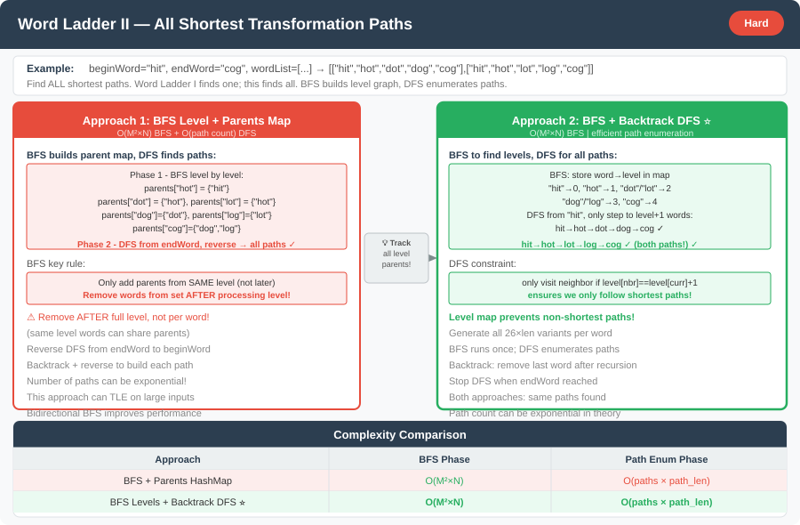

# 🔹 Problem: Word Ladder II




**Difficulty:** Hard 🌵

---

## 🔹 Problem Statement
You are given two words, `beginWord` and `endWord`, and a **dictionary of words** called `wordList`.  
Your task is to find **all the shortest transformation sequences** from `beginWord` to `endWord`, such that:

1. Only **one letter** can be changed at a time.
2. Each transformed word **must exist** in the given `wordList`.
3. Return **all possible shortest transformation sequences** in **lexicographical order**.

If no transformation is possible, return an **empty list**.

---

## 🔹 Example

**Input:**
beginWord = "hit";
endWord = "cog";
wordList = Arrays.asList("hot","dot","dog","lot","log","cog")

Output:

[
  ["hit","hot","dot","dog","cog"],

  ["hit","hot","lot","log","cog"]
]

Explanation:
Both sequences are the shortest (length = 5):

hit → hot → dot → dog → cog

hit → hot → lot → log → cog

---

## 🔹 Intuition
This problem is an extension of **Word Ladder I**, but instead of finding just the shortest transformation length,  
we must return **all shortest transformation sequences**.

The main idea is to use:
- **BFS (Breadth-First Search)** to explore all shortest paths level by level.
- **Backtracking (DFS)** to reconstruct all possible shortest sequences from the BFS traversal.

Each word can be thought of as a **node**, and an edge exists between two words if they differ by exactly one character.  
BFS ensures shortest distance discovery, while DFS reconstructs every valid shortest sequence using parent references.

---

## 🔹 Approach

### 1. BFS Traversal
- Use BFS starting from `beginWord`.
- For each word, generate all valid one-letter transformations that exist in `wordList`.
- Track **parent relationships** using a map — `child -> list of parents`.
- Stop BFS once `endWord` is found to ensure only shortest paths are processed.

### 2. Backtracking
- Use DFS to backtrack from `endWord` to `beginWord` through parent relationships.
- Each path formed during backtracking is a valid shortest transformation sequence.
- Reverse the path before adding it to the final result.

**Time Complexity:** O(N × M × 26)  
**Space Complexity:** O(N × M)

---

## 🔹 Java Code

```java
public class WordLadderII {

    public static List<List<String>> findLadders(String beginWord, String endWord, List<String> wordList) {
        Set<String> wordSet = new HashSet<>(wordList);
        List<List<String>> results = new ArrayList<>();
        if (!wordSet.contains(endWord)) return results;

        Map<String, List<String>> parentMap = new HashMap<>();
        Map<String, Integer> distance = new HashMap<>();

        bfs(beginWord, endWord, wordSet, parentMap, distance);

        List<String> path = new ArrayList<>();
        path.add(endWord);
        backtrack(beginWord, endWord, parentMap, path, results);
        return results;
    }

    private static void bfs(String beginWord, String endWord, Set<String> wordSet,
                            Map<String, List<String>> parentMap, Map<String, Integer> distance) {

        Queue<String> queue = new ArrayDeque<>();
        queue.add(beginWord);
        distance.put(beginWord, 0);

        for (String word : wordSet)
            parentMap.put(word, new ArrayList<>());
        parentMap.put(beginWord, new ArrayList<>());

        while (!queue.isEmpty()) {
            String current = queue.poll();
            int currentDist = distance.get(current);

            for (String neighbor : getNeighbors(current, wordSet)) {
                parentMap.get(neighbor).add(current);

                if (!distance.containsKey(neighbor)) {
                    distance.put(neighbor, currentDist + 1);
                    queue.add(neighbor);
                }
            }
        }
    }

    private static void backtrack(String beginWord, String currentWord,
                                  Map<String, List<String>> parentMap, List<String> path,
                                  List<List<String>> results) {
        if (currentWord.equals(beginWord)) {
            List<String> validPath = new ArrayList<>(path);
            Collections.reverse(validPath);
            results.add(validPath);
            return;
        }

        for (String parent : parentMap.get(currentWord)) {
            path.add(parent);
            backtrack(beginWord, parent, parentMap, path, results);
            path.remove(path.size() - 1);
        }
    }

    private static List<String> getNeighbors(String word, Set<String> wordSet) {
        List<String> neighbors = new ArrayList<>();
        char[] chars = word.toCharArray();

        for (int i = 0; i < chars.length; i++) {
            char original = chars[i];
            for (char c = 'a'; c <= 'z'; c++) {
                if (c == original) continue;
                chars[i] = c;
                String newWord = new String(chars);
                if (wordSet.contains(newWord)) neighbors.add(newWord);
            }
            chars[i] = original;
        }

        return neighbors;
    }
}
```

---

## 🔹 Complexity Analysis

| Approach             | Time Complexity | Space Complexity |
|----------------------|-----------------|------------------|
| BFS + Backtracking   | O(N × M × 26)  | O(N × M)         |

- **N** → number of words in the dictionary
- **M** → length of each word

---

## 🔹 Edge Cases
- `endWord` not in `wordList` → return `[]`
- `beginWord` equals `endWord` → return `[ [beginWord] ]`
- Empty `wordList` → return `[]`
- Multiple shortest sequences → include all
- Duplicate entries in the word list → handle using `Set`

---

## 🔹 Follow-Up Questions
1. Can you optimize BFS using **bidirectional search**?
2. How would you handle a **large dictionary** efficiently?
3. How can the algorithm be modified to return **only one** valid shortest sequence?
4. What changes are needed if **weighted transformations** are introduced?
