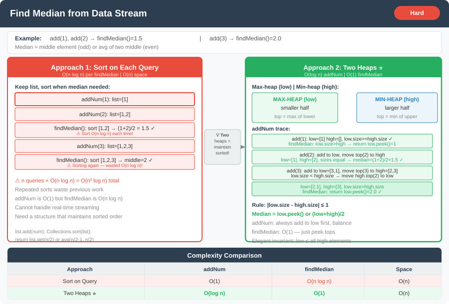

# 🔹 Problem: Find Median from Data Stream




**Difficulty:** Hard ⚡

---

## 🔹 Problem Statement
Design a data structure that supports adding numbers and **finding the median** of the added numbers at any time.

Implement the following methods:
- `void addNum(int num)` → Adds a number to the data structure.
- `double findMedian()` → Returns the median of all elements so far.

**Example:**  

addNum(1)

addNum(2)

findMedian() → 1.5

addNum(3)

findMedian() → 2


---

## 🔹 Intuition
- Median = middle element (or average of two middle elements).
- Use two heaps:
    - **Max-heap** for the lower half
    - **Min-heap** for the upper half
- Balance both heaps so their sizes differ by at most 1.
- Median is:
    - Max of lower half (if sizes differ)
    - Average of both tops (if sizes equal)

---

## 🔹 Approaches

### 1. Brute Force
- Keep all numbers in a list.
- Sort the list whenever `findMedian` is called.
- Return middle element(s).

**Time Complexity:** O(n log n) per `findMedian`  
**Space Complexity:** O(n)

---

### 2. Two Heaps (Optimal)
- Max-heap `low` → stores smaller half
- Min-heap `high` → stores larger half
- When adding a number:
    1. Add to `low`.
    2. Move top of `low` to `high`.
    3. Balance sizes (`low.size() >= high.size()`).
- Median =
    - Top of `low` if `low.size() > high.size()`
    - Average of tops if sizes equal

**Time Complexity:** O(log n) per `addNum`, O(1) per `findMedian`  
**Space Complexity:** O(n)

---

## 🔹 Java Code

```java
import java.util.*;

public class MedianFinder {

    private PriorityQueue<Integer> low;  // Max-heap
    private PriorityQueue<Integer> high; // Min-heap

    public MedianFinder() {
        low = new PriorityQueue<>(Collections.reverseOrder());
        high = new PriorityQueue<>();
    }

    public void addNum(int num) {
        low.offer(num);
        high.offer(low.poll());

        if (low.size() < high.size()) {
            low.offer(high.poll());
        }
    }

    public double findMedian() {
        if (low.size() > high.size()) return low.peek();
        return (low.peek() + high.peek()) / 2.0;
    }

    public static void main(String[] args) {
        MedianFinder mf = new MedianFinder();
        mf.addNum(1);
        mf.addNum(2);
        System.out.println(mf.findMedian()); // 1.5
        mf.addNum(3);
        System.out.println(mf.findMedian()); // 2.0
    }
}
```

---

## 🔹 Complexity Analysis

| Approach            | Time Complexity       | Space Complexity |
|--------------------|---------------------|-----------------|
| Brute Force         | O(n log n) per find | O(n)            |
| Two Heaps           | O(log n) per addNum | O(n)            |
|                     | O(1) per findMedian |                 |

---

## 🔹 Edge Cases
- No numbers added → calling `findMedian()` → undefined / handle separately
- Single number → median = that number
- Even number of elements → median = average of two middle numbers
- Large numbers → heaps handle automatically

---

## 🔹 Follow-Up Questions
1. How would you modify it to **remove numbers** dynamically?
2. Can you implement it using a **balanced BST** instead of heaps?
3. How would you optimize for **streaming data** with memory constraints?
