# High-Level Design: Rate Limiter

**Difficulty:** Medium ⚡  
**Interview duration:** 45–60 min  
**Style:** Conversational mock interview — flows first, then requirements, then scale up component by component.

**Diagrams:** 13 rendered sequence diagrams and flowcharts in `assets/images/high_level_design/` (regenerate: `python3 scripts/render_hld_diagrams.py`).

---

## How to use this doc

Read it like a **mock interview transcript**. The interviewer starts vague; you drive clarification, write flows, lock requirements, then design **small → scale**. Each section adds one box on the diagram and includes the follow-up questions interviewers actually ask.

---

## 0. The opening question

> **Interviewer:** *"Design a rate limiter for our API gateway."*

That is intentionally vague. Do **not** jump to Redis or token buckets yet.

---

## 1. Clarify scope — expected flows first

Start by restating what you heard and asking questions. Interviewers reward candidates who **discover requirements through conversation**.

> **You:** *"Before I draw boxes, I want to make sure I understand who calls this and what happens on a limit breach. Can I walk through the flows I'm imagining?"*

> **Interviewer:** *"Sure."*

### 1.0 End-to-end request decision (overview flowchart)

Draw this first on the whiteboard — every request hits this pipeline before the backend.


### 1.1 Happy path — request allowed

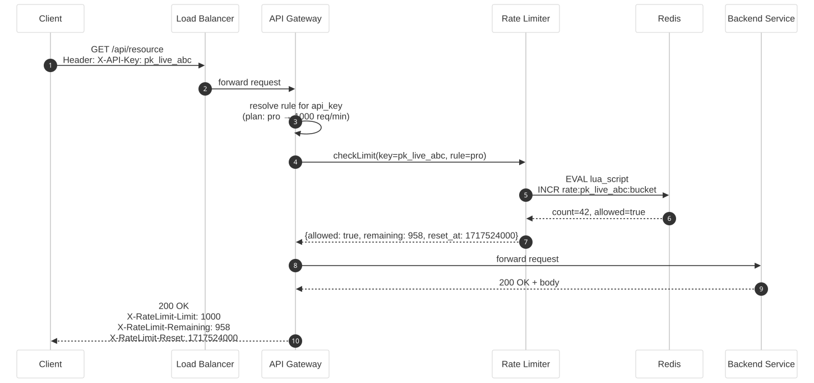

**Steps you narrate on the whiteboard:**

1. Client sends a request with an identity — `user_id`, `api_key`, or `IP`.
2. API (or gateway) asks the rate limiter: *"Is this key within quota?"*
3. Limiter returns **allowed** + optional metadata (`remaining`, `reset_at`).
4. Request proceeds to backend; response may include rate-limit headers.

### 1.2 Reject path — limit exceeded

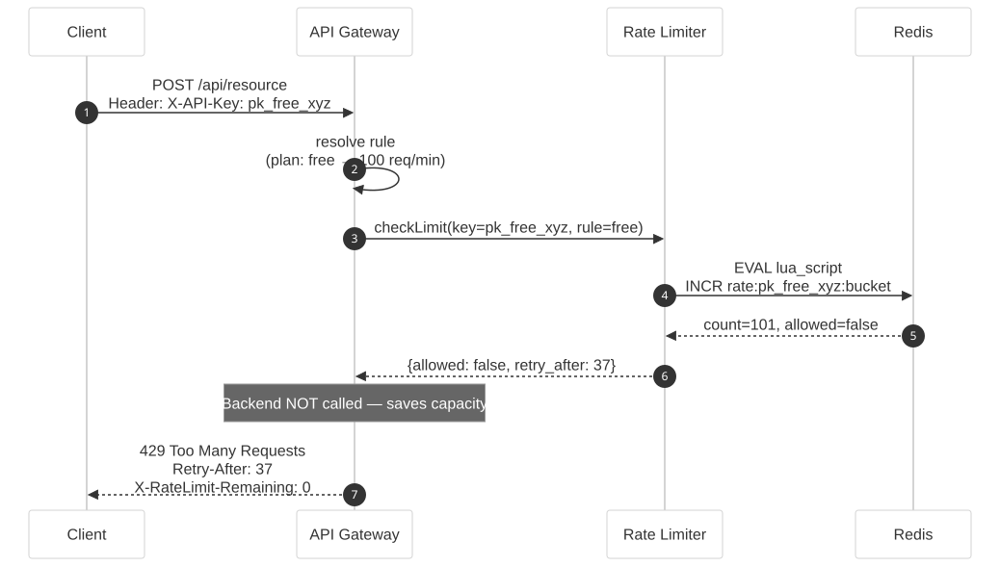

**Steps:**

1. Same check as above.
2. Limiter returns **denied** + `retry_after`.
3. API responds **429** without hitting the backend (saves capacity).

### 1.3 Configuration / admin flow (often skipped at first — mention it)

> **You:** *"Do we need an admin flow to define rules — e.g. free tier 100 req/min, paid tier 10k/min?"*

> **Interviewer:** *"Yes, rules should be configurable without redeploying the gateway."*

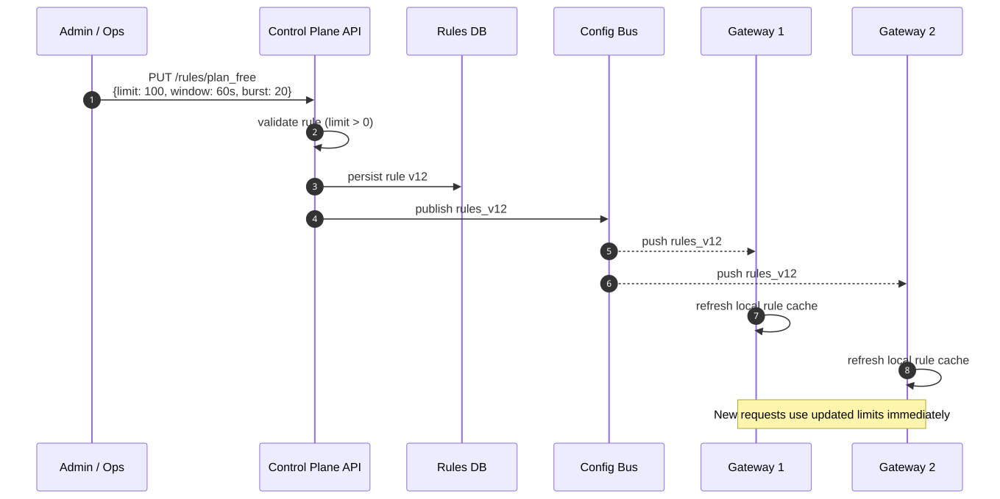

### 1.4 Clarifying questions checklist

| Question | Typical answer | Why it matters |
|----------|----------------|----------------|
| Where does limiting run? | API gateway or sidecar in front of services | Drives deployment model |
| Limit **per what**? | Per user, API key, IP, or endpoint | Defines the **key** |
| Hard reject or queue? | Hard reject (429) | No queue in v1 |
| Distributed or single region? | Multi-region, many gateway instances | Needs shared state |
| Strong accuracy or approximate OK? | "Don't exceed limit by much" | Algorithm choice |
| Sync only or async jobs too? | Sync HTTP for now | Latency budget |

> **Interviewer:** *"Good. Let's say: per API key, hard 429, runs at the gateway, millions of RPS aggregate, rules configurable per plan."*

---

## 2. Functional requirements (FR)

> **You:** *"Let me write functional requirements before the architecture."*

| # | Requirement |
|---|-------------|
| FR1 | Accept or reject each request based on a **rule** (e.g. 100 requests / 60 seconds per API key). |
| FR2 | Return **metadata** on allow: `remaining`, `limit`, `reset_at` (HTTP headers). |
| FR3 | On deny, return **429** with `Retry-After` (seconds). |
| FR4 | Support **multiple rules** — per key, per endpoint, per plan tier. |
| FR5 | Rules are **configurable** at runtime (control plane → data plane). |
| FR6 | **Low latency** on the check path — limiter must not dominate p99. |

---

## 3. Non-functional requirements (NFR)

> **Interviewer:** *"What non-functionals are you optimizing for?"*

| # | Requirement | Target (example) |
|---|-------------|------------------|
| NFR1 | **Availability** | 99.99% — gateway must stay up even if limiter store blips |
| NFR2 | **Latency** | &lt; 5 ms p99 added per check | 
| NFR3 | **Throughput** | 100k+ checks/sec per region |
| NFR4 | **Accuracy** | Don't overshoot limit by &gt; 1–2% under normal load |
| NFR5 | **Consistency** | Eventual consistency OK across regions (slight burst tolerance) |
| NFR6 | **Memory** | Bounded per key; TTL evicts inactive keys |
| NFR7 | **Fairness** | No single hot key should melt one shard |

> **Interviewer:** *"We can tolerate slight overshoot during cross-region races. Favor availability over perfect global counts."*

---

## 4. Back-of-the-envelope

> **You:** *"Quick math to sanity-check storage and QPS."*

- **Traffic:** 1M RPS globally → ~300k RPS per region (3 regions).
- **Keys:** 10M active API keys; only **hot** keys matter for sharding.
- **Storage per key:** counter + window metadata ≈ 16–64 bytes → Redis-style store is fine.
- **Limiter check QPS:** same as API QPS — must be O(1), no heavy coordination per request.

---

## 5. Phase 1 — Single box (one gateway, in-memory)

> **Interviewer:** *"Start simple. One machine."*

> **You:** *"One process, hash map from key → counter. Rule: 100 req/min."*


**Algorithm (fixed window — simplest):**

- Window = current minute `floor(now / 60)`.
- Key = `api_key + window`.
- Increment; if count &gt; 100 → deny.

> **Interviewer:** *"What's wrong with this?"*

> **You:** *"Two problems: (1) **Boundary burst** — 100 at 0:59 and 100 at 1:00 = 200 in two seconds. (2) **Doesn't scale** — multiple gateway instances each have their own map, so effective limit is N × limit."*

That transition is the bridge to Phase 2.

---

## 6. Phase 2 — External store (shared counter)

> **You:** *"Pull state out to a shared store so all gateway instances see the same count."*


### 6.1 Interviewer drill-down: Redis atomic check

> **Interviewer:** *"Why Redis?"*

> **You:** *"Sub-ms latency, atomic `INCR`, TTL for automatic key expiry, mature cluster mode. Each limit key can be `rate:{api_key}:{window}` with EXPIRE."*

> **Interviewer:** *"Race condition on read-modify-write?"*

> **You:** *"Use a single atomic operation — `INCR` + compare to limit in a **Lua script** or Redis transaction so check-and-increment is one round trip."*

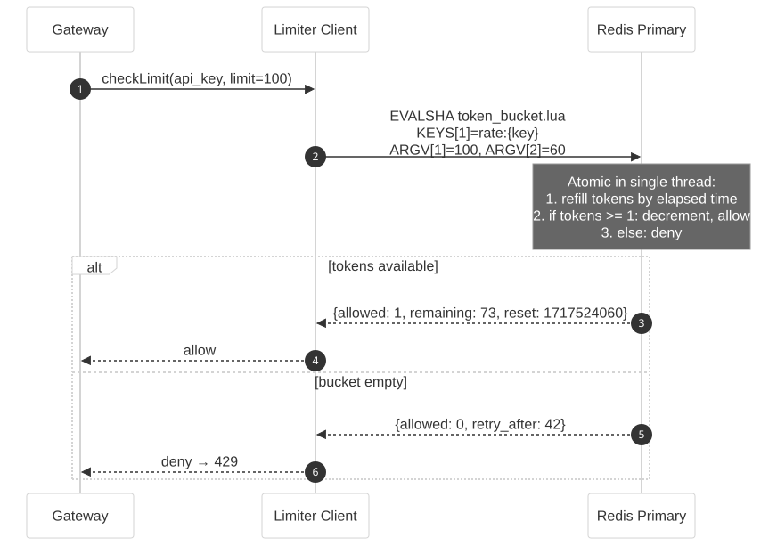

```lua
-- Pseudologic inside Lua
local current = redis.call('INCR', KEYS[1])
if current == 1 then
  redis.call('EXPIRE', KEYS[1], ARGV[2])
end
if current > tonumber(ARGV[1]) then
  return 0  -- deny
end
return 1  -- allow
```

### 6.2 Redis down — fail-open sequence

> **Interviewer:** *"What if Redis is down?"*

> **You:** *"Policy choice: **fail-open** (allow traffic — availability) vs **fail-closed** (reject — safety). For most consumer APIs, fail-open with alerting; for fraud-sensitive endpoints, fail-closed. I'd default fail-open and make it configurable per route."*

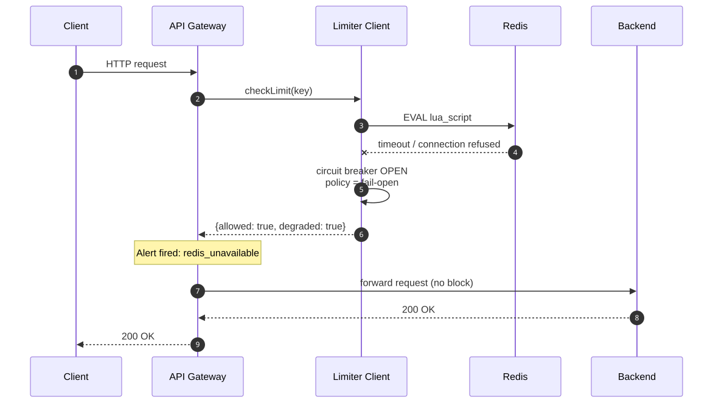

---

## 7. Phase 3 — Pick the algorithm (conversation)

> **Interviewer:** *"Fixed window had a boundary problem. What else?"*

### 7.1 Token bucket flowchart (recommended default)


### 7.2 Algorithm comparison

| Algorithm | Accuracy | Memory | Burst control |
|-----------|----------|--------|---------------|
| Fixed window | Low at edges | O(1) | Bad at boundary |
| Sliding window log | High | O(requests) | Good |
| Sliding window counter | Medium | O(1) | Good |
| Token bucket | Medium | O(1) | **Configurable** |

**Conversation beats:**

> **Interviewer:** *"Sliding window log at millions of keys?"*

> **You:** *"Too heavy for default — memory scales with request count. Maybe for strict tiers only."*

> **Interviewer:** *"So what do you ship?"*

> **You:** *"**Token bucket** for product-facing APIs (bursts feel natural). Mention **sliding window counter** as a stricter alternative."*

---

## 8. Phase 4 — Add the control plane

> **Interviewer:** *"How do rules get to the gateway?"*


**Rule model (example):**

```json
{
  "rule_id": "plan_free",
  "match": { "api_key_prefix": "pk_free_" },
  "algorithm": "token_bucket",
  "limit": 100,
  "window_sec": 60,
  "burst": 20
}
```

> **Interviewer:** *"Gateway caches rules locally?"*

> **You:** *"Yes — in-memory cache with version stamp. On config push, invalidate. If control plane is stale, keep last known good rules (don't block traffic)."*

---

## 9. Phase 5 — Scale Redis (hot keys & sharding)

> **Interviewer:** *"One celebrity API key sends 50k RPS. One Redis key. Problem?"*

> **You:** *"Classic **hot key**. Single shard CPU bound; all gateways hammer one slot."*


**Mitigations (discuss in order):**

1. **Shard by key** — `hash(api_key) % N` spreads normal traffic.
2. **Local token cache (edge counting)** — gateway keeps a small local allowance (e.g. 10 tokens), refills from Redis in batches → fewer remote calls.
3. **Jittered counters** — for extreme hot keys, split into `key:1..key:K` sub-counters; sum on read (approximate).
4. **Dedicated rate limit for known hot tenants** — higher local burst, async sync.

> **Interviewer:** *"Local cache — don't you break global accuracy?"*

> **You:** *"Slightly, yes. We cap local budget to a fraction of the rule (e.g. 10%). Redis remains source of truth for the rest. Trade-off: NFR4 vs NFR2/NFR3."*

---

## 10. Phase 6 — Multi-region

> **Interviewer:** *"We're in US, EU, APAC. One global Redis?"*

> **You:** *"Cross-region Redis adds 100ms+ RTT — violates NFR2. I'd use **per-region limiters** with **regional quota**."*


- Global limit 1000/min → allocate e.g. US 500, EU 300, APAC 200 (by traffic profile).
- **Overshoot** possible if every region maxes out — acceptable per NFR5, or sync sparingly via async aggregate (complex; mention only if asked).

> **Interviewer:** *"User travels US → EU?"*

> **You:** *"They might get a fresh regional budget. For API keys, that's usually fine. For strict global caps, add a optional **global layer** — async counter in a central store checked only on 10% sample or on deny escalation."*

---

## 11. API contract (what you put on the board)

**Internal (gateway → limiter):**

```
checkLimit(key: string, rule_id: string) → { allowed: bool, remaining: int, reset_at: epoch, retry_after?: int }
```

**External (HTTP headers — de facto standard):**

| Header | Meaning |
|--------|---------|
| `X-RateLimit-Limit` | Max requests in window |
| `X-RateLimit-Remaining` | Left in current window |
| `X-RateLimit-Reset` | Unix time when window resets |
| `Retry-After` | Seconds to wait (on 429) |

> **Interviewer:** *"Idempotency?"*

> **You:** *"Retries with same `Idempotency-Key` shouldn't double-charge. Optional: dedupe window in limiter or exclude safe methods — worth a follow-up with product."*

---

## 12. Component-by-component Q&A (rapid fire)

### API Gateway

| Question | Answer |
|----------|--------|
| Limiter in-process or sidecar? | Sidecar / embedded library — same host, no extra hop |
| Sync or async check? | **Sync** on request path |
| Order of middleware? | Auth → rate limit → routing |

### Rate Limiter Service

| Question | Answer |
|----------|--------|
| Separate microservice? | Optional at huge scale; usually **library + Redis** first |
| Batch checks? | Bulk head APIs for GraphQL-style fan-in — optimization |

### Redis

| Question | Answer |
|----------|--------|
| Eviction? | TTL on every key; `allkeys-lru` as safety net |
| Persistence? | Limiters are ephemeral — **no AOF required** for pure counters |
| Replication lag? | Brief overshoot if read from replica — prefer primary for writes |

### Control Plane

| Question | Answer |
|----------|--------|
| Who owns rules? | Product ops / billing plan service |
| Validation? | Prevent limit=0 accidents; audit log on change |

---

## 13. Failure modes & observability

| Failure | Behavior | Detection |
|---------|----------|-----------|
| Redis timeout | Fail-open or fail-closed per route | p99 latency alert |
| Hot key | Elevated shard CPU | per-key QPS metric |
| Config stale | Old rules apply | version mismatch gauge |
| Clock skew | Window drift | NTP monitoring on gateways |

**Metrics to mention:** `rate_limit_allowed_total`, `rate_limit_denied_total`, `redis_check_latency_ms`, `local_cache_hit_ratio`.

**Dashboards:** top denied keys, deny rate by plan, shard heat map.

---

## 14. Final architecture


**One-sentence close:**

> *"Every request hits a gateway with a cached rule set; the gateway does an O(1) token-bucket check against a sharded Redis cluster via atomic Lua; denials return 429 without touching backends; control plane pushes plan rules; we fail-open on store outages and accept slight multi-region overshoot."*

---

## 15. Trade-offs cheat sheet

| Decision | Option A | Option B | When to pick |
|----------|----------|----------|--------------|
| State location | In-memory | Redis | Always Redis multi-instance |
| Algorithm | Token bucket | Sliding window counter | Token bucket if bursts matter |
| Redis down | Fail-open | Fail-closed | Open for availability; closed for abuse |
| Global limit | Regional quotas | Single global Redis | Regional for latency |
| Hot key | Local edge budget | Sub-key sharding | Combine both at scale |
| Accuracy vs cost | Sliding log | Fixed window + token | Token/sliding counter for APIs |

---

## 16. Follow-ups interviewers stack at the end

1. **Design a rate limiter for a webhook sender** (outbound, queue-based) — limit per destination domain.
2. **Distributed leaky bucket across 1000 workers** — centralized Redis vs gossip (mention approximate).
3. **GraphQL** — one HTTP request, 50 resolver calls — limit by **cost / points**, not raw request count.
4. **DDoS from millions of IPs** — rate limit alone isn't enough; add WAF, IP reputation, CAPTCHA (scope creep — acknowledge and refocus on authenticated keys).

---

## 17. Mock interview pacing (45 min)

| Time | You should be here |
|------|-------------------|
| 0–5 min | Clarifying questions + two flows (allow / deny) |
| 5–10 min | FR + NFR on the board |
| 10–15 min | Single-node → shared Redis diagram |
| 15–25 min | Algorithm choice + Lua atomicity |
| 25–35 min | Control plane, sharding, hot keys |
| 35–45 min | Multi-region, failures, metrics, recap |

---

## 18. Diagram index

| Diagram | Type | File |
|---------|------|------|
| Request decision pipeline | Flowchart | `01_flow_request_decision.svg` |
| Happy path (allowed) | Sequence | `01_seq_request_allowed.svg` |
| Reject path (429) | Sequence | `01_seq_request_denied.svg` |
| Admin / config push | Sequence | `01_seq_config_admin.svg` |
| Phase 1 in-memory | Flowchart | `01_flow_phase1_in_memory.svg` |
| Phase 2 shared Redis | Flowchart | `01_flow_phase2_redis.svg` |
| Redis Lua atomic check | Sequence | `01_seq_redis_lua_check.svg` |
| Redis down fail-open | Sequence | `01_seq_redis_down_fail_open.svg` |
| Token bucket algorithm | Flowchart | `01_flow_token_bucket.svg` |
| Control plane | Flowchart | `01_flow_control_plane.svg` |
| Hot key sharding | Flowchart | `01_flow_sharding_hot_keys.svg` |
| Multi-region | Flowchart | `01_flow_multi_region.svg` |
| Final architecture | Flowchart | `01_flow_final_architecture.svg` |

---

*Next in series: [Consistent Hashing](README.md#core-building-blocks) · [URL Shortener](README.md#core-building-blocks)*
