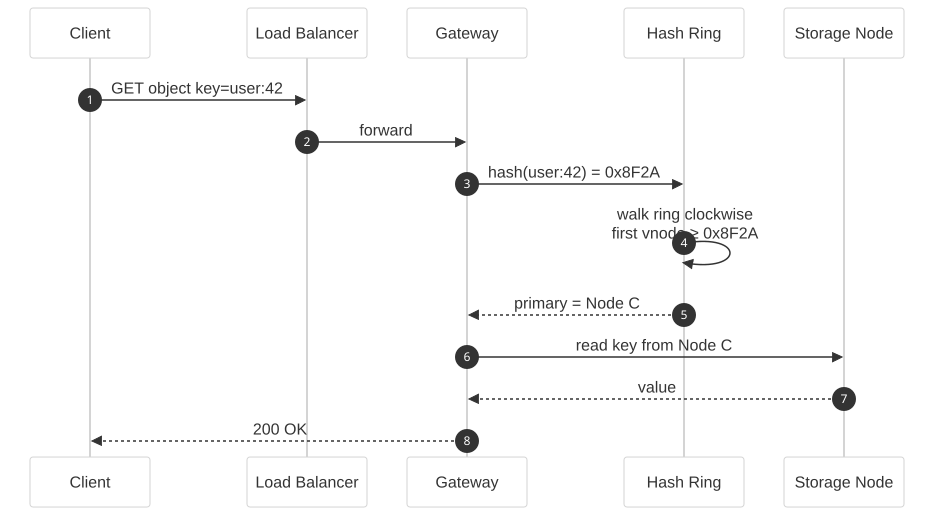
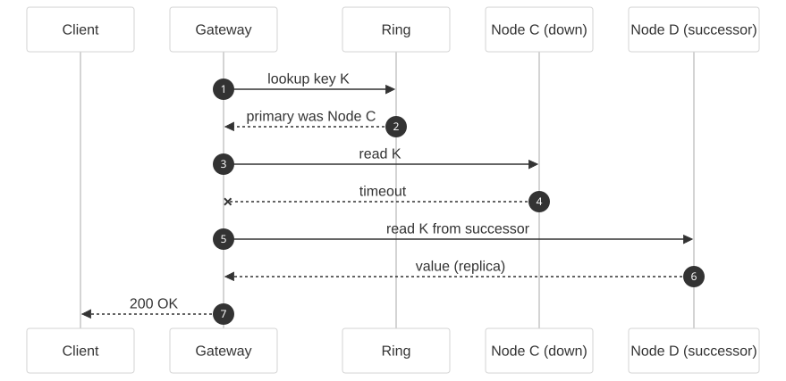

# High-Level Design: Consistent Hashing

**Difficulty:** Medium ⚡  
**Interview duration:** 35–45 min  
**Style:** Conversational mock interview — flows first, then requirements, then scale from naive hashing to a production ring.

**Diagrams:** `assets/images/high_level_design/02_*` (regenerate: `python3 scripts/render_hld_diagrams.py`).

---

## 0. The opening question

> **Interviewer:** *"We need to distribute keys across a cluster of cache nodes. Keys should stay mostly put when we add or remove a server. How would you do it?"*

Do **not** open with "use Redis Cluster" — clarify the problem first.

---

## 1. Clarify scope — expected flows first

> **You:** *"Let me walk through the flows: how a client finds a node for a key, and what happens when the cluster changes size."*

### 1.1 Key lookup (happy path)



1. Client sends `GET key`.
2. Router hashes the key onto a ring.
3. Walk **clockwise** to the first node ≥ hash → that's the **primary owner**.
4. Read/write goes to that node (and replicas if configured).

### 1.2 Node add — rebalance


1. Operator adds Node D.
2. Only keys in ranges **between D's predecessor and D** move to D.
3. Rest of the ring is untouched.

### 1.3 Node remove — failover read



1. Primary node times out.
2. Client/router tries **successor** (next node on ring) for replica data.
3. Background rebalance copies orphaned ranges to successor.

### 1.4 Clarifying questions

| Question | Typical answer | Why it matters |
|----------|----------------|----------------|
| Fixed node list or dynamic? | Dynamic — nodes join/leave | Need membership protocol |
| Replication? | Yes, N replicas clockwise | Lookup returns replica set |
| Who owns the ring? | Every gateway + every node caches view | Gossip or control plane |
| Hot keys? | Virtual nodes + optional app-level sharding | Load balance |

> **Interviewer:** *"Assume dynamic membership, 3 replicas, millions of keys, minimal remapping on scale."*

---

## 2. Functional requirements (FR)

| # | Requirement |
|---|-------------|
| FR1 | Given a key, deterministically map to a **primary node** on the ring. |
| FR2 | On node **add**, only keys in the new node's range are migrated. |
| FR3 | On node **remove**, keys remain available via replicas until rebalanced. |
| FR4 | Support **replication factor** N — return N clockwise successors. |
| FR5 | Cluster **membership** view converges across all nodes. |

---

## 3. Non-functional requirements (NFR)

| # | Requirement | Target |
|---|-------------|--------|
| NFR1 | **Minimal remapping** | ~K/N keys move when one of N nodes changes |
| NFR2 | **Lookup latency** | O(log V) with sorted ring or O(V) with binary search on vnode list |
| NFR3 | **Even load** | Std dev of keys per node within ~10% (virtual nodes) |
| NFR4 | **Availability** | Reads succeed if any replica up |
| NFR5 | **Eventual consistency** on membership | Seconds to converge via gossip |

---

## 4. Phase 1 — Naive modulo hashing (then break it)

> **Interviewer:** *"Simplest approach?"*

> **You:** *"`node = hash(key) % N`."*



> **Interviewer:** *"We go from 3 nodes to 4. What happens?"*

> **You:** *"N changes — **almost every key** remaps. Cache stampedes, mass data migration. Unacceptable at scale."*

That motivates consistent hashing.

---

## 5. Phase 2 — Consistent hashing ring

**Core idea:** Hash nodes and keys onto the same ring (0 … 2^32-1). Key belongs to the **first node ≥ key hash**, wrapping around.

```
hash("user:42") → walk ring → Node C
hash("user:99") → walk ring → Node A
```

**Data structure:** Sorted map of `(vnode_position → physical_node_id)`.

> **Interviewer:** *"How do you find the node?"*

> **You:** *"Binary search on sorted vnode positions — O(log V) where V = virtual node count."*

---

## 6. Phase 3 — Virtual nodes (vnodes)

> **Interviewer:** *"200 keys land on one physical node, 50 on another. Why?"*

> **You:** *"Bad luck on a small ring — uneven arc sizes. Fix: place **many virtual nodes** per physical machine (e.g. 256). Keys spread evenly; remapping is still only ~1/N on node change."*



| Physical nodes | vnodes each | Total ring points |
|----------------|-------------|-------------------|
| 10 | 256 | 2,560 |

---

## 7. Replication on the ring

> **Interviewer:** *"Replication factor 3?"*

> **You:** *"Primary = first node ≥ hash. Replica 1 = next distinct physical node clockwise. Replica 2 = next after that. Skip duplicate physical nodes if a machine owns multiple vnodes."*

**Write path:** coordinator writes to all N replicas (quorum optional — see KV store doc).  
**Read path:** any replica; repair stale copies in background.

---

## 8. Membership & gossip

> **Interviewer:** *"How do nodes learn the ring changed?"*

> **You:** *"**Gossip protocol** (like Cassandra/Dynamo): each node periodically exchanges membership state with random peers. Versioned ring config propagates in O(log N) rounds. Clients refresh ring from any seed node."*

**Alternative:** Central control plane (etcd/ZooKeeper) pushes ring updates — simpler, single point of dependency.

---

## 9. Final architecture



**One-sentence close:**

> *"Keys and nodes share a hash ring with hundreds of vnodes per machine; lookup is binary search + clockwise walk; replication is the next N-1 distinct physical nodes; membership propagates via gossip; adding one node only migrates its arc of keys."*

---

## 10. Component Q&A

| Question | Answer |
|----------|--------|
| What hash function? | MD5/SHA-1 truncated to 32–64 bits — uniform distribution matters more than speed |
| Hot key on ring? | App-level split `key:1`, `key:2` or dedicated cache in front |
| Split brain? | Versioned ring + quorum writes prevent serving from stale ring |
| Bounded load? | Power-of-two choices: check 2 random vnodes, pick lighter load |

---

## 11. Trade-offs

| Decision | Option A | Option B |
|----------|----------|----------|
| Ring state | Gossip (Dynamo) | Central config (simpler) |
| Vnode count | High (256) — even spread | Low (16) — less metadata |
| Remapping | Background copy + dual-read | Stop-the-world migration |
| Hot key | Sub-key sharding | Separate cache tier |

---

## 12. Follow-ups

1. **Dynamo-style consistent hashing with vector clocks** — tie to KV store doc.
2. **Jump consistent hash** — minimal remapping, no vnodes (Google approach).
3. **Rendezvous (HRW) hashing** — no ring, highest random weight wins.

---

*Next: [Key-Value Store (Cassandra-style)](03_key_value_store_hld.md)*
