# High-Level Design: Distributed Key-Value Store (Cassandra-style)

**Difficulty:** Hard 🔥  
**Interview duration:** 45–60 min  
**Style:** Conversational mock interview — write/read flows, quorum math, then Cassandra-like pieces.

**Diagrams:** `assets/images/high_level_design/03_*` (regenerate: `python3 scripts/render_hld_diagrams.py`).

---

## 0. The opening question

> **Interviewer:** *"Design a distributed key-value store like Cassandra — billions of keys, always writable, tunable consistency."*

---

## 1. Clarify scope — expected flows first

> **You:** *"I'll walk through write, read, and what happens when a node is down."*

### 1.1 Write path


1. Client sends `PUT` with consistency `W`.
2. **Coordinator** (any node) hashes key → finds replica set on ring.
3. Writes to all replicas in parallel.
4. Success when **W acks** received.

### 1.2 Read path


1. Client sends `GET` with consistency `R`.
2. Coordinator reads from replicas in parallel.
3. Returns value when **R responses** agree (latest timestamp wins).
4. Optional **read repair** if versions differ.

### 1.3 Node down — hinted handoff


1. Primary replica unavailable.
2. Coordinator writes to next alive replica with a **hint** (intended owner).
3. When primary recovers, hint is delivered — **no write lost**.

### 1.4 Clarifying questions

| Question | Typical answer |
|----------|----------------|
| CAP preference? | **AP** — availability + partition tolerance; tunable C via quorum |
| Data model? | `(key, column) → value` with timestamp; wide rows OK |
| Durability? | Commit log + SSTable on disk (LSM tree) |
| Multi-datacenter? | Yes — per-DC replication factor |

> **Interviewer:** *"AP system, RF=3, users pick W and R per query."*

---

## 2. Functional requirements (FR)

| # | Requirement |
|---|-------------|
| FR1 | `PUT(key, value)` and `GET(key)` over the network. |
| FR2 | **Partition** data across nodes (consistent hashing). |
| FR3 | **Replicate** each key to RF nodes. |
| FR4 | Tunable **W** and **R** per operation. |
| FR5 | **Delete** via tombstone with timestamp. |
| FR6 | Cluster **add/remove** nodes with rebalancing. |

---

## 3. Non-functional requirements (NFR)

| # | Requirement | Target |
|---|-------------|--------|
| NFR1 | **Write availability** | Writes succeed if any replica reachable (with hints) |
| NFR2 | **Read latency** | p99 &lt; 10 ms local DC |
| NFR3 | **Durability** | Survive single node disk loss (RF≥3) |
| NFR4 | **Scale** | Linear horizontal scale — add nodes → more capacity |
| NFR5 | **Throughput** | Millions of ops/sec cluster-wide |

---

## 4. Phase 1 — Single node (then why distribute)

> **Interviewer:** *"Start with one machine."*

> **You:** *"In-memory hash map + optional WAL on disk. Single point of failure, RAM-bound. We shard when data &gt; one machine or QPS &gt; one disk."*

---

## 5. Phase 2 — Partitioning + replication



- **Partitioner:** `murmur3(key) → token` on consistent hash ring ([see doc 02](02_consistent_hashing_hld.md)).
- **Replication:** RF=3 → 3 distinct nodes clockwise from token.
- **Coordinator:** any node can receive client request; acts as coordinator for that key.

---

## 6. Phase 3 — Quorum consistency



| N (RF) | W | R | Behavior |
|--------|---|---|----------|
| 3 | 2 | 2 | Strong — overlapping quorum |
| 3 | 1 | 1 | Fast, eventual — stale reads possible |
| 3 | 3 | 1 | Write-strong |

**Rule:** If `W + R > N`, reads see latest written value.

> **Interviewer:** *"Client wants monotonic reads?"*

> **You:** *"Use `R=2` or read from same coordinator with session token tracking last write time."*

---

## 7. Phase 4 — Storage engine (LSM)

> **Interviewer:** *"Where does the value live on disk?"*

> **You:** *"**LSM tree** (Cassandra/Bigtable model):"*

1. Write → **commit log** (durability) + **memtable** (in-memory sorted map).
2. Memtable flushes → immutable **SSTable** on disk.
3. Background **compaction** merges SSTables, drops tombstones.
4. Read → check memtable, then SSTables (bloom filter skips absent keys).

---

## 8. Phase 5 — Failure handling

### Hinted handoff
Already shown in §1.3 — keeps writes available during brief outages.

### Read repair



Background **anti-entropy repair** (Merkle trees) compares replica checksums and syncs diffs — catches hints that were lost.

### Gossip & failure detection
- Phi accrual failure detector — node marked down after suspicion threshold.
- Gossip spreads state: alive/down, load, schema version.

---

## 9. Multi-datacenter (brief)

> **Interviewer:** *"Two DCs?"*

> **You:** *"**NetworkTopologyStrategy**: RF=3 with 2 replicas local DC + 1 remote. Reads default to local DC (low latency). Cross-DC writes async or `LOCAL_QUORUM` per DC."*

---

## 10. Data model sketch

```
Keyspace: users
  Table: profiles
    Partition key: user_id
    Columns: name, email, updated_at
    Clustering: (column_name) — optional ordering within partition
```

Each cell carries a **timestamp** (vector clock in full Dynamo; Cassandra uses last-write-wins per cell).

---

## 11. API (simplified)

```
PUT /v1/kv/{key}  ?W=2  body={value, timestamp}
GET /v1/kv/{key}  ?R=2
DELETE /v1/kv/{key}
```

---

## 12. Component Q&A

| Component | Interview question | Answer |
|-----------|-------------------|--------|
| Coordinator | Single coordinator bottleneck? | Stateless — any node coordinates; cost is 1 extra hop |
| SSTable | Read amplification? | Bloom filters + partition key index + compaction tiers |
| Tombstone | Delete not visible? | `gc_grace_seconds` — wait before physical delete |
| CAP | Partition happens? | Choose availability — accept conflicting writes, resolve by timestamp |

---

## 13. Trade-offs cheat sheet

| Decision | Cassandra choice | Alternative |
|----------|------------------|-------------|
| Consistency | Tunable quorum | MongoDB primary-secondary |
| Partitioning | Consistent hash ring | Range partitioning (HBase) |
| Storage | LSM (write-optimized) | B-tree (PostgreSQL) |
| Conflict resolution | LWW timestamp | Vector clocks (Dynamo paper) |

**Close:**

> *"Cassandra-style KV: consistent-hash partition, RF replicas, coordinator quorum writes/reads, hinted handoff for availability, LSM for durability, gossip for membership, read repair + compaction for long-term consistency."*

---

## 14. Follow-ups

1. **Dynamo paper differences** — vector clocks, SLURP reconciliation.
2. **Range queries** — partition key design, avoid hot partitions.
3. **Lightweight transactions** — Paxos for compare-and-set (Cassandra LWT).

---

*Prev: [Consistent Hashing](02_consistent_hashing_hld.md) · Next: [Unique ID Generator](04_unique_id_generator_hld.md)*
