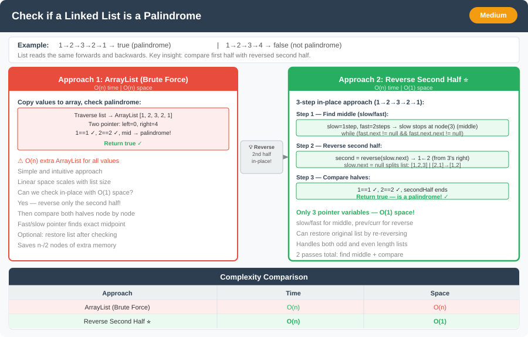

# 🔹 Check if a Linked List is a Palindrome




---

## 📌 Problem Statement
Given the head of a singly linked list, determine whether it is a **palindrome** (i.e., reads the same forward and backward).

---

## 💡 Logic & Intuition
- We need to check if the list reads the same from both directions. To do that:
    1. Find the **middle** with **`slow` / `fast`** using **`while (fast != null && fast.next != null)`** (same as *Middle of Linked List*: second middle when length is even).
    2. Set **`secondHead`** to the start of the right half (**`slow`** if length is even, **`slow.next`** if odd), **reverse** from there, then compare from **`head`** against the reversed list.
    3. (Optional) Restoring the original list in-place is harder without a clean split; often skipped for the check-only version.

---

## 🔹 Approaches

### 1. Brute Force using Extra Space
- Store the list values in an **ArrayList**.
- Check palindrome using **two-pointer technique**.
- **Time Complexity:** O(n)
- **Space Complexity:** O(n)

### 2. Optimal (Reverse Second Half in-place)
- Use **slow / fast** like **Middle of Linked List** (LeetCode 876): **`while (fast != null && fast.next != null)`** — **even** length ends with **`slow`** as the first node of the right half; **odd** length ends with **`fast`** on the last node and **`slow`** on the middle.
- **`secondHead = (fast == null) ? slow : slow.next`**, **`reverse(secondHead)`**, then walk **`head`** and the reversed head in lockstep until the reversed list is exhausted (no explicit split / **`null`** cut needed for the palindrome check).
- **Time Complexity:** O(n)
- **Space Complexity:** O(1)

---

## 💻 Java Code (Both Approaches)

```java
// Approach 1: Brute Force with Extra Space
public static boolean isPalindromeBrute(ListNode head) {
    List<Integer> vals = new ArrayList<>();

    while (head != null) {
        vals.add(head.val);
        head = head.next;
    }

    int left = 0, right = vals.size() - 1;
    while (left < right) {
        if (!vals.get(left).equals(vals.get(right))) return false;
        left++;
        right--;
    }

    return true;
}

// Approach 2: Optimal (Reverse Second Half)
public class PalindromeLinkedList {

    static class ListNode {
        int val;
        ListNode next;
        ListNode(int val) { this.val = val; }
    }

    public static boolean isPalindromeOptimal(ListNode head) {
        if (head == null || head.next == null) return true;

        // Step 1: Find middle (same as Middle of LL: second middle when length is even)
        ListNode slow = head, fast = head;
        while (fast != null && fast.next != null) {
            slow = slow.next;
            fast = fast.next.next;
        }

        ListNode secondHead = (fast == null) ? slow : slow.next;
        ListNode secondHalf = reverse(secondHead);

        ListNode firstHalf = head;
        while (secondHalf != null) {
            if (firstHalf.val != secondHalf.val) return false;
            firstHalf = firstHalf.next;
            secondHalf = secondHalf.next;
        }

        return true;
    }

    private static ListNode reverse(ListNode head) {
        ListNode prev = null;
        while (head != null) {
            ListNode next = head.next;
            head.next = prev;
            prev = head;
            head = next;
        }
        return prev;
    }
}
```

---

## 🔹 Complexity Analysis

| Approach                | Time Complexity | Space Complexity |
|-------------------------|-----------------|------------------|
| Brute Force (ArrayList) | O(n)            | O(n)             |
| Optimal (Reverse Half)  | O(n)            | O(1)             |

---

## 🔹 Edge Cases
- Empty list → return `true`.
- List with **1 node** → return `true`.
- List with **2 nodes** → correctly identifies palindrome or not.

---

## 🔹 Follow-Up Questions
1. Can you restore the list after checking for palindrome **without using extra space**?
2. How would you check palindrome for a **doubly linked list** efficiently?
3. Can you generalize this to check if a list is a **k-palindrome** (removing k nodes to make it palindrome)?  
