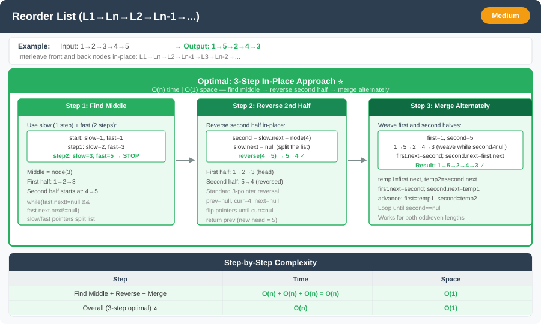

# 🔹 Reorder List




---

## 📌 Problem Statement
Given a singly linked list:

L1 → L2 → … → Ln

Reorder it to:

L1 → Ln → L2 → Ln-1 → L3 → Ln-2 → …


Rearrange the nodes **in-place** without altering the node values.

---

## 💡 Logic & Intuition
- The problem can be broken down into **three subproblems**:
    1. Find the middle with **`slow` / `fast`** using **`while (fast != null && fast.next != null)`** (same as *Middle of Linked List* LeetCode 876 / palindrome). **`secondHead = (fast == null) ? slow : slow.next`** starts the right half.
    2. **Split** before reverse + merge: **even** length — walk **`p` from `head`** until **`p.next == slow`**, then **`p.next = null`**; **odd** — **`slow.next = null`** after **`secondHead`** is fixed. Splitting avoids a **cycle** when weaving (reorder **splices**; palindrome may only compare).
    3. **Reverse** the second half, then **merge** alternately (`L1`, `Ln`, `L2`, …).
- **O(1) extra space**, in-place.

---

## 🔹 Approach (Optimized)
1. **`slow` / `fast`:** **`while (fast != null && fast.next != null)`**; **`secondHead = (fast == null) ? slow : slow.next`**.
2. **Split:** **even** (`fast == null`) — **`p`** from **`head`** until **`p.next == slow`**, **`p.next = null`**; **odd** — **`slow.next = null`**.
3. **Reverse** **`secondHead`**, then **merge** alternately.

**Time Complexity:** O(n)  
**Space Complexity:** O(1)

---

## 💻 Java Code

```java
public static class ListNode {
    int val;
    ListNode next;

    ListNode(int val) {
        this.val = val;
    }
}

public static void reorderList(ListNode head) {
    if (head == null || head.next == null) return;

    // Step 1: Middle (same as Middle of LL / palindrome)
    ListNode slow = head, fast = head;
    while (fast != null && fast.next != null) {
        slow = slow.next;
        fast = fast.next.next;
    }

    // Step 2: Right half + split (required before merge; see Logic)
    ListNode secondHead = (fast == null) ? slow : slow.next;
    if (fast == null) {
        ListNode p = head;
        while (p.next != slow) {
            p = p.next;
        }
        p.next = null;
    } else {
        slow.next = null;
    }

    ListNode second = reverseList(secondHead);

    // Step 3: Merge two halves
    ListNode first = head;
    while (second != null) {
        ListNode temp1 = first.next;
        ListNode temp2 = second.next;

        first.next = second;
        second.next = temp1;

        first = temp1;
        second = temp2;
    }
}

// Helper method to reverse a linked list
private static ListNode reverseList(ListNode head) {
    ListNode prev = null, curr = head;
    while (curr != null) {
        ListNode nextTemp = curr.next;
        curr.next = prev;
        prev = curr;
        curr = nextTemp;
    }
    return prev;
}
```

---

## 🔹 Complexity Analysis

| Step                  | Time Complexity | Space Complexity |
|-----------------------|-----------------|------------------|
| Finding middle        | O(n)            | O(1)             |
| Reversing second half | O(n)            | O(1)             |
| Merging two halves    | O(n)            | O(1)             |
| **Overall**           | **O(n)**        | **O(1)**         |

---

## 🔹 Edge Cases
- Empty list → no changes.
- Single node → list remains the same.
- Two nodes → simply swap order if needed.
- Odd vs even length lists → works for both.

---

## 🔹 Follow-Up Questions
1. How would you **reorder a doubly linked list**?
2. Can this be done **recursively** without using extra space?
3. How would you **reorder only a sublist** from position m to n?


