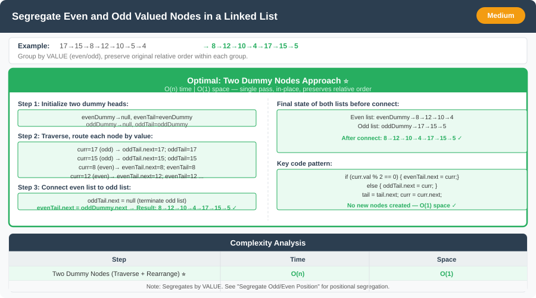

# 🔹 Segregate Even and Odd Valued Nodes in a Linked List




---

## 📌 Problem Statement
Given a singly linked list, segregate all nodes with **even values** before nodes with **odd values**, preserving their **original relative order**.

**Example:**  
Input: `17 → 15 → 8 → 12 → 10 → 5 → 4`  
Output: `8 → 12 → 10 → 4 → 17 → 15 → 5`

---

## 💡 Logic & Intuition
We need to reorder nodes based on their **values**, not their positions.

**Idea:**
- Create two dummy nodes:
    - One for **even values** (`evenDummy`)
    - One for **odd values** (`oddDummy`)
- Traverse the linked list:
    - Append each node to the respective list based on its value.
- Connect the **even list** to the **odd list** at the end.

This ensures:
- **Even nodes come first**
- **Relative order is preserved**
- Modifies the list **in-place** with O(1) extra space.

---

## 🔹 Approaches

### 1. Two Dummy Node Approach (Optimal)
- Maintain `evenDummy` and `oddDummy` as starting points of the two lists.
- Traverse the original list once, distributing nodes accordingly.
- At the end, connect `evenTail.next = oddDummy.next` and terminate the odd list (`oddTail.next = null`).
- **Time Complexity:** O(n)
- **Space Complexity:** O(1) (dummy nodes are negligible)

---

## 💻 Java Code

```java
public class SegregateEvenOddValue {

    static class ListNode {
        int val;
        ListNode next;
        ListNode(int val) {
            this.val = val;
        }
    }

    public static ListNode segregateEvenOdd(ListNode head) {
        if (head == null) return null;

        ListNode evenDummy = new ListNode(0), evenTail = evenDummy;
        ListNode oddDummy = new ListNode(0), oddTail = oddDummy;
        ListNode curr = head;

        while (curr != null) {
            if (curr.val % 2 == 0) {
                evenTail.next = curr;
                evenTail = evenTail.next;
            } else {
                oddTail.next = curr;
                oddTail = oddTail.next;
            }
            curr = curr.next;
        }

        // Terminate the odd list
        oddTail.next = null;
        // Connect even list to odd list
        evenTail.next = oddDummy.next;

        return evenDummy.next;
    }
}
```

---

## 🔹 Complexity Analysis

| Step                 | Time Complexity | Space Complexity |
|----------------------|-----------------|------------------|
| Traversing the list  | O(n)            | O(1)             |
| Rearranging pointers | O(n)            | O(1)             |
| **Overall**          | **O(n)**        | **O(1)**         |

---

## 🔹 Edge Cases
- Empty list → return `null`.
- All nodes are even → no change.
- All nodes are odd → no change.
- Single node → return as is.

---

## 🔹 Follow-Up Questions
1. How would you **modify the list without using dummy nodes**?
2. Can you solve it in **one traversal without separate even/odd tails**?
3. How would this change if the **relative order of odd nodes didn’t matter**?
