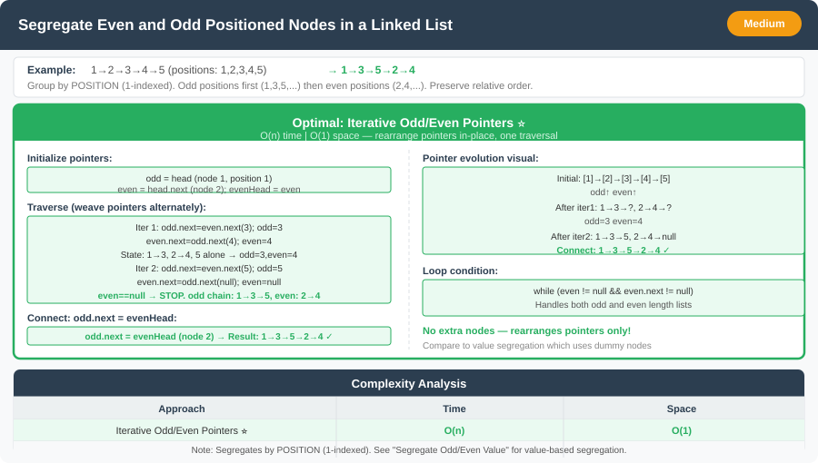

# 🔹 Segregate Even and Odd Positioned Nodes in a Linked List




---

## 📌 Problem Statement
Given a singly linked list, group all nodes at **odd positions** together, followed by nodes at **even positions**.

- **Note:** Position is **1-based index**, not value.

**Example:**  
Input: `1 → 2 → 3 → 4 → 5`  
Output: `1 → 3 → 5 → 2 → 4`

---

## 💡 Logic & Intuition
- Use two pointers:
    - `odd` → to build the list of odd-positioned nodes.
    - `even` → to build the list of even-positioned nodes.
- Maintain a reference to the head of the even list (`evenHead`) to connect at the end.
- Traverse the list and rearrange pointers **in-place**.

---

## 🔹 Approaches

### 1. Iterative (Optimal)
- Initialize `odd = head` and `even = head.next`.
- Keep `evenHead = even` to attach at the end.
- Traverse while `even != null && even.next != null`:
    - `odd.next = even.next; odd = odd.next`
    - `even.next = odd.next; even = even.next`
- Finally, `odd.next = evenHead`
- **Time Complexity:** O(n)
- **Space Complexity:** O(1)

---

## 💻 Java Code

```java
public class SegregateOddEvenPosition {

    static class ListNode {
        int val;
        ListNode next;
        ListNode(int val) {
            this.val = val;
        }
    }

    public static ListNode oddEvenList(ListNode head) {
        if (head == null || head.next == null) return head;

        ListNode odd = head;
        ListNode even = head.next;
        ListNode evenHead = even;

        while (even != null && even.next != null) {
            odd.next = even.next;
            odd = odd.next;

            even.next = odd.next;
            even = even.next;
        }

        odd.next = evenHead;
        return head;
    }
}
```

---

## 🔹 Complexity Analysis

| Step                 | Time Complexity | Space Complexity |
|----------------------|-----------------|------------------|
| Traversing the list  | O(n)            | O(1)             |
| Rearranging pointers | O(n)            | O(1)             |
| **Overall**          | **O(n)**        | **O(1)**         |

---

## 🔹 Edge Cases
- **Empty list** → return `null`.
- **Single node** → return the same node.
- **Two nodes** → output remains the same.
- All nodes at **odd/even positions only** → list remains unchanged.

---

## 🔹 Follow-Up Questions
1. How would you modify this to **group even-valued nodes first** instead of based on position?
2. Can this approach be extended to **k-groups** instead of just odd/even positions?
3. How would you implement this **recursively** while maintaining relative order?
