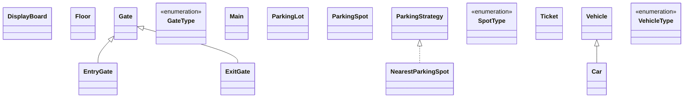

# Low-Level Design: Parking Lot System

**Difficulty:** Medium ⚡  
**Interview duration:** 45–60 min  
**Code status:** ✅ Reference Java included (§3)  
**Companion code:** `LLD/ParkingLot`  

---

## How to present in an interview

Present in this order — interviewers expect **flow first**, then **model**, then **code**:

1. **Core flow** — main use cases as numbered steps (happy path + key branches).
2. **Entities & relationships** — nouns and verbs from the flow; who owns whom.
3. **Reference implementation** — classes that map 1:1 to the model (only after flow is agreed).

Do not open with a class diagram or code dumps before the flow is clear.

---

## 1. Core flow

### 1.1 Vehicle entry

1. Vehicle arrives at an **entry gate**.
2. System picks an available **parking spot** (strategy: nearest / first-free).
3. Spot is marked occupied; **display board** counts are updated.
4. A **ticket** is issued linking vehicle, spot, and entry time.

### 1.2 Vehicle exit

1. Vehicle presents ticket at **exit gate**.
2. System computes fee from duration and vehicle/spot type (extensible).
3. Payment succeeds → spot freed, ticket closed, display board updated.

---

## 2. Entities & relationships

_Deduced from the flows above — each entity should appear in at least one step._

| Entity | Responsibility | Key fields / collaborators |
|--------|----------------|----------------------------|
| **ParkingLot** | Singleton orchestrator | floors, gates, activeTickets, displayBoard, parkingStrategy |
| **Floor** | Groups spots | floorNumber, parkingSpotList |
| **ParkingSpot** | Physical slot | spotType, vehicle, isOccupied |
| **Vehicle / Car** | Parked asset | licenseNumber, vehicleType |
| **Ticket** | Entry proof | ticketId, vehicle, parkingSpot, entryTime |
| **Gate / EntryGate / ExitGate** | Access points | gate id, floor |
| **DisplayBoard** | Availability UI | freeSpots per SpotType |
| **ParkingStrategy** | Spot selection | NearestParkingSpot implementation |

### Relationships

- ParkingLot **1—*** many Floor; Floor **1—*** many ParkingSpot
- Ticket **1—1** Vehicle; Ticket **1—1** ParkingSpot
- ParkingLot uses ParkingStrategy to search across floors

### Design notes

- Strategy pattern for spot assignment
- Singleton for single-lot instance

### Class diagram



---

## 3. Reference implementation (Java)

Companion project: **`LLD/ParkingLot/`**. Copies below for browsing on GitHub (logical order, not A–Z).

**Run locally:**
```bash
cd LLD/ParkingLot
javac src/*.java
java -cp src Main
```

| # | Source |
|---|--------|
| 1 | [`GateType.java`](code/01_parking_lot_system_lld/GateType.java) |
| 2 | [`SpotType.java`](code/01_parking_lot_system_lld/SpotType.java) |
| 3 | [`VehicleType.java`](code/01_parking_lot_system_lld/VehicleType.java) |
| 4 | [`ParkingStrategy.java`](code/01_parking_lot_system_lld/ParkingStrategy.java) |
| 5 | [`Car.java`](code/01_parking_lot_system_lld/Car.java) |
| 6 | [`EntryGate.java`](code/01_parking_lot_system_lld/EntryGate.java) |
| 7 | [`ExitGate.java`](code/01_parking_lot_system_lld/ExitGate.java) |
| 8 | [`NearestParkingSpot.java`](code/01_parking_lot_system_lld/NearestParkingSpot.java) |
| 9 | [`ParkingLot.java`](code/01_parking_lot_system_lld/ParkingLot.java) |
| 10 | [`DisplayBoard.java`](code/01_parking_lot_system_lld/DisplayBoard.java) |
| 11 | [`Floor.java`](code/01_parking_lot_system_lld/Floor.java) |
| 12 | [`Gate.java`](code/01_parking_lot_system_lld/Gate.java) |
| 13 | [`ParkingSpot.java`](code/01_parking_lot_system_lld/ParkingSpot.java) |
| 14 | [`Ticket.java`](code/01_parking_lot_system_lld/Ticket.java) |
| 15 | [`Vehicle.java`](code/01_parking_lot_system_lld/Vehicle.java) |
| 16 | [`Main.java`](code/01_parking_lot_system_lld/Main.java) |

