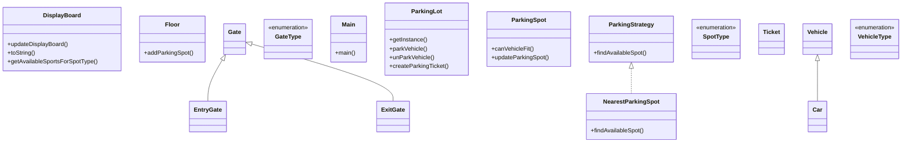

# Low-Level Design: Parking Lot System

**Difficulty:** Medium ⚡  
**Interview duration:** 45–60 min  
**Code status:** ✅ Reference Java included (§3)  
**Companion code:** `LLD/ParkingLot`  

---

## How to present in an interview

Present in this order — interviewers expect **flow first**, then **model**, then **code**:

1. **Core flow** — main use cases as numbered steps (happy path + key branches).
2. **Entities & relationships** — nouns and verbs from the flow; who owns whom.
3. **Reference implementation** — classes that map 1:1 to the model (only after flow is agreed).

Do not open with a class diagram or code dumps before the flow is clear.

---

## 1. Core flow

### 1.1 Vehicle entry

1. Vehicle arrives at an **entry gate**.
2. System picks an available **parking spot** (strategy: nearest / first-free).
3. Spot is marked occupied; **display board** counts are updated.
4. A **ticket** is issued linking vehicle, spot, and entry time.

### 1.2 Vehicle exit

1. Vehicle presents ticket at **exit gate**.
2. System computes fee from duration and vehicle/spot type (extensible).
3. Payment succeeds → spot freed, ticket closed, display board updated.

---

## 2. Entities & relationships

_Deduced from the flows above — each entity should appear in at least one step._

| Entity | Responsibility | Key fields / collaborators |
|--------|----------------|----------------------------|
| **ParkingLot** | Singleton orchestrator | floors, gates, activeTickets, displayBoard, parkingStrategy |
| **Floor** | Groups spots | floorNumber, parkingSpotList |
| **ParkingSpot** | Physical slot | spotType, vehicle, isOccupied |
| **Vehicle / Car** | Parked asset | licenseNumber, vehicleType |
| **Ticket** | Entry proof | ticketId, vehicle, parkingSpot, entryTime |
| **Gate / EntryGate / ExitGate** | Access points | gate id, floor |
| **DisplayBoard** | Availability UI | freeSpots per SpotType |
| **ParkingStrategy** | Spot selection | NearestParkingSpot implementation |

### Relationships

- ParkingLot **1—*** many Floor; Floor **1—*** many ParkingSpot
- Ticket **1—1** Vehicle; Ticket **1—1** ParkingSpot
- ParkingLot uses ParkingStrategy to search across floors

### Design notes

- Strategy pattern for spot assignment
- Singleton for single-lot instance

### Class diagram



---

## 3. Reference implementation (Java)

Reference implementation from **`LLD/ParkingLot/`** (all sources in this file).

Classes in **logical order**: enums → interfaces → domain → strategies → services → `Main`.

**Run:**
```bash
cd LLD/ParkingLot
javac src/*.java
java -cp src Main
```

### `GateType.java`

```java
public enum GateType {
    ENTRY,
    EXIT
}
```

### `SpotType.java`

```java
public enum SpotType {
    SMALL,
    MEDIUM,
    LARGE
}
```

### `VehicleType.java`

```java
public enum VehicleType {
    BIKE,
    CAR,
    TRUCK
}
```

### `ParkingStrategy.java`

```java
import java.util.List;

public interface ParkingStrategy {
    ParkingSpot findAvailableSpot(Vehicle vehicle, List<Floor> floorList);
}
```

### `Car.java`

```java
public class Car extends Vehicle {
    public Car(String vehicleId) {
        super(vehicleId, VehicleType.CAR);
    }
}
```

### `EntryGate.java`

```java
public class EntryGate extends Gate {
    public EntryGate(int lat, int lon) {
        super(lat,lon, GateType.ENTRY);
    }
}
```

### `ExitGate.java`

```java
public class ExitGate extends Gate {
    public ExitGate(int lat, int lon) {
        super(lat, lon, GateType.EXIT);
    }
}
```

### `NearestParkingSpot.java`

```java
import java.util.List;

public class NearestParkingSpot implements ParkingStrategy {
    @Override
    public ParkingSpot findAvailableSpot(Vehicle vehicle, List<Floor> floorList) {
        for (Floor floor : floorList) {
           for(ParkingSpot parkingSpot: floor.parkingSpotList) {
               if(parkingSpot.isFree && parkingSpot.canVehicleFit(vehicle)) {
                   return parkingSpot;
               }
           }
        }
        return null;
    }
}
```

### `ParkingLot.java`

```java
import java.time.LocalDateTime;
import java.util.HashMap;
import java.util.List;
import java.util.Map;

public class ParkingLot {
    private static ParkingLot instance;
    List<Floor> floors;
    Map<String, Ticket> activeTickets;
    DisplayBoard displayBoard;
    Map<String, Gate> entryGateMap;
    Map<String, Gate> exitGateMap;
    ParkingStrategy parkingStrategy;


    private ParkingLot(List<Floor> floors, List<Gate> entryGates, List<Gate> exitGates, ParkingStrategy parkingStrategy) {
        this.floors = floors;
        this.activeTickets = new HashMap<>();
        this.displayBoard = new DisplayBoard();
        for (Floor floor : floors) {
            floor.parkingSpotList.forEach(parkingSpot -> this.displayBoard.freeSpots.put(parkingSpot.spotType, this.displayBoard.freeSpots.getOrDefault(parkingSpot.spotType,0) + 1));
        }
        this.entryGateMap = new HashMap<>();
        for (Gate gate : entryGates) {
            this.entryGateMap.put(gate.id, gate);
        }
        this.exitGateMap = new HashMap<>();
        for (Gate gate : exitGates) {
            this.exitGateMap.put(gate.id, gate);
        }
        this.parkingStrategy = parkingStrategy;
    }

    public static synchronized ParkingLot getInstance(List<Floor> floors, List<Gate> entryGates, List<Gate> exitGates,  ParkingStrategy parkingStrategy) {
        if(instance == null) {
            instance = new ParkingLot(floors, entryGates, exitGates, parkingStrategy);
        }
        return instance;
    }

    Ticket parkVehicle(Vehicle vehicle) {
        ParkingSpot parkingSpot = parkingStrategy.findAvailableSpot(vehicle, floors);
        Ticket ticket = null;
        if(parkingSpot != null) {
            ticket = createParkingTicket(vehicle, parkingSpot);
            parkingSpot.updateParkingSpot(vehicle, true);
            activeTickets.put(ticket.ticketId, ticket);
            displayBoard.updateDisplayBoard(parkingSpot.spotType, true);
        }
        return ticket;
    }

    void unParkVehicle(Ticket ticket) {
        activeTickets.remove(ticket.ticketId);
        ParkingSpot currentSpot = ticket.parkingSpot;
        currentSpot.updateParkingSpot(ticket.vehicle, false);
        displayBoard.updateDisplayBoard(ticket.parkingSpot.spotType,false);
    }

    Ticket createParkingTicket(Vehicle vehicle, ParkingSpot parkingSpot) {
        return new Ticket(vehicle, LocalDateTime.now(),parkingSpot);
    }

    Map<SpotType, Integer> getAllAvailableSpots() {
        return displayBoard.freeSpots;
    }
}
```

### `DisplayBoard.java`

```java
import java.util.HashMap;
import java.util.Map;

public class DisplayBoard {
    Map<SpotType, Integer> freeSpots;

    public DisplayBoard() {
        this.freeSpots = new HashMap<>();
    }

    void updateDisplayBoard(SpotType spotType, boolean hasVehicleEntered) {
        if(hasVehicleEntered) freeSpots.put(spotType, freeSpots.get(spotType) - 1);
        else freeSpots.put(spotType, freeSpots.get(spotType) + 1);
    }

    @Override
    public String toString() {
        return "DisplayBoard{" +
                "freeSpots=" + freeSpots +
                '}';
    }

    int getAvailableSportsForSpotType(SpotType spotType) {
        return freeSpots.get(spotType);
    }
}
```

### `Floor.java`

```java
import java.util.ArrayList;
import java.util.List;

public class Floor {
    int floorNumber;
    List<ParkingSpot> parkingSpotList;

    public Floor(int floorNumber) {
        this.floorNumber = floorNumber;
        parkingSpotList = new ArrayList<>();
    }
    void addParkingSpot(ParkingSpot parkingSpot) {
        parkingSpotList.add(parkingSpot);
    }
}
```

### `Gate.java`

```java
import java.util.UUID;

abstract class Gate {
    String id;
    int lat;
    int lon;
    GateType gatetype;

    public Gate(int lat, int lon, GateType gatetype) {
        this.lat = lat;
        this.id = UUID.randomUUID().toString();
        this.lon = lon;
        this.gatetype = gatetype;
    }
}
```

### `ParkingSpot.java`

```java
import java.util.UUID;

public class ParkingSpot {
    String spotId;
    SpotType spotType;
    Vehicle vehicle;
    boolean isFree;

    public ParkingSpot(SpotType spotType) {
        this.spotType = spotType;
        this.vehicle = null;
        this.isFree = true;
        this.spotId = UUID.randomUUID().toString();
    }

    boolean canVehicleFit(Vehicle vehicle) {
        switch (spotType) {
            case SMALL:
                return vehicle.vehicleType == VehicleType.BIKE;
            case MEDIUM:
                return vehicle.vehicleType == VehicleType.BIKE || vehicle.vehicleType == VehicleType.CAR;
            case LARGE:
                return vehicle.vehicleType == VehicleType.BIKE || vehicle.vehicleType == VehicleType.CAR || vehicle.vehicleType == VehicleType.TRUCK;
            default:
                return false;

        }
    }

    void updateParkingSpot(Vehicle vehicle, boolean hasVehicleEntered) {
        if(hasVehicleEntered) {
            this.isFree = false;
            this.vehicle = vehicle;
        }
        else{
            this.isFree = true;
            this.vehicle = null;

        }
    }
}
```

### `Ticket.java`

```java
import java.time.LocalDateTime;
import java.util.UUID;

public class Ticket {
    String ticketId;
    Vehicle vehicle;
    ParkingSpot parkingSpot;
    LocalDateTime entryTime;
    LocalDateTime exitTime;

    public Ticket(Vehicle vehicle, LocalDateTime entryTime, ParkingSpot parkingSpot) {
        this.ticketId = UUID.randomUUID().toString();
        this.vehicle = vehicle;
        this.parkingSpot = parkingSpot;
        this.entryTime = entryTime;
    }
}
```

### `Vehicle.java`

```java
abstract class Vehicle {
    String vehicleId;
    VehicleType vehicleType;

    public Vehicle(String vehicleId, VehicleType vehicleType) {
        this.vehicleId = vehicleId;
        this.vehicleType = vehicleType;
    }
}
```

### `Main.java`

```java
import java.util.ArrayList;
import java.util.List;

//TIP To <b>Run</b> code, press <shortcut actionId="Run"/> or
// click the <icon src="AllIcons.Actions.Execute"/> icon in the gutter.
public class Main {
    public static void main(String[] args) {
        List<Floor> floorList = new ArrayList<>();
        EntryGate entryGate = new EntryGate(1,1);
        ExitGate exitGate = new ExitGate(2,1);
        for(int i=1;i<=10;i++) {
            Floor floor = new Floor(i);
            if (i < 4) floor.addParkingSpot(new ParkingSpot(SpotType.SMALL));
            else if (i >= 4 && i <= 7) floor.addParkingSpot(new ParkingSpot(SpotType.MEDIUM));
            else floor.addParkingSpot(new ParkingSpot(SpotType.LARGE));
            floorList.add(floor);
        }
        ParkingLot parkingLot = ParkingLot.getInstance(floorList, List.of(entryGate), List.of(exitGate), new NearestParkingSpot());
        System.out.println(parkingLot.getAllAvailableSpots());
        Car car = new Car("1234");
        Ticket t1 = parkingLot.parkVehicle(car);
        parkingLot.parkVehicle(new Car("124"));
        parkingLot.parkVehicle(new Car("125"));
        parkingLot.parkVehicle(new Car("126"));
        parkingLot.parkVehicle(new Car("127"));
        parkingLot.parkVehicle(new Car("128"));
        parkingLot.parkVehicle(new Car("129"));
        parkingLot.parkVehicle(new Car("130"));
        System.out.println(parkingLot.getAllAvailableSpots());
        parkingLot.unParkVehicle(t1);
        System.out.println(parkingLot.getAllAvailableSpots());
        }
}
```

