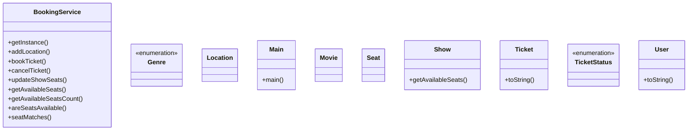

# Low-Level Design: Movie Ticket Booking System

**Difficulty:** Hard 🔥  
**Interview duration:** 60–75 min  
**Code status:** ✅ Reference Java included (§3)  
**Companion code:** `LLD/Movie Ticket Booking System`  

---

## How to present in an interview

Present in this order — interviewers expect **flow first**, then **model**, then **code**:

1. **Core flow** — main use cases as numbered steps (happy path + key branches).
2. **Entities & relationships** — nouns and verbs from the flow; who owns whom.
3. **Reference implementation** — classes that map 1:1 to the model (only after flow is agreed).

Do not open with a class diagram or code dumps before the flow is clear.

---

## 1. Core flow

### 1.1 Book show

1. User searches **movie** in a **city** (Location).
2. User picks a **show** (movie + time + screen layout).
3. User selects **seats**; system locks/checks availability.
4. User pays; **ticket** confirmed with seat map snapshot.

---

## 2. Entities & relationships

_Deduced from the flows above — each entity should appear in at least one step._

| Entity | Responsibility | Key fields / collaborators |
|--------|----------------|----------------------------|
| **User** | Customer | profile, booking history |
| **Movie** | Catalog item | title, genre, metadata |
| **Location** | City / theatre region | cityName |
| **Show** | Screening instance | movie, showTime, seats |
| **Seat / ShowSeat** | Bookable unit | seatNumber, seatType, isAvailable |
| **Ticket** | Confirmed booking | show, seats, status |
| **BookingService** | Use cases | search, hold seats, confirm |

### Relationships

- Location hosts many Show; Show has many Seat
- Ticket aggregates selected Seat(s) for one Show

### Class diagram



---

## 3. Reference implementation (Java)

Reference implementation from **`LLD/Movie Ticket Booking System/`** (all sources in this file).

Classes in **logical order**: enums → interfaces → domain → strategies → services → `Main`.

**Run:**
```bash
cd LLD/Movie Ticket Booking System
javac src/*.java
java -cp src Main
```

### `Genre.java`

```java
public enum Genre {
    HORROR,
    COMEDY,
    DRAMA
}
```

### `TicketStatus.java`

```java
public enum TicketStatus {
    BOOKED,
    CANCELLED,
}
```

### `Location.java`

```java
import java.util.List;

public class Location {
    String cityName;
    List<Show> shows;

    public Location(String cityName, List<Show> shows) {
        this.cityName = cityName;
        this.shows = shows;
    }
}
```

### `Movie.java`

```java
public class Movie {
    String movieName;
    Genre genre;

    public Movie(String movieName, Genre genre) {
        this.movieName = movieName;
        this.genre = genre;
    }
}
```

### `Seat.java`

```java
import java.util.Objects;

public class Seat {
    int row;
    int seatNumber;
    boolean isAvailable;

    public Seat(int row, int seatNumber) {
        this.row = row;
        this.seatNumber = seatNumber;
        this.isAvailable = true;
    }
}
```

### `Show.java`

```java
import java.time.LocalDateTime;
import java.util.List;
import java.util.Map;
import java.util.stream.Collectors;

public class Show {
    Movie movie;
    LocalDateTime startTime;
    List<Seat> showSeats;

    public Show(Movie movie, LocalDateTime startTime, List<Seat> showSeats) {
        this.movie = movie;
        this.startTime = startTime;
        this.showSeats = showSeats;
    }

    List<Seat> getAvailableSeats() {
        return showSeats.stream().filter(seat -> seat.isAvailable).toList();
    }
}
```

### `Ticket.java`

```java
import java.util.List;
import java.util.UUID;

public class Ticket {
    String ticketId;
    User bookedByUser;
    TicketStatus ticketStatus;
    Show show;
    List<Seat> seats;

    public Ticket(User bookedByUser, Show show, List<Seat> seats) {
        this.bookedByUser = bookedByUser;
        this.show = show;
        this.seats = seats;
        this.ticketId = UUID.randomUUID().toString();
        this.ticketStatus = TicketStatus.BOOKED;
    }

    @Override
    public String toString() {
        return "Ticket{" +
                "ticketId='" + ticketId + '\'' +
                ", bookedByUser=" + bookedByUser +
                ", ticketStatus=" + ticketStatus +
                ", show=" + show +
                ", seats=" + seats +
                '}';
    }
}
```

### `User.java`

```java
import java.util.ArrayList;
import java.util.List;

public class User {
    String name;
    List<Ticket> tickets;


    public User(String name) {
        this.name = name;
        this.tickets = new ArrayList<>();
    }

    @Override
    public String toString() {
        return "User{" +
                "name='" + name + '\'' +
                ", tickets=" + tickets +
                '}';
    }
}
```

### `BookingService.java`

```java
import java.util.ArrayList;
import java.util.List;

public class BookingService {
    private static BookingService instance;
    List<Location> locations;

    private BookingService() {
        locations = new ArrayList<>();
    }

    public static BookingService getInstance() {
        if (instance == null) {
            instance = new BookingService();
        }
        return instance;
    }

    void addLocation(Location location) {
        this.locations.add(location);
    }

    Ticket bookTicket(User user, Show show, List<Seat> seatList) {
        if (areSeatsAvailable(show, seatList)) {
            Ticket ticket = new Ticket(user, show, seatList);
            user.tickets.add(ticket);
            updateShowSeats(show, seatList, false);
            return ticket;
        }
        return null;
    }

    void cancelTicket(Ticket ticket) {
        if (ticket != null) {
            for (Seat seat : ticket.show.showSeats) {
                for (Seat s : ticket.seats) {
                    if (seatMatches(s, seat)) {
                        seat.isAvailable = true;
                        break;
                    }
                }
            }
            ticket.ticketStatus = TicketStatus.CANCELLED;
        }
    }


    private void updateShowSeats(Show show, List<Seat> seatList, boolean isCancelled) {
        if (!isCancelled) {
            for (Seat seat : show.showSeats) {
                for (Seat s : seatList) {
                    if (seatMatches(s, seat)) {
                        seat.isAvailable = false;
                        break;
                    }
                }
            }
        }
    }


    List<Seat> getAvailableSeats(Show show) {
        return show.getAvailableSeats();
    }

    int getAvailableSeatsCount(Show show) {
        return show.getAvailableSeats().size();
    }

    private boolean areSeatsAvailable(Show show, List<Seat> seatList) {
        List<Seat> availableSeats = getAvailableSeats(show);
        for (Seat seat : seatList) {
            boolean found = false;
            for (Seat available : availableSeats) {
                if (seatMatches(available, seat)) {
                    found = true;
                    break;
                }
            }
            if (!found) return false;
        }
        return true;
    }


    private boolean seatMatches(Seat a, Seat b) {
        return a.row == b.row && a.seatNumber == b.seatNumber;
    }
}
```

### `Main.java`

```java
import java.time.LocalDateTime;
import java.util.ArrayList;
import java.util.List;

//TIP To <b>Run</b> code, press <shortcut actionId="Run"/> or
// click the <icon src="AllIcons.Actions.Execute"/> icon in the gutter.
public class Main {
    public static void main(String[] args) {
        BookingService bookingService = BookingService.getInstance();
        Movie movie1 = new Movie("Name", Genre.COMEDY);
        Movie movie2 = new Movie("Name1", Genre.DRAMA);
        List<Seat> show1Seats = new ArrayList<>();
        List<Seat> show2Seats = new ArrayList<>();
        for(int i=1;i<=10;i++) {
            for(int j=1;j<=50;j++) {
                Seat seat1 = new Seat(i,j);
                Seat seat2 = new Seat(i,j);
                show1Seats.add(seat1);
                show2Seats.add(seat2);
            }
        }
        Show show1 = new Show(movie1, LocalDateTime.now(),show1Seats);
        Show show2 = new Show(movie2, LocalDateTime.now(),show2Seats);
        bookingService.addLocation(new Location("Bangalore",List.of(show1,show2)));
        System.out.println(bookingService.getAvailableSeatsCount(show1));
        System.out.println(bookingService.getAvailableSeatsCount(show2));
        User user1 = new User("Aman");
        User user2 = new User("Jan");
        User user3 = new User("Daniel");
        Ticket t1 = bookingService.bookTicket(user1,show1, List.of(new Seat(2,34), new Seat(2,35)));
        Ticket t2 = bookingService.bookTicket(user2,show2, List.of(new Seat(2,34), new Seat(2,35)));
        System.out.println(bookingService.getAvailableSeatsCount(show1));
        System.out.println(bookingService.getAvailableSeatsCount(show2));
        Ticket t3 = bookingService.bookTicket(user3,show2, List.of(new Seat(2,34), new Seat(2,35)));
        System.out.println(bookingService.getAvailableSeatsCount(show2));
        bookingService.cancelTicket(t2);
        System.out.println(bookingService.getAvailableSeatsCount(show2));
        Ticket t4 = bookingService.bookTicket(user3,show2, List.of(new Seat(2,34), new Seat(2,35)));
        System.out.println(bookingService.getAvailableSeatsCount(show2));
        System.out.println(t1.ticketStatus);
        System.out.println(t2.ticketStatus);
//        System.out.println(t3.ticketStatus);
        System.out.println(t4.ticketStatus);

    }
}
```

