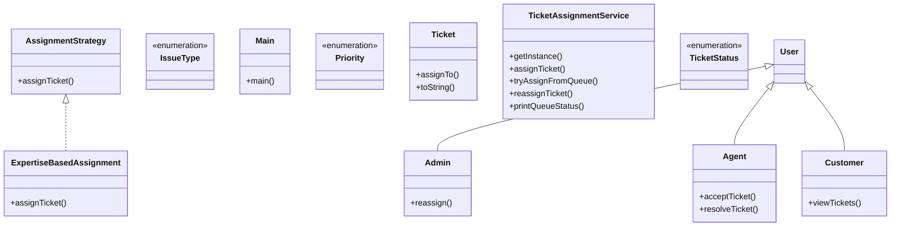

# Low-Level Design: Customer Issue Resolution System

**Difficulty:** Medium ⚡  
**Interview duration:** 45–60 min  
**Code status:** ✅ Reference Java included (§3)  
**Companion code:** `LLD/Customer Issue Resolution System`  

---

## How to present in an interview

Present in this order — interviewers expect **flow first**, then **model**, then **code**:

1. **Core flow** — main use cases as numbered steps (happy path + key branches).
2. **Entities & relationships** — nouns and verbs from the flow; who owns whom.
3. **Reference implementation** — classes that map 1:1 to the model (only after flow is agreed).

Do not open with a class diagram or code dumps before the flow is clear.

---

## 1. Core flow

### 1.1 Ticket lifecycle

1. **Customer** raises a **ticket** (type, priority, description).
2. **TicketAssignmentService** assigns to an **Agent** (strategy: expertise-based).
3. Agent works ticket: OPEN → IN_PROGRESS → RESOLVED.
4. **Admin** can reassign if needed.

---

## 2. Entities & relationships

_Deduced from the flows above — each entity should appear in at least one step._

| Entity | Responsibility | Key fields / collaborators |
|--------|----------------|----------------------------|
| **User** | Base identity | name, email |
| **Customer** | Requester | tickets raised |
| **Agent** | Resolver | expertise, activeTickets, availability |
| **Admin** | Operations | reassign capability |
| **Ticket** | Work item | status, priority, issueType, assignee |
| **AssignmentStrategy** | Routing | ExpertiseBasedAssignment |
| **TicketAssignmentService** | Facade | create, assign, reassign, resolve |

### Relationships

- Customer **1—*** Ticket; Agent **0—*** Ticket (assigned)
- TicketAssignmentService uses AssignmentStrategy

### Class diagram



---

## 3. Reference implementation (Java)

Reference implementation from **`LLD/Customer Issue Resolution System/`** (all sources in this file).

Classes in **logical order**: enums → interfaces → domain → strategies → services → `Main`.

**Run:**
```bash
cd LLD/Customer Issue Resolution System
javac src/*.java
java -cp src Main
```

### `IssueType.java`

```java
public enum IssueType {
    PAYMENT,
    DATA_CORRECTION
}
```

### `Priority.java`

```java
public enum Priority {
    HIGH,
    MEDIUM,
    LOW
}
```

### `TicketStatus.java`

```java
public enum TicketStatus {
    OPEN,
    CLOSED,
    IN_PROGRESS,
    RESOLVED
}
```

### `AssignmentStrategy.java`

```java
import java.util.List;

public interface AssignmentStrategy {
    Agent assignTicket(Ticket ticket, List<Agent> agentList);
}
```

### `Admin.java`

```java
public class Admin extends User {
    public Admin(String name, String email) {
        super(name, email);
    }

    // Convenience method — actual logic lives in TicketAssignmentService
    public void reassign(Ticket ticket, Agent agent, TicketAssignmentService service) {
        service.reassignTicket(ticket, agent, this);
    }
}
```

### `Agent.java`

```java
import java.util.ArrayList;
import java.util.List;

public class Agent extends User {
    List<Ticket> activeTickets;    // ✅ Added
    List<Ticket> resolvedTickets;
    List<IssueType> expertise;
    boolean isAvailable;

    public Agent(String name, String email, List<IssueType> expertise) {
        super(name, email);
        this.activeTickets = new ArrayList<>();
        this.resolvedTickets = new ArrayList<>();
        this.isAvailable = true;
        this.expertise = expertise;
    }

    public void acceptTicket(Ticket ticket) {
        activeTickets.add(ticket);
        ticket.assignTo(this);
        // Mark busy if you want max 1 ticket per agent at a time:
        // this.isAvailable = false;
    }

    // ✅ Agent resolves a ticket — moves it to resolvedTickets
    public void resolveTicket(Ticket ticket, TicketAssignmentService service) {
        if (!activeTickets.contains(ticket)) {
            System.out.println("Ticket not assigned to this agent.");
            return;
        }
        ticket.ticketStatus = TicketStatus.RESOLVED;
        activeTickets.remove(ticket);
        resolvedTickets.add(ticket);
        this.isAvailable = true;
        System.out.println(name + " resolved ticket: " + ticket.id.substring(0, 8));
        // ✅ Try to drain the waiting queue now that agent is free
        service.tryAssignFromQueue(this);
    }
}
```

### `Customer.java`

```java
import java.util.ArrayList;
import java.util.List;

public class Customer extends User {
    List<Ticket> activeTickets;

    public Customer(String name, String email) {
        super(name, email);
        this.activeTickets = new ArrayList<>();
    }

    public void viewTickets() {
        System.out.println("=== Tickets for " + name + " ===");
        activeTickets.forEach(t -> System.out.println("  " + t));
    }
}
```

### `ExpertiseBasedAssignment.java`

```java
import java.util.List;
import java.util.Optional;

public class ExpertiseBasedAssignment implements AssignmentStrategy {
    @Override
    public Agent assignTicket(Ticket ticket, List<Agent> agentList) {
        Optional<Agent> availableAgent = agentList.stream()
                .filter(agent -> agent.isAvailable && agent.expertise.contains(ticket.issueType))
                .findFirst();

        if (availableAgent.isPresent()) {
            Agent agent = availableAgent.get();
            agent.acceptTicket(ticket);   // ✅ Actually assign the ticket
            agent.isAvailable = false;    // ✅ Mark agent busy
            System.out.println("Ticket " + ticket.id.substring(0, 8)
                    + " assigned to agent: " + agent.name);
            return agent;
        }
        return null;
    }
}
```

### `Ticket.java`

```java
import java.time.LocalDateTime;
import java.util.UUID;

public class Ticket {
    String id;
    LocalDateTime createdAt;
    Priority priority;
    String description;
    TicketStatus ticketStatus;
    IssueType issueType;
    User raisedBy;
    Agent assignedAgent; // ✅ Added

    public Ticket(Priority priority, String description, IssueType issueType, User raisedBy) {
        this.priority = priority;
        this.description = description;
        this.createdAt = LocalDateTime.now();
        this.id = UUID.randomUUID().toString();
        this.issueType = issueType;
        this.raisedBy = raisedBy;
        this.ticketStatus = TicketStatus.OPEN;
        this.assignedAgent = null;
    }

    public void assignTo(Agent agent) {
        this.assignedAgent = agent;
        this.ticketStatus = TicketStatus.IN_PROGRESS;
    }

    @Override
    public String toString() {
        return "[Ticket id=" + id.substring(0, 8) + ", issue=" + issueType
                + ", priority=" + priority + ", status=" + ticketStatus
                + ", agent=" + (assignedAgent != null ? assignedAgent.name : "QUEUED") + "]";
    }
}
```

### `User.java`

```java
import java.util.UUID;

abstract class User {
    String name;
    String email;
    String id;

    public User(String name, String email) {
        this.name = name;
        this.email = email;
        this.id = UUID.randomUUID().toString();
    }
}
```

### `TicketAssignmentService.java`

```java
import java.util.LinkedList;
import java.util.List;
import java.util.Queue;

public class TicketAssignmentService {
    private static TicketAssignmentService instance;
    AssignmentStrategy strategy;
    List<Agent> agentList;
    Queue<Ticket> waitingQueue; // ✅ Queue for unassigned tickets

    private TicketAssignmentService(AssignmentStrategy assignmentStrategy, List<Agent> agentList) {
        this.strategy = assignmentStrategy;
        this.agentList = agentList;
        this.waitingQueue = new LinkedList<>();
    }

    public static TicketAssignmentService getInstance(AssignmentStrategy assignmentStrategy, List<Agent> agentList) {
        if (instance == null) {
            instance = new TicketAssignmentService(assignmentStrategy, agentList);
        }
        return instance;
    }

    public Ticket assignTicket(User raisedBy, String description, IssueType issueType, Priority priority) {
        Ticket ticket = new Ticket(priority, description, issueType, raisedBy);

        // Track ticket on customer side
        if (raisedBy instanceof Customer customer) {
            customer.activeTickets.add(ticket);
        }

        Agent agent = strategy.assignTicket(ticket, agentList);
        if (agent == null) {
            // ✅ No agent available — put ticket in waiting queue
            waitingQueue.add(ticket);
            System.out.println("No agent available. Ticket " + ticket.id.substring(0, 8)
                    + " added to waiting queue. Queue size: " + waitingQueue.size());
        }
        return ticket; // always return ticket (never null) so caller can track it
    }

    // ✅ Called when an agent becomes free — try to assign queued tickets
    public void tryAssignFromQueue(Agent freedAgent) {
        if (waitingQueue.isEmpty()) return;

        // Find a queued ticket this agent can handle
        Ticket pending = waitingQueue.stream()
                .filter(t -> freedAgent.expertise.contains(t.issueType) && freedAgent.isAvailable)
                .findFirst()
                .orElse(null);

        if (pending != null) {
            waitingQueue.remove(pending);
            freedAgent.acceptTicket(pending);
            freedAgent.isAvailable = false;
            System.out.println("Queued ticket " + pending.id.substring(0, 8)
                    + " auto-assigned to freed agent: " + freedAgent.name);
        }
    }

    // ✅ Admin can manually reassign a ticket to a specific agent
    public void reassignTicket(Ticket ticket, Agent newAgent, Admin admin) {
        System.out.println("Admin " + admin.name + " reassigning ticket " + ticket.id.substring(0, 8)
                + " to agent: " + newAgent.name);

        // Remove from old agent if assigned
        if (ticket.assignedAgent != null) {
            Agent oldAgent = ticket.assignedAgent;
            oldAgent.activeTickets.remove(ticket);
            oldAgent.isAvailable = true;
        }
        // Remove from queue if waiting
        waitingQueue.remove(ticket);

        newAgent.acceptTicket(ticket);
        newAgent.isAvailable = false;
    }

    public void printQueueStatus() {
        System.out.println("=== Waiting Queue (" + waitingQueue.size() + " tickets) ===");
        waitingQueue.forEach(t -> System.out.println("  " + t));
    }
}
```

### `Main.java`

```java
import java.util.List;

public class Main {
    public static void main(String[] args) {
        // Setup
        Customer customer1 = new Customer("Aman", "aman@gmail.com");
        Customer customer2 = new Customer("Sara", "sara@gmail.com");
        Agent agent1 = new Agent("Ravi", "ravi@company.com", List.of(IssueType.PAYMENT));
        Agent agent2 = new Agent("Priya", "priya@company.com", List.of(IssueType.PAYMENT, IssueType.DATA_CORRECTION));
        Admin admin = new Admin("Manisha", "manisha@company.com");

        TicketAssignmentService service = TicketAssignmentService.getInstance(
                new ExpertiseBasedAssignment(), List.of(agent1, agent2));

        // Ticket 1 — assigned to agent1
        Ticket t1 = service.assignTicket(customer1, "Payment not working", IssueType.PAYMENT, Priority.HIGH);

        // Ticket 2 — assigned to agent2
        Ticket t2 = service.assignTicket(customer2, "Wrong name on account", IssueType.DATA_CORRECTION, Priority.MEDIUM);

        // Ticket 3 — both payment agents busy, goes to queue
        Ticket t3 = service.assignTicket(customer1, "Double charged", IssueType.PAYMENT, Priority.HIGH);

        service.printQueueStatus();
        customer1.viewTickets();

        // Agent1 resolves t1 → auto-picks t3 from queue
        System.out.println("\n--- agent1 resolves ticket 1 ---");
        agent1.resolveTicket(t1, service);

        service.printQueueStatus();
        customer1.viewTickets();

        // Admin reassigns t2 to agent1
        System.out.println("\n--- Admin reassigns t2 ---");
        admin.reassign(t2, agent1, service);
    }
}
```

