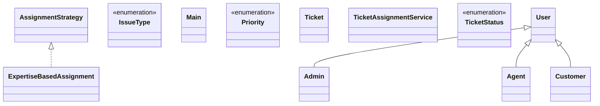

# Low-Level Design: Customer Issue Resolution System

**Difficulty:** Medium ⚡  
**Interview duration:** 45–60 min  
**Code status:** ✅ Reference Java included (§3)  
**Companion code:** `LLD/Customer Issue Resolution System`  

---

## How to present in an interview

Present in this order — interviewers expect **flow first**, then **model**, then **code**:

1. **Core flow** — main use cases as numbered steps (happy path + key branches).
2. **Entities & relationships** — nouns and verbs from the flow; who owns whom.
3. **Reference implementation** — classes that map 1:1 to the model (only after flow is agreed).

Do not open with a class diagram or code dumps before the flow is clear.

---

## 1. Core flow

### 1.1 Ticket lifecycle

1. **Customer** raises a **ticket** (type, priority, description).
2. **TicketAssignmentService** assigns to an **Agent** (strategy: expertise-based).
3. Agent works ticket: OPEN → IN_PROGRESS → RESOLVED.
4. **Admin** can reassign if needed.

---

## 2. Entities & relationships

_Deduced from the flows above — each entity should appear in at least one step._

| Entity | Responsibility | Key fields / collaborators |
|--------|----------------|----------------------------|
| **User** | Base identity | name, email |
| **Customer** | Requester | tickets raised |
| **Agent** | Resolver | expertise, activeTickets, availability |
| **Admin** | Operations | reassign capability |
| **Ticket** | Work item | status, priority, issueType, assignee |
| **AssignmentStrategy** | Routing | ExpertiseBasedAssignment |
| **TicketAssignmentService** | Facade | create, assign, reassign, resolve |

### Relationships

- Customer **1—*** Ticket; Agent **0—*** Ticket (assigned)
- TicketAssignmentService uses AssignmentStrategy

### Class diagram



---

## 3. Reference implementation (Java)

Companion project: **`LLD/Customer Issue Resolution System/`**. Copies below for browsing on GitHub (logical order, not A–Z).

**Run locally:**
```bash
cd LLD/Customer Issue Resolution System
javac src/*.java
java -cp src Main
```

| # | Source |
|---|--------|
| 1 | [`IssueType.java`](code/04_customer_issue_resolution_system_lld/IssueType.java) |
| 2 | [`Priority.java`](code/04_customer_issue_resolution_system_lld/Priority.java) |
| 3 | [`TicketStatus.java`](code/04_customer_issue_resolution_system_lld/TicketStatus.java) |
| 4 | [`AssignmentStrategy.java`](code/04_customer_issue_resolution_system_lld/AssignmentStrategy.java) |
| 5 | [`Admin.java`](code/04_customer_issue_resolution_system_lld/Admin.java) |
| 6 | [`Agent.java`](code/04_customer_issue_resolution_system_lld/Agent.java) |
| 7 | [`Customer.java`](code/04_customer_issue_resolution_system_lld/Customer.java) |
| 8 | [`ExpertiseBasedAssignment.java`](code/04_customer_issue_resolution_system_lld/ExpertiseBasedAssignment.java) |
| 9 | [`Ticket.java`](code/04_customer_issue_resolution_system_lld/Ticket.java) |
| 10 | [`User.java`](code/04_customer_issue_resolution_system_lld/User.java) |
| 11 | [`TicketAssignmentService.java`](code/04_customer_issue_resolution_system_lld/TicketAssignmentService.java) |
| 12 | [`Main.java`](code/04_customer_issue_resolution_system_lld/Main.java) |

