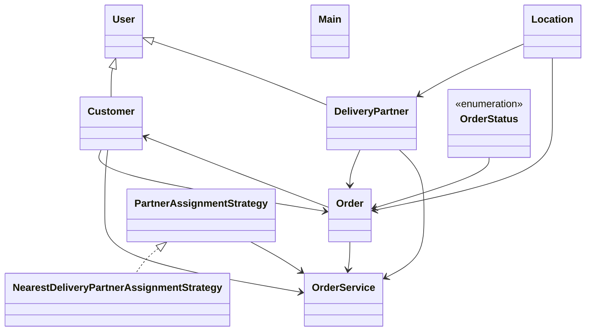

# Low-Level Design: Dunzo / Hyperlocal Delivery

**Difficulty:** Hard 🔥  
**Interview duration:** 60–75 min  
**Code status:** ✅ Reference Java included (§3)  
**Companion code:** `LLD/Dunzo`  

---

## How to present in an interview

Present in this order — interviewers expect **flow first**, then **model**, then **code**:

1. **Core flow** — main use cases as numbered steps (happy path + key branches).
2. **Entities & relationships** — nouns and verbs from the flow; who owns whom.
3. **Reference implementation** — classes that map 1:1 to the model (only after flow is agreed).

Do not open with a class diagram or code dumps before the flow is clear.

---

## 1. Core flow

### 1.1 Deliver parcel

1. Customer creates **order** (pickup → drop **locations**).
2. System assigns nearest free **delivery partner** (strategy).
3. Partner picks up → in transit → delivered; **order status** updates.

---

## 2. Entities & relationships

_Deduced from the flows above — each entity should appear in at least one step._

| Entity | Responsibility | Key fields / collaborators |
|--------|----------------|----------------------------|
| **Customer** | Sender | profile, orders |
| **Order** | Delivery job | pickup, drop, status |
| **Location** | Geo point | lat/long or address |
| **DeliveryPartner** | Courier | location, availability |
| **PartnerAssignmentStrategy** | Matching | nearest partner |
| **OrderService** | Orchestration | place, assign, update status |

### Relationships

- Order **2—** Location (pickup, drop)
- OrderService selects DeliveryPartner via strategy

### Class diagram



---

## 3. Reference implementation (Java)

Companion project: **`LLD/Dunzo/`**. Copies below for browsing on GitHub (logical order, not A–Z).

**Run locally:**
```bash
cd LLD/Dunzo
javac src/*.java
java -cp src Main
```

| # | Source |
|---|--------|
| 1 | [`OrderStatus.java`](code/05_dunzo_delivery_system_lld/OrderStatus.java) |
| 2 | [`PartnerAssignmentStrategy.java`](code/05_dunzo_delivery_system_lld/PartnerAssignmentStrategy.java) |
| 3 | [`Order.java`](code/05_dunzo_delivery_system_lld/Order.java) |
| 4 | [`Customer.java`](code/05_dunzo_delivery_system_lld/Customer.java) |
| 5 | [`DeliveryPartner.java`](code/05_dunzo_delivery_system_lld/DeliveryPartner.java) |
| 6 | [`NearestDeliveryPartnerAssignmentStrategy.java`](code/05_dunzo_delivery_system_lld/NearestDeliveryPartnerAssignmentStrategy.java) |
| 7 | [`Location.java`](code/05_dunzo_delivery_system_lld/Location.java) |
| 8 | [`User.java`](code/05_dunzo_delivery_system_lld/User.java) |
| 9 | [`OrderService.java`](code/05_dunzo_delivery_system_lld/OrderService.java) |
| 10 | [`Main.java`](code/05_dunzo_delivery_system_lld/Main.java) |

