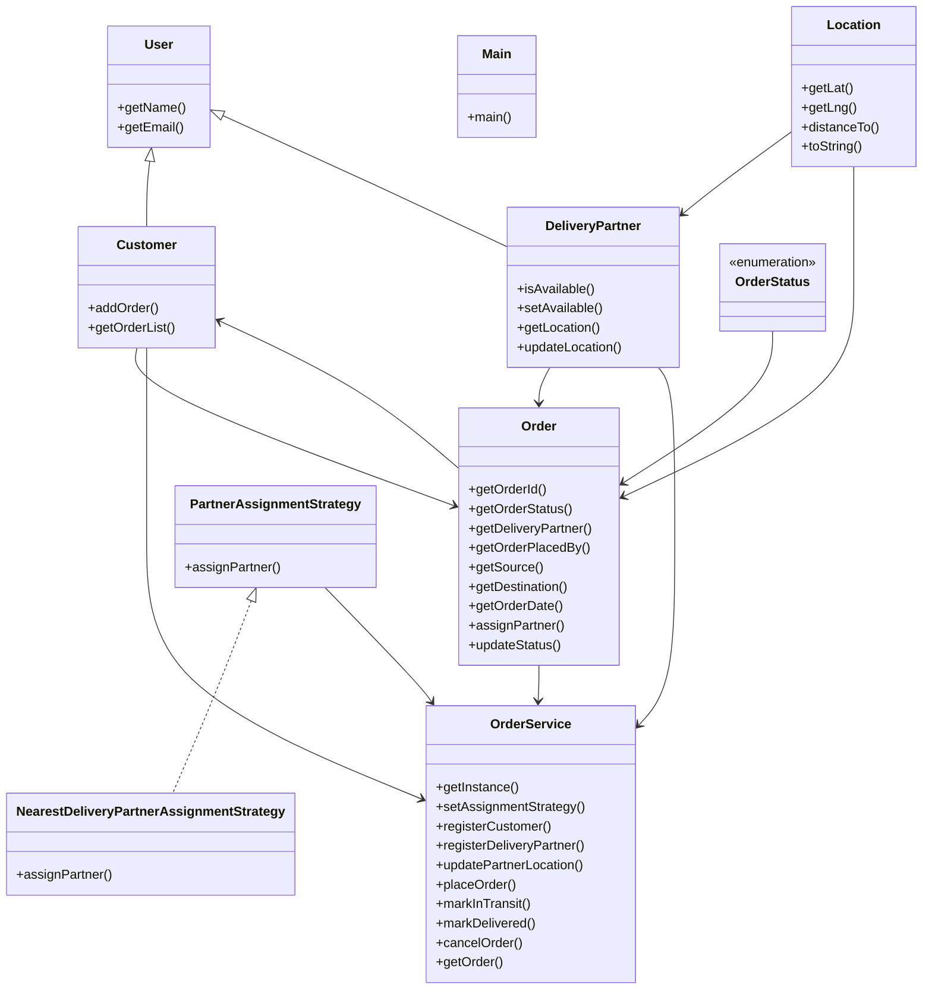

# Low-Level Design: Dunzo / Hyperlocal Delivery

**Difficulty:** Hard 🔥  
**Interview duration:** 60–75 min  
**Code status:** ✅ Reference Java included (§3)  
**Companion code:** `LLD/Dunzo`  

---

## How to present in an interview

Present in this order — interviewers expect **flow first**, then **model**, then **code**:

1. **Core flow** — main use cases as numbered steps (happy path + key branches).
2. **Entities & relationships** — nouns and verbs from the flow; who owns whom.
3. **Reference implementation** — classes that map 1:1 to the model (only after flow is agreed).

Do not open with a class diagram or code dumps before the flow is clear.

---

## 1. Core flow

### 1.1 Deliver parcel

1. Customer creates **order** (pickup → drop **locations**).
2. System assigns nearest free **delivery partner** (strategy).
3. Partner picks up → in transit → delivered; **order status** updates.

---

## 2. Entities & relationships

_Deduced from the flows above — each entity should appear in at least one step._

| Entity | Responsibility | Key fields / collaborators |
|--------|----------------|----------------------------|
| **Customer** | Sender | profile, orders |
| **Order** | Delivery job | pickup, drop, status |
| **Location** | Geo point | lat/long or address |
| **DeliveryPartner** | Courier | location, availability |
| **PartnerAssignmentStrategy** | Matching | nearest partner |
| **OrderService** | Orchestration | place, assign, update status |

### Relationships

- Order **2—** Location (pickup, drop)
- OrderService selects DeliveryPartner via strategy

### Class diagram



---

## 3. Reference implementation (Java)

Reference implementation from **`LLD/Dunzo/`** (all sources in this file).

Classes in **logical order**: enums → interfaces → domain → strategies → services → `Main`.

**Run:**
```bash
cd LLD/Dunzo
javac src/*.java
java -cp src Main
```

### `OrderStatus.java`

```java
public enum OrderStatus {
    BOOKED,
    ASSIGNED,
    IN_TRANSIT,
    DELIVERED,
    CANCELLED
}
```

### `PartnerAssignmentStrategy.java`

```java
import java.util.List;

public interface PartnerAssignmentStrategy {
    DeliveryPartner assignPartner(List<DeliveryPartner> deliveryPartnerList, Order order);
}
```

### `Order.java`

```java
import java.time.LocalDateTime;
import java.util.UUID;

public class Order {
    private final String orderId;
    private OrderStatus orderStatus;
    private DeliveryPartner deliveryPartner;
    private final Customer orderPlacedBy;
    private final Location source;
    private final Location destination;
    private final LocalDateTime orderDate;

    public Order(Customer orderPlacedBy, Location source, Location destination) {
        this.orderPlacedBy = orderPlacedBy;
        this.source = source;
        this.destination = destination;
        this.orderDate = LocalDateTime.now();
        this.orderId = UUID.randomUUID().toString();
        this.orderStatus = OrderStatus.BOOKED;
    }

    public String getOrderId() {
        return orderId;
    }

    public OrderStatus getOrderStatus() {
        return orderStatus;
    }

    public DeliveryPartner getDeliveryPartner() {
        return deliveryPartner;
    }

    public Customer getOrderPlacedBy() {
        return orderPlacedBy;
    }

    public Location getSource() {
        return source;
    }

    public Location getDestination() {
        return destination;
    }

    public LocalDateTime getOrderDate() {
        return orderDate;
    }

    public void assignPartner(DeliveryPartner partner) {
        if (this.orderStatus != OrderStatus.BOOKED) {
            throw new IllegalStateException("Partner can only be assigned when order is BOOKED");
        }
        this.deliveryPartner = partner;
        this.orderStatus = OrderStatus.ASSIGNED;
    }

    public void updateStatus(OrderStatus newStatus) {
        this.orderStatus = newStatus;
    }
}
```

### `Customer.java`

```java
import java.util.ArrayList;
import java.util.Collections;
import java.util.List;

public class Customer extends User {
    private final List<Order> orderList;

    public Customer(String name, String email) {
        super(name, email);
        this.orderList = new ArrayList<>();
    }

    public void addOrder(Order order) {
        this.orderList.add(order);
    }

    public List<Order> getOrderList() {
        return Collections.unmodifiableList(orderList);
    }
}
```

### `DeliveryPartner.java`

```java
public class DeliveryPartner extends User {
    private boolean available;
    private Location location;

    public DeliveryPartner(String name, String email, Location location) {
        super(name, email);
        this.available = true;
        this.location = location;
    }

    public boolean isAvailable() {
        return available;
    }

    public void setAvailable(boolean available) {
        this.available = available;
    }

    public Location getLocation() {
        return location;
    }

    public void updateLocation(Location location) {
        this.location = location;
    }
}
```

### `NearestDeliveryPartnerAssignmentStrategy.java`

```java
import java.util.List;

public class NearestDeliveryPartnerAssignmentStrategy implements PartnerAssignmentStrategy {
    @Override
    public DeliveryPartner assignPartner(List<DeliveryPartner> deliveryPartnerList, Order order) {
        double minDistance = Double.MAX_VALUE;
        DeliveryPartner nearestPartner = null;

        for (DeliveryPartner partner : deliveryPartnerList) {
            if (!partner.isAvailable() || partner.getLocation() == null) {
                continue;
            }

            double dist = partner.getLocation().distanceTo(order.getSource());
            if (dist < minDistance) {
                minDistance = dist;
                nearestPartner = partner;
            }
        }
        return nearestPartner;
    }
}
```

### `Location.java`

```java
public class Location {
    private final double lat;
    private final double lng;

    public Location(double lat, double lng) {
        this.lat = lat;
        this.lng = lng;
    }

    public double getLat() {
        return lat;
    }

    public double getLng() {
        return lng;
    }

    public double distanceTo(Location other) {
        double dLat = other.lat - this.lat;
        double dLng = other.lng - this.lng;
        return Math.sqrt(dLat * dLat + dLng * dLng);
    }

    @Override
    public String toString() {
        return "(" + lat + ", " + lng + ")";
    }
}
```

### `User.java`

```java
public abstract class User {
    private final String name;
    private final String email;

    protected User(String name, String email) {
        if (name == null || name.isBlank()) {
            throw new IllegalArgumentException("Name cannot be empty");
        }
        if (email == null || email.isBlank()) {
            throw new IllegalArgumentException("Email cannot be empty");
        }
        this.name = name;
        this.email = email;
    }

    public String getName() {
        return name;
    }

    public String getEmail() {
        return email;
    }
}
```

### `OrderService.java`

```java
import java.util.ArrayList;
import java.util.HashMap;
import java.util.List;
import java.util.Map;

public class OrderService {
    private static volatile OrderService orderService;

    private final Map<String, Customer> customersByEmail;
    private final Map<String, DeliveryPartner> partnersByEmail;
    private final Map<String, Order> ordersById;
    private PartnerAssignmentStrategy assignmentStrategy;

    private OrderService() {
        this.customersByEmail = new HashMap<>();
        this.partnersByEmail = new HashMap<>();
        this.ordersById = new HashMap<>();
        this.assignmentStrategy = new NearestDeliveryPartnerAssignmentStrategy();
    }

    public static OrderService getInstance() {
        if (orderService == null) {
            synchronized (OrderService.class) {
                if (orderService == null) {
                    orderService = new OrderService();
                }
            }
        }
        return orderService;
    }

    public void setAssignmentStrategy(PartnerAssignmentStrategy assignmentStrategy) {
        this.assignmentStrategy = assignmentStrategy;
    }

    public Customer registerCustomer(String name, String email) {
        Customer customer = new Customer(name, email);
        customersByEmail.put(email, customer);
        return customer;
    }

    public DeliveryPartner registerDeliveryPartner(String name, String email, Location location) {
        DeliveryPartner partner = new DeliveryPartner(name, email, location);
        partnersByEmail.put(email, partner);
        return partner;
    }

    public void updatePartnerLocation(String partnerEmail, Location location) {
        DeliveryPartner partner = getPartnerOrThrow(partnerEmail);
        partner.updateLocation(location);
    }

    public Order placeOrder(String customerEmail, Location source, Location destination) {
        Customer customer = getCustomerOrThrow(customerEmail);

        Order order = new Order(customer, source, destination);
        DeliveryPartner assignedPartner = assignmentStrategy.assignPartner(
                new ArrayList<>(partnersByEmail.values()), order
        );

        if (assignedPartner == null) {
            throw new IllegalStateException("No delivery partner available");
        }

        order.assignPartner(assignedPartner);
        assignedPartner.setAvailable(false);

        ordersById.put(order.getOrderId(), order);
        customer.addOrder(order);

        return order;
    }

    public void markInTransit(String orderId) {
        Order order = getOrderOrThrow(orderId);
        if (order.getOrderStatus() != OrderStatus.ASSIGNED) {
            throw new IllegalStateException("Order must be ASSIGNED to move IN_TRANSIT");
        }
        order.updateStatus(OrderStatus.IN_TRANSIT);
    }

    public void markDelivered(String orderId) {
        Order order = getOrderOrThrow(orderId);
        if (order.getOrderStatus() != OrderStatus.IN_TRANSIT) {
            throw new IllegalStateException("Order must be IN_TRANSIT to mark DELIVERED");
        }
        order.updateStatus(OrderStatus.DELIVERED);
        if (order.getDeliveryPartner() != null) {
            order.getDeliveryPartner().setAvailable(true);
        }
    }

    public void cancelOrder(String orderId) {
        Order order = getOrderOrThrow(orderId);
        if (order.getOrderStatus() == OrderStatus.DELIVERED) {
            throw new IllegalStateException("Delivered order cannot be cancelled");
        }
        order.updateStatus(OrderStatus.CANCELLED);
        if (order.getDeliveryPartner() != null) {
            order.getDeliveryPartner().setAvailable(true);
        }
    }

    public Order getOrder(String orderId) {
        return ordersById.get(orderId);
    }

    public List<Order> getOrdersForCustomer(String customerEmail) {
        return getCustomerOrThrow(customerEmail).getOrderList();
    }

    private Customer getCustomerOrThrow(String customerEmail) {
        Customer customer = customersByEmail.get(customerEmail);
        if (customer == null) {
            throw new IllegalArgumentException("Customer not found: " + customerEmail);
        }
        return customer;
    }

    private DeliveryPartner getPartnerOrThrow(String partnerEmail) {
        DeliveryPartner partner = partnersByEmail.get(partnerEmail);
        if (partner == null) {
            throw new IllegalArgumentException("Delivery partner not found: " + partnerEmail);
        }
        return partner;
    }

    private Order getOrderOrThrow(String orderId) {
        Order order = ordersById.get(orderId);
        if (order == null) {
            throw new IllegalArgumentException("Order not found: " + orderId);
        }
        return order;
    }
}
```

### `Main.java`

```java
public class Main {
    public static void main(String[] args) {
        OrderService service = OrderService.getInstance();

        service.registerCustomer("Aman", "aman@dunzo.com");
        service.registerDeliveryPartner("Ravi", "ravi@dunzo.com", new Location(12.9716, 77.5946));
        service.registerDeliveryPartner("Neha", "neha@dunzo.com", new Location(12.9352, 77.6245));

        Order order = service.placeOrder(
                "aman@dunzo.com",
                new Location(12.9600, 77.6000),
                new Location(12.9900, 77.6500)
        );

        System.out.println("Order ID: " + order.getOrderId());
        System.out.println("Assigned Partner: " + order.getDeliveryPartner().getName());
        System.out.println("Status: " + order.getOrderStatus());

        service.markInTransit(order.getOrderId());
        System.out.println("Status after pickup: " + service.getOrder(order.getOrderId()).getOrderStatus());

        service.markDelivered(order.getOrderId());
        System.out.println("Final Status: " + service.getOrder(order.getOrderId()).getOrderStatus());
    }
}
```

