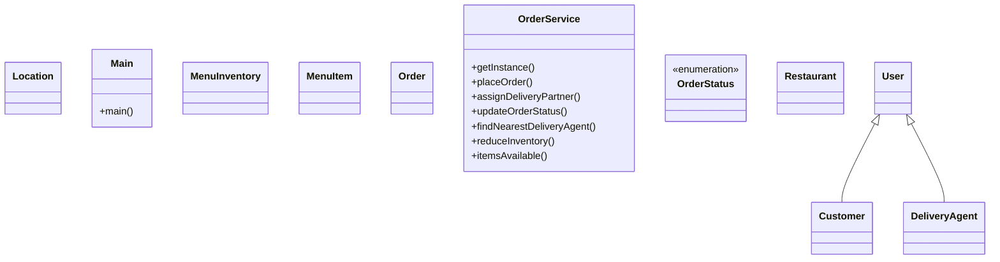

# Low-Level Design: Restaurant Order & Rating (Zomato-style)

**Difficulty:** Hard 🔥  
**Interview duration:** 60–75 min  
**Code status:** ✅ Reference Java included (§3)  
**Companion code:** `LLD/Zomato`  

---

## How to present in an interview

Present in this order — interviewers expect **flow first**, then **model**, then **code**:

1. **Core flow** — main use cases as numbered steps (happy path + key branches).
2. **Entities & relationships** — nouns and verbs from the flow; who owns whom.
3. **Reference implementation** — classes that map 1:1 to the model (only after flow is agreed).

Do not open with a class diagram or code dumps before the flow is clear.

---

## 1. Core flow

### 1.1 Food order

1. User browses **restaurant** menu (**menu items** + inventory).
2. User places **order** with quantities.
3. Kitchen/restaurant accepts; **order status** progresses.
4. Nearest **delivery agent** assigned for fulfillment.

---

## 2. Entities & relationships

_Deduced from the flows above — each entity should appear in at least one step._

| Entity | Responsibility | Key fields / collaborators |
|--------|----------------|----------------------------|
| **User** | Customer | orders history |
| **Restaurant** | Seller | location, menu |
| **MenuItem** | Catalog line | name, price |
| **MenuInventory** | Stock per item | quantity |
| **Order** | Purchase | items, status, agent |
| **DeliveryAgent** | Rider | location, isAvailable |
| **OrderService** | Workflow | place, assign rider, track |

### Relationships

- Restaurant **1—*** MenuItem; Order **1—*** line items
- Order **0—1** DeliveryAgent when out for delivery

### Class diagram



---

## 3. Reference implementation (Java)

Reference implementation from **`LLD/Zomato/`** (all sources in this file).

Classes in **logical order**: enums → interfaces → domain → strategies → services → `Main`.

**Run:**
```bash
cd LLD/Zomato
javac src/*.java
java -cp src Main
```

### `OrderStatus.java`

```java
public enum OrderStatus {
    PICKED_UP,
    DELIVERED,
    BOOKED,
    CANCELLED,
}
```

### `Customer.java`

```java
public class Customer extends User {
    public Customer(String name, String email) {
        super(name, email);
    }
}
```

### `DeliveryAgent.java`

```java
import java.util.UUID;

public class DeliveryAgent extends User {
    Location location;
    boolean isAvailable;
    public DeliveryAgent(String name, String email) {
        super(name, email);
        this.isAvailable = true;
        this.location = null;
    }
}
```

### `Location.java`

```java
public class Location {
    int latitude;
    int longitude;
    public Location(int latitude, int longitude) {}
}
```

### `MenuInventory.java`

```java
import java.util.HashMap;
import java.util.Map;

public class MenuInventory {
    Map<String, Integer> menuStock;
    MenuInventory() {
       menuStock = new HashMap<>();
    }
}
```

### `MenuItem.java`

```java
import java.util.UUID;

public class MenuItem {
    String menuId;
    String name;
    int price;
    public MenuItem(String name, int price) {
        this.name = name;
        this.price = price;
        this.menuId = UUID.randomUUID().toString();
    }
}
```

### `Order.java`

```java
import java.util.Map;
import java.util.UUID;

public class Order {
    String orderId;
    Map<String, Integer> orderDetails;
    Restaurant restaurant;
    DeliveryAgent deliveryAgent;
    OrderStatus orderStatus;
    User orderPlacedBy;

    public Order(Map<String, Integer> orderDetails, User orderPlacedBy, Restaurant restaurant) {
        this.orderDetails = orderDetails;
        this.orderPlacedBy = orderPlacedBy;
        this.orderId = UUID.randomUUID().toString();
        this.orderStatus = OrderStatus.BOOKED;
        this.deliveryAgent = null;
        this.restaurant = restaurant;
    }

}
```

### `Restaurant.java`

```java
import java.util.List;
import java.util.UUID;

public class Restaurant {
    String restaurantName;
    String restaurantId;
    Location location;
    List<MenuItem> menuItems;
    MenuInventory menuInventory;

    public Restaurant(String restaurantName, Location location, List<MenuItem> menuItems, MenuInventory menuInventory) {
        this.restaurantName = restaurantName;
        this.location = location;
        this.menuItems = menuItems;
        this.restaurantId = UUID.randomUUID().toString();
        this.menuInventory = menuInventory;
    }
}
```

### `User.java`

```java
import java.util.UUID;

abstract class User {
    String id;
    String name;
    String email;

    public User(String name, String email) {
        this.name = name;
        this.email = email;
        this.id = UUID.randomUUID().toString();
    }
}
```

### `OrderService.java`

```java
import java.util.HashMap;
import java.util.Map;

public class OrderService {
    private static  OrderService instance;
    int defaultRadius = 5;
    Map<String, Customer> userMap;
    Map<String, Restaurant> restaurantMap;
    Map<String, DeliveryAgent> deliveryAgentMap;
    Map<String, Order> orderMap;
    private OrderService() {
        userMap = new HashMap<>();
        restaurantMap = new HashMap<>();
        deliveryAgentMap = new HashMap<>();
        orderMap = new HashMap<>();
    }
    public static OrderService getInstance() {
        if (instance == null) {
            instance = new OrderService();
        }
        return instance;
    }

    Order placeOrder(Map<String, Integer> orderItems, User placedBy, Restaurant restaurant) {
        if(itemsAvailable(orderItems, restaurant)) {
            Order order = new Order(orderItems, placedBy, restaurant);
            orderMap.put(order.orderId, order);
            reduceInventory(orderItems, restaurant);
            return order;
        }
        return null;
    }

    DeliveryAgent assignDeliveryPartner(Order order) {
        Location restaurantLocation = order.restaurant.location;
        DeliveryAgent deliveryAgent = findNearestDeliveryAgent(deliveryAgentMap,defaultRadius, restaurantLocation);
        if(deliveryAgent != null) {
            updateOrderStatus(order, deliveryAgent, OrderStatus.PICKED_UP);
            deliveryAgent.isAvailable = false;
            return deliveryAgent;
        }
        return null;
    }


    private void updateOrderStatus(Order order, DeliveryAgent deliveryAgent, OrderStatus orderStatus) {
        order.orderStatus = orderStatus;
        order.deliveryAgent = deliveryAgent;
    }

    private DeliveryAgent findNearestDeliveryAgent(Map<String,DeliveryAgent> deliveryAgentMap, int defaultRadius, Location restaurantLocation) {
        for(DeliveryAgent deliveryAgent : deliveryAgentMap.values()) {
            if(deliveryAgent.isAvailable) return deliveryAgent;
        }
        return null;
    }

    private void reduceInventory(Map<String, Integer> orderItems, Restaurant restaurant) {
        for (Map.Entry<String, Integer> entry : orderItems.entrySet()) {
            String menuId = entry.getKey();
            int quantity = entry.getValue();
            restaurant.menuInventory.menuStock.put(menuId, restaurant.menuInventory.menuStock.get(menuId) - quantity);
        }
    }

    private boolean itemsAvailable(Map<String, Integer> orderItems, Restaurant restaurant) {
        for (Map.Entry<String, Integer> entry : orderItems.entrySet()) {
            String menuItemId = entry.getKey();
            int quantity = entry.getValue();
            int inventory = restaurant.menuInventory.menuStock.getOrDefault(menuItemId, 0);
            if(inventory - quantity < 0) {
                return false;
            }
        }
        return true;
    }
}
```

### `Main.java`

```java
import java.util.ArrayList;
import java.util.HashMap;
import java.util.List;
import java.util.Map;

public class Main {
    public static void main(String[] args) {
        OrderService orderService = OrderService.getInstance();
        Customer customer = new Customer("aman", "jaiswal");
        orderService.userMap.put(customer.id,  customer);
        DeliveryAgent deliveryAgent1 = new DeliveryAgent("ravi", "jaiswal");
        DeliveryAgent deliveryAgent2 = new DeliveryAgent("kishan", "jaiswal");
        orderService.deliveryAgentMap.put(deliveryAgent1.id, deliveryAgent1);
        orderService.deliveryAgentMap.put(deliveryAgent2.id, deliveryAgent2);
        MenuItem rice = new MenuItem("Rice", 100);
        MenuItem dal = new MenuItem("Dal", 50);
        MenuItem chicken = new MenuItem("Chicken", 300);
        List<MenuItem> menuItems = new ArrayList<>();
        menuItems.add(rice);
        menuItems.add(dal);
        menuItems.add(chicken);
        MenuInventory menuInventory = new MenuInventory();
        menuInventory.menuStock.put(rice.menuId,10);
        menuInventory.menuStock.put(dal.menuId,20);
        menuInventory.menuStock.put(chicken.menuId,30);
        Restaurant restaurant = new Restaurant("Dhaba", new Location(1,1),menuItems, menuInventory);
        Map<String, Integer> orderItems = new HashMap<>();
        orderItems.put(rice.menuId, 4);
        orderItems.put(dal.menuId, 4);
        Order order = orderService.placeOrder(orderItems, customer, restaurant);
        Map<String, Integer> orderItems1 = new HashMap<>();
        orderItems1.put(rice.menuId, 4);
        orderItems1.put(dal.menuId, 4);
        Map<String, Integer> orderItems2 = new HashMap<>();
        orderItems2.put(rice.menuId, 2);
        orderItems2.put(dal.menuId, 2);
        Order order1 = orderService.placeOrder(orderItems1, customer, restaurant);
        Order order2 = orderService.placeOrder(orderItems2, customer, restaurant);
        System.out.println(order.orderStatus);
        System.out.println(order1.orderStatus);
        System.out.println(order2.orderStatus);
        orderService.assignDeliveryPartner(order);
        orderService.assignDeliveryPartner(order1);
        orderService.assignDeliveryPartner(order2);
        System.out.println(order.orderStatus);
        System.out.println(order1.orderStatus);
        System.out.println(order2.orderStatus);
    }
}
```

