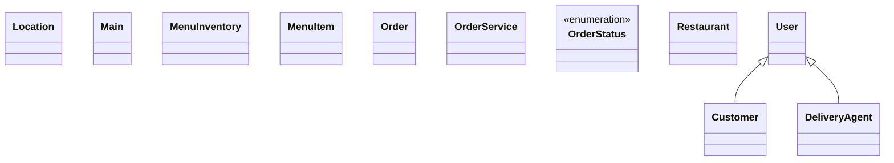

# Low-Level Design: Restaurant Order & Rating (Zomato-style)

**Difficulty:** Hard 🔥  
**Interview duration:** 60–75 min  
**Code status:** ✅ Reference Java included (§3)  
**Companion code:** `LLD/Zomato`  

---

## How to present in an interview

Present in this order — interviewers expect **flow first**, then **model**, then **code**:

1. **Core flow** — main use cases as numbered steps (happy path + key branches).
2. **Entities & relationships** — nouns and verbs from the flow; who owns whom.
3. **Reference implementation** — classes that map 1:1 to the model (only after flow is agreed).

Do not open with a class diagram or code dumps before the flow is clear.

---

## 1. Core flow

### 1.1 Food order

1. User browses **restaurant** menu (**menu items** + inventory).
2. User places **order** with quantities.
3. Kitchen/restaurant accepts; **order status** progresses.
4. Nearest **delivery agent** assigned for fulfillment.

---

## 2. Entities & relationships

_Deduced from the flows above — each entity should appear in at least one step._

| Entity | Responsibility | Key fields / collaborators |
|--------|----------------|----------------------------|
| **User** | Customer | orders history |
| **Restaurant** | Seller | location, menu |
| **MenuItem** | Catalog line | name, price |
| **MenuInventory** | Stock per item | quantity |
| **Order** | Purchase | items, status, agent |
| **DeliveryAgent** | Rider | location, isAvailable |
| **OrderService** | Workflow | place, assign rider, track |

### Relationships

- Restaurant **1—*** MenuItem; Order **1—*** line items
- Order **0—1** DeliveryAgent when out for delivery

### Class diagram



---

## 3. Reference implementation (Java)

Companion project: **`LLD/Zomato/`**. Copies below for browsing on GitHub (logical order, not A–Z).

**Run locally:**
```bash
cd LLD/Zomato
javac src/*.java
java -cp src Main
```

| # | Source |
|---|--------|
| 1 | [`OrderStatus.java`](code/06_restaurant_order_rating_system_lld/OrderStatus.java) |
| 2 | [`Customer.java`](code/06_restaurant_order_rating_system_lld/Customer.java) |
| 3 | [`DeliveryAgent.java`](code/06_restaurant_order_rating_system_lld/DeliveryAgent.java) |
| 4 | [`Location.java`](code/06_restaurant_order_rating_system_lld/Location.java) |
| 5 | [`MenuInventory.java`](code/06_restaurant_order_rating_system_lld/MenuInventory.java) |
| 6 | [`MenuItem.java`](code/06_restaurant_order_rating_system_lld/MenuItem.java) |
| 7 | [`Order.java`](code/06_restaurant_order_rating_system_lld/Order.java) |
| 8 | [`Restaurant.java`](code/06_restaurant_order_rating_system_lld/Restaurant.java) |
| 9 | [`User.java`](code/06_restaurant_order_rating_system_lld/User.java) |
| 10 | [`OrderService.java`](code/06_restaurant_order_rating_system_lld/OrderService.java) |
| 11 | [`Main.java`](code/06_restaurant_order_rating_system_lld/Main.java) |

