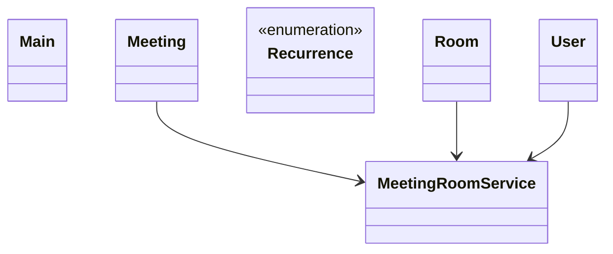

# Low-Level Design: Meeting Scheduler

**Difficulty:** Medium ⚡  
**Interview duration:** 45–60 min  
**Code status:** ✅ Reference Java included (§3)  
**Companion code:** `LLD/MeetingScheduler`  

---

## How to present in an interview

Present in this order — interviewers expect **flow first**, then **model**, then **code**:

1. **Core flow** — main use cases as numbered steps (happy path + key branches).
2. **Entities & relationships** — nouns and verbs from the flow; who owns whom.
3. **Reference implementation** — classes that map 1:1 to the model (only after flow is agreed).

Do not open with a class diagram or code dumps before the flow is clear.

---

## 1. Core flow

### 1.1 Schedule meeting

1. Organizer defines **meeting** (time range, recurrence, participants).
2. System checks **room** and attendee **calendars** for conflicts.
3. On success, room booked and meeting marked active.
4. Cancel/reschedule frees the room slot.

---

## 2. Entities & relationships

_Deduced from the flows above — each entity should appear in at least one step._

| Entity | Responsibility | Key fields / collaborators |
|--------|----------------|----------------------------|
| **User** | Participant | name, meetings list |
| **Meeting** | Event | start, end, recurrence, participants, room |
| **Room** | Resource | capacity, bookings |
| **Recurrence** | Repeat rule | NONE, DAILY, WEEKLY, … |
| **MeetingRoomService** | Singleton scheduler | create, conflict check, cancel |

### Relationships

- Meeting **1—1** Room; Meeting ***—*** User participants
- MeetingRoomService owns conflict detection across rooms/users

### Class diagram



---

## 3. Reference implementation (Java)

Companion project: **`LLD/MeetingScheduler/`**. Copies below for browsing on GitHub (logical order, not A–Z).

**Run locally:**
```bash
cd LLD/MeetingScheduler
javac src/*.java
java -cp src Main
```

| # | Source |
|---|--------|
| 1 | [`Recurrence.java`](code/07_meeting_scheduler_lld/Recurrence.java) |
| 2 | [`Meeting.java`](code/07_meeting_scheduler_lld/Meeting.java) |
| 3 | [`Room.java`](code/07_meeting_scheduler_lld/Room.java) |
| 4 | [`User.java`](code/07_meeting_scheduler_lld/User.java) |
| 5 | [`MeetingRoomService.java`](code/07_meeting_scheduler_lld/MeetingRoomService.java) |
| 6 | [`Main.java`](code/07_meeting_scheduler_lld/Main.java) |

