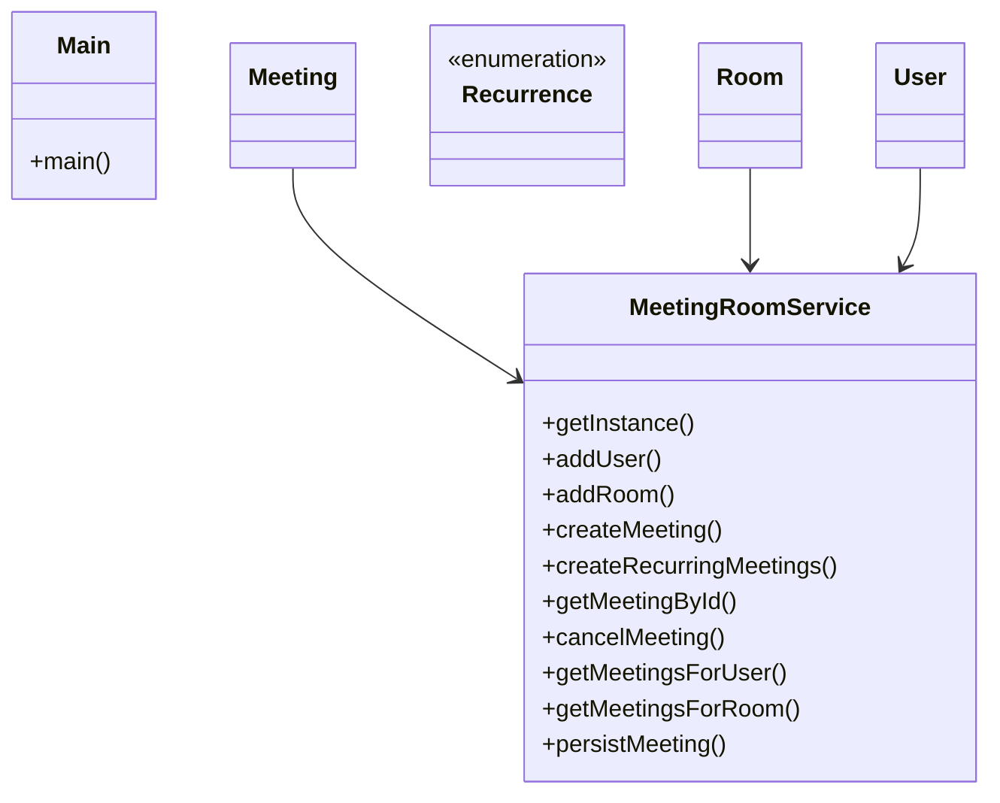

# Low-Level Design: Meeting Scheduler

**Difficulty:** Medium ⚡  
**Interview duration:** 45–60 min  
**Code status:** ✅ Reference Java included (§3)  
**Companion code:** `LLD/MeetingScheduler`  

---

## How to present in an interview

Present in this order — interviewers expect **flow first**, then **model**, then **code**:

1. **Core flow** — main use cases as numbered steps (happy path + key branches).
2. **Entities & relationships** — nouns and verbs from the flow; who owns whom.
3. **Reference implementation** — classes that map 1:1 to the model (only after flow is agreed).

Do not open with a class diagram or code dumps before the flow is clear.

---

## 1. Core flow

### 1.1 Schedule meeting

1. Organizer defines **meeting** (time range, recurrence, participants).
2. System checks **room** and attendee **calendars** for conflicts.
3. On success, room booked and meeting marked active.
4. Cancel/reschedule frees the room slot.

---

## 2. Entities & relationships

_Deduced from the flows above — each entity should appear in at least one step._

| Entity | Responsibility | Key fields / collaborators |
|--------|----------------|----------------------------|
| **User** | Participant | name, meetings list |
| **Meeting** | Event | start, end, recurrence, participants, room |
| **Room** | Resource | capacity, bookings |
| **Recurrence** | Repeat rule | NONE, DAILY, WEEKLY, … |
| **MeetingRoomService** | Singleton scheduler | create, conflict check, cancel |

### Relationships

- Meeting **1—1** Room; Meeting ***—*** User participants
- MeetingRoomService owns conflict detection across rooms/users

### Class diagram



---

## 3. Reference implementation (Java)

Reference implementation from **`LLD/MeetingScheduler/`** (all sources in this file).

Classes in **logical order**: enums → interfaces → domain → strategies → services → `Main`.

**Run:**
```bash
cd LLD/MeetingScheduler
javac src/*.java
java -cp src Main
```

### `Recurrence.java`

```java
public enum Recurrence {
    DAILY,
    WEEKLY,
    MONTHLY
}
```

### `Meeting.java`

```java
import java.time.LocalDateTime;
import java.util.List;
import java.util.UUID;

public class Meeting {
    String meetingId;
    Recurrence recurrence;
    LocalDateTime startTime;
    LocalDateTime endTime;
    Room room;
    User organizedBy;
    List<User> participants;
    boolean isActive;

    public Meeting(Recurrence recurrence, LocalDateTime startTime, LocalDateTime endTime, Room room, User organizedBy, List<User> participants) {
        this.recurrence = recurrence;
        this.startTime = startTime;
        this.endTime = endTime;
        this.room = room;
        this.organizedBy = organizedBy;
        this.participants = participants;
        this.isActive = true;
        this.meetingId = UUID.randomUUID().toString();
    }
}
```

### `Room.java`

```java
import java.util.ArrayList;
import java.util.List;
import java.util.UUID;

public class Room {
    String roomId;
    String roomName;
    int capacity;
    List<Meeting> calendar;

    public Room(String roomName, int capacity) {
        this.roomName = roomName;
        this.capacity = capacity;
        this.roomId = UUID.randomUUID().toString();
        this.calendar = new ArrayList<>();
    }
}
```

### `User.java`

```java
import java.util.ArrayList;
import java.util.List;
import java.util.UUID;

public class User {
    String userId;
    String userName;
    List<Meeting> calendar;

    public User(String userName) {
        this.userName = userName;
        this.calendar = new ArrayList<>();
        this.userId = UUID.randomUUID().toString();
    }
}
```

### `MeetingRoomService.java`

```java
import java.time.LocalDateTime;
import java.util.ArrayList;
import java.util.HashMap;
import java.util.List;
import java.util.Map;

public class MeetingRoomService {

    private static final MeetingRoomService INSTANCE = new MeetingRoomService();

    private final Map<String, User> userMap;
    private final Map<String, Room> roomMap;
    private final Map<String, Meeting> meetingMap;

    private MeetingRoomService() {
        userMap = new HashMap<>();
        roomMap = new HashMap<>();
        meetingMap = new HashMap<>();
    }

    public static MeetingRoomService getInstance() {
        return INSTANCE;
    }

    public void addUser(User user) {
        if (user == null) {
            throw new IllegalArgumentException("User cannot be null");
        }
        userMap.put(user.userId, user);
    }

    public void addRoom(Room room) {
        if (room == null) {
            throw new IllegalArgumentException("Room cannot be null");
        }
        if (room.calendar == null) {
            room.calendar = new ArrayList<>();
        }
        roomMap.put(room.roomId, room);
    }

    public Meeting createMeeting(
            Recurrence recurrence,
            LocalDateTime startTime,
            LocalDateTime endTime,
            User organizedBy,
            List<User> participants,
            Room room
    ) {
        validateInputs(startTime, endTime, organizedBy, room);
        List<User> attendees = buildAttendeeList(organizedBy, participants);
        validateCapacity(attendees, room);
        validateSingleSlotAvailability(startTime, endTime, attendees, room);

        Meeting meeting = new Meeting(recurrence, startTime, endTime, room, organizedBy, attendees);
        persistMeeting(meeting, attendees, room);
        return meeting;
    }

    public List<Meeting> createRecurringMeetings(
            Recurrence recurrence,
            int occurrences,
            LocalDateTime startTime,
            LocalDateTime endTime,
            User organizedBy,
            List<User> participants,
            Room room
    ) {
        if (recurrence == null) {
            throw new IllegalArgumentException("Recurrence is required for recurring meetings");
        }
        if (occurrences <= 0) {
            throw new IllegalArgumentException("Occurrences must be > 0");
        }

        validateInputs(startTime, endTime, organizedBy, room);
        List<User> attendees = buildAttendeeList(organizedBy, participants);
        validateCapacity(attendees, room);

        List<LocalDateTime[]> slots = new ArrayList<>();
        LocalDateTime currentStart = startTime;
        LocalDateTime currentEnd = endTime;

        for (int i = 0; i < occurrences; i++) {
            slots.add(new LocalDateTime[]{currentStart, currentEnd});
            currentStart = moveForward(currentStart, recurrence);
            currentEnd = moveForward(currentEnd, recurrence);
        }

        validateSeriesAvailability(slots, attendees, room);

        List<Meeting> created = new ArrayList<>();
        for (LocalDateTime[] slot : slots) {
            Meeting meeting = new Meeting(recurrence, slot[0], slot[1], room, organizedBy, attendees);
            persistMeeting(meeting, attendees, room);
            created.add(meeting);
        }
        return created;
    }

    public Meeting getMeetingById(String meetingId) {
        if (meetingId == null || meetingId.isEmpty()) {
            return null;
        }
        return meetingMap.get(meetingId);
    }

    public boolean cancelMeeting(String meetingId) {
        Meeting meeting = getMeetingById(meetingId);
        if (meeting == null || !meeting.isActive) {
            return false;
        }
        meeting.isActive = false;
        return true;
    }

    public List<Meeting> getMeetingsForUser(User user) {
        List<Meeting> result = new ArrayList<>();
        if (user == null) {
            return result;
        }
        for (Meeting meeting : user.calendar) {
            if (meeting.isActive) {
                result.add(meeting);
            }
        }
        return result;
    }

    public List<Meeting> getMeetingsForRoom(Room room) {
        List<Meeting> result = new ArrayList<>();
        if (room == null || room.calendar == null) {
            return result;
        }
        for (Meeting meeting : room.calendar) {
            if (meeting.isActive) {
                result.add(meeting);
            }
        }
        return result;
    }

    private void persistMeeting(Meeting meeting, List<User> attendees, Room room) {
        meetingMap.put(meeting.meetingId, meeting);
        for (User user : attendees) {
            user.calendar.add(meeting);
        }
        room.calendar.add(meeting);
    }

    private void validateInputs(
            LocalDateTime startTime,
            LocalDateTime endTime,
            User organizedBy,
            Room room
    ) {
        if (startTime == null || endTime == null) {
            throw new IllegalArgumentException("Start time and end time are required");
        }
        if (!startTime.isBefore(endTime)) {
            throw new IllegalArgumentException("Start time must be before end time");
        }
        if (organizedBy == null) {
            throw new IllegalArgumentException("Organizer is required");
        }
        if (room == null) {
            throw new IllegalArgumentException("Room is required");
        }
        if (!roomMap.containsKey(room.roomId)) {
            throw new IllegalArgumentException("Room is not registered: " + room.roomId);
        }
        if (!userMap.containsKey(organizedBy.userId)) {
            throw new IllegalArgumentException("Organizer is not registered: " + organizedBy.userId);
        }
    }

    private List<User> buildAttendeeList(User organizedBy, List<User> participants) {
        Map<String, User> uniqueUsers = new HashMap<>();
        uniqueUsers.put(organizedBy.userId, organizedBy);

        if (participants != null) {
            for (User participant : participants) {
                if (participant == null) {
                    continue;
                }
                if (!userMap.containsKey(participant.userId)) {
                    throw new IllegalArgumentException("Participant is not registered: " + participant.userId);
                }
                uniqueUsers.put(participant.userId, participant);
            }
        }

        return new ArrayList<>(uniqueUsers.values());
    }

    private void validateCapacity(List<User> attendees, Room room) {
        if (attendees.size() > room.capacity) {
            throw new IllegalStateException("Room capacity exceeded for room: " + room.roomName);
        }
    }

    private void validateSingleSlotAvailability(
            LocalDateTime startTime,
            LocalDateTime endTime,
            List<User> attendees,
            Room room
    ) {
        checkAllParticipantsAvailability(startTime, endTime, attendees);
        checkRoomAvailability(startTime, endTime, room);
    }

    private void validateSeriesAvailability(
            List<LocalDateTime[]> slots,
            List<User> attendees,
            Room room
    ) {
        for (int i = 0; i < slots.size(); i++) {
            LocalDateTime[] slot = slots.get(i);
            validateSingleSlotAvailability(slot[0], slot[1], attendees, room);

            for (int j = 0; j < i; j++) {
                LocalDateTime[] previous = slots.get(j);
                if (isOverlapping(slot[0], slot[1], previous[0], previous[1])) {
                    throw new IllegalStateException("Recurring series has overlapping occurrences");
                }
            }
        }
    }

    private void checkAllParticipantsAvailability(
            LocalDateTime startTime,
            LocalDateTime endTime,
            List<User> participants
    ) {
        for (User participant : participants) {
            for (Meeting existingMeeting : participant.calendar) {
                if (existingMeeting.isActive &&
                        isOverlapping(startTime, endTime, existingMeeting.startTime, existingMeeting.endTime)) {
                    throw new IllegalStateException(
                            "Participant unavailable: " + participant.userName + " for the requested slot"
                    );
                }
            }
        }
    }

    private void checkRoomAvailability(LocalDateTime startTime, LocalDateTime endTime, Room room) {
        if (room.calendar == null) {
            return;
        }
        for (Meeting existingMeeting : room.calendar) {
            if (existingMeeting.isActive &&
                    isOverlapping(startTime, endTime, existingMeeting.startTime, existingMeeting.endTime)) {
                throw new IllegalStateException(
                        "Room unavailable: " + room.roomName + " for the requested slot"
                );
            }
        }
    }

    private boolean isOverlapping(
            LocalDateTime start1,
            LocalDateTime end1,
            LocalDateTime start2,
            LocalDateTime end2
    ) {
        return start1.isBefore(end2) && start2.isBefore(end1);
    }

    private LocalDateTime moveForward(LocalDateTime time, Recurrence recurrence) {
        switch (recurrence) {
            case DAILY:
                return time.plusDays(1);
            case WEEKLY:
                return time.plusWeeks(1);
            case MONTHLY:
                return time.plusMonths(1);
            default:
                throw new IllegalArgumentException("Unsupported recurrence: " + recurrence);
        }
    }
}
```

### `Main.java`

```java
import java.time.LocalDateTime;
import java.util.Arrays;
import java.util.List;

public class Main {

    public static void main(String[] args) {
        MeetingRoomService service = MeetingRoomService.getInstance();

        User aman = new User("Aman");
        User raj = new User("Raj");
        User neha = new User("Neha");

        service.addUser(aman);
        service.addUser(raj);
        service.addUser(neha);

        Room atlas = new Room("Atlas", 4);
        service.addRoom(atlas);

        LocalDateTime start = LocalDateTime.of(2026, 5, 10, 10, 0);
        LocalDateTime end = LocalDateTime.of(2026, 5, 10, 11, 0);

        Meeting m1 = service.createMeeting(
                Recurrence.DAILY,
                start,
                end,
                aman,
                Arrays.asList(raj, neha),
                atlas
        );
        System.out.println("Created meeting: " + m1.meetingId);

        try {
            service.createMeeting(
                    Recurrence.DAILY,
                    LocalDateTime.of(2026, 5, 10, 10, 30),
                    LocalDateTime.of(2026, 5, 10, 11, 30),
                    aman,
                    List.of(raj),
                    atlas
            );
        } catch (Exception ex) {
            System.out.println("Expected conflict: " + ex.getMessage());
        }

        boolean cancelled = service.cancelMeeting(m1.meetingId);
        System.out.println("Cancelled first meeting: " + cancelled);

        Meeting m2 = service.createMeeting(
                Recurrence.DAILY,
                LocalDateTime.of(2026, 5, 10, 10, 30),
                LocalDateTime.of(2026, 5, 10, 11, 30),
                aman,
                List.of(raj),
                atlas
        );
        System.out.println("Created after cancellation: " + m2.meetingId);

        List<Meeting> weeklySeries = service.createRecurringMeetings(
                Recurrence.WEEKLY,
                3,
                LocalDateTime.of(2026, 5, 11, 12, 0),
                LocalDateTime.of(2026, 5, 11, 13, 0),
                neha,
                List.of(aman),
                atlas
        );

        System.out.println("Created recurring meetings count: " + weeklySeries.size());
        System.out.println("Aman active meetings: " + service.getMeetingsForUser(aman).size());
        System.out.println("Atlas active meetings: " + service.getMeetingsForRoom(atlas).size());
    }
}
```

