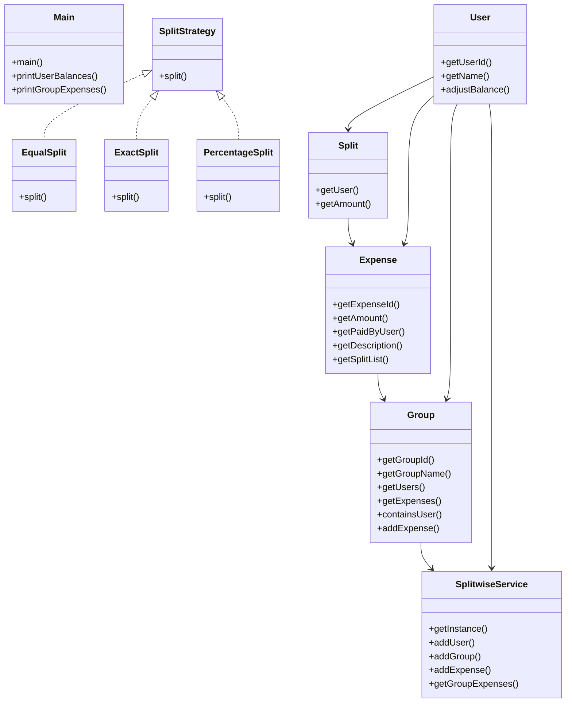

# Low-Level Design: Splitwise

**Difficulty:** Medium ⚡  
**Interview duration:** 45–60 min  
**Code status:** ✅ Reference Java included (§3)  
**Companion code:** `LLD/Splitwise`  

---

## How to present in an interview

Present in this order — interviewers expect **flow first**, then **model**, then **code**:

1. **Core flow** — main use cases as numbered steps (happy path + key branches).
2. **Entities & relationships** — nouns and verbs from the flow; who owns whom.
3. **Reference implementation** — classes that map 1:1 to the model (only after flow is agreed).

Do not open with a class diagram or code dumps before the flow is clear.

---

## 1. Core flow

### 1.1 Split expense

1. User creates **group** with members.
2. User adds **expense** with amount and **split strategy** (equal / exact / %).
3. **SplitwiseService** updates pairwise balances / settlements.

---

## 2. Entities & relationships

_Deduced from the flows above — each entity should appear in at least one step._

| Entity | Responsibility | Key fields / collaborators |
|--------|----------------|----------------------------|
| **User** | Member | name, email, balance map |
| **Group** | Expense pool | members |
| **Expense** | Spend event | amount, paidBy, splits |
| **Split** | Per-user share | user, amount |
| **SplitStrategy** | Algorithm | Equal, Exact, Percentage |
| **SplitwiseService** | Ledger | add expense, show balances |

### Relationships

- Group **1—*** User; Expense **1—*** Split
- Expense delegates split computation to SplitStrategy

### Class diagram



---

## 3. Reference implementation (Java)

Reference implementation from **`LLD/Splitwise/`** (all sources in this file).

Classes in **logical order**: enums → interfaces → domain → strategies → services → `Main`.

**Run:**
```bash
cd LLD/Splitwise
javac src/*.java
java -cp src Main
```

### `SplitStrategy.java`

```java
import java.util.List;

public interface SplitStrategy {
    List<Split> split(int amount, List<User> users, List<Integer> customAmount);
}
```

### `Expense.java`

```java
import java.util.ArrayList;
import java.util.Collections;
import java.util.List;
import java.util.UUID;

public class Expense {
    private final String expenseId;
    private final int amount;
    private final User paidByUser;
    private final String description;
    private final List<Split> splitList;

    public Expense(int amount, User paidByUser, String description, List<Split> splitList) {
        if (amount <= 0) {
            throw new IllegalArgumentException("Expense amount must be > 0.");
        }
        if (paidByUser == null) {
            throw new IllegalArgumentException("paidByUser cannot be null.");
        }
        if (splitList == null || splitList.isEmpty()) {
            throw new IllegalArgumentException("splitList cannot be empty.");
        }

        this.expenseId = UUID.randomUUID().toString();
        this.amount = amount;
        this.paidByUser = paidByUser;
        this.description = (description == null) ? "" : description;
        this.splitList = new ArrayList<>(splitList);
    }

    public String getExpenseId() {
        return expenseId;
    }

    public int getAmount() {
        return amount;
    }

    public User getPaidByUser() {
        return paidByUser;
    }

    public String getDescription() {
        return description;
    }

    public List<Split> getSplitList() {
        return Collections.unmodifiableList(splitList);
    }
}
```

### `Group.java`

```java
import java.util.ArrayList;
import java.util.Collections;
import java.util.List;
import java.util.UUID;

public class Group {
    private final String groupId;
    private final String groupName;
    private final List<User> users;
    private final List<Expense> expenses;

    public Group(String groupName, List<User> users) {
        if (groupName == null || groupName.trim().isEmpty()) {
            throw new IllegalArgumentException("groupName cannot be empty.");
        }
        if (users == null || users.isEmpty()) {
            throw new IllegalArgumentException("Group must have at least one user.");
        }

        this.groupId = UUID.randomUUID().toString();
        this.groupName = groupName;
        this.users = new ArrayList<>(users);
        this.expenses = new ArrayList<>();

        for (User user : this.users) {
            if (user == null) {
                throw new IllegalArgumentException("Group contains null user.");
            }
        }
    }

    public String getGroupId() {
        return groupId;
    }

    public String getGroupName() {
        return groupName;
    }

    public List<User> getUsers() {
        return Collections.unmodifiableList(users);
    }

    public List<Expense> getExpenses() {
        return Collections.unmodifiableList(expenses);
    }

    public boolean containsUser(String userId) {
        if (userId == null || userId.trim().isEmpty()) {
            return false;
        }
        for (User user : users) {
            if (userId.equals(user.getUserId())) {
                return true;
            }
        }
        return false;
    }

    public void addExpense(Expense expense) {
        if (expense == null) {
            throw new IllegalArgumentException("expense cannot be null.");
        }
        expenses.add(expense);
    }
}
```

### `EqualSplit.java`

```java
import java.util.ArrayList;
import java.util.List;

public class EqualSplit implements SplitStrategy {
    @Override
    public List<Split> split(int amount, List<User> users, List<Integer> customAmount) {
        if (amount <= 0) {
            throw new IllegalArgumentException("Amount must be > 0.");
        }
        if (users == null || users.isEmpty()) {
            throw new IllegalArgumentException("Users list cannot be empty.");
        }

        int n = users.size();
        int base = amount / n;
        int remainder = amount % n;

        List<Split> splits = new ArrayList<>();
        for (int i = 0; i < n; i++) {
            int share = base + (i < remainder ? 1 : 0);
            splits.add(new Split(users.get(i), share));
        }
        return splits;
    }
}
```

### `ExactSplit.java`

```java
import java.util.ArrayList;
import java.util.List;

public class ExactSplit implements SplitStrategy {
    @Override
    public List<Split> split(int amount, List<User> users, List<Integer> customAmount) {
        if (amount <= 0) {
            throw new IllegalArgumentException("Amount must be > 0.");
        }
        if (users == null || users.isEmpty()) {
            throw new IllegalArgumentException("Users list cannot be empty.");
        }
        if (customAmount == null || users.size() != customAmount.size()) {
            throw new IllegalArgumentException("customAmount size must match users size.");
        }

        int total = 0;
        List<Split> splits = new ArrayList<>();
        for (int i = 0; i < users.size(); i++) {
            int share = customAmount.get(i);
            if (share < 0) {
                throw new IllegalArgumentException("Split amount cannot be negative.");
            }
            total += share;
            splits.add(new Split(users.get(i), share));
        }

        if (total != amount) {
            throw new IllegalArgumentException("Exact split total must equal expense amount.");
        }

        return splits;
    }
}
```

### `PercentageSplit.java`

```java
import java.util.ArrayList;
import java.util.List;

public class PercentageSplit implements SplitStrategy {
    @Override
    public List<Split> split(int amount, List<User> users, List<Integer> percentages) {
        if (amount <= 0) {
            throw new IllegalArgumentException("Amount must be > 0.");
        }
        if (users == null || users.isEmpty()) {
            throw new IllegalArgumentException("Users list cannot be empty.");
        }
        if (percentages == null || users.size() != percentages.size()) {
            throw new IllegalArgumentException("Percentages size must match users size.");
        }

        int percentSum = 0;
        for (Integer p : percentages) {
            if (p == null || p < 0) {
                throw new IllegalArgumentException("Percentage must be non-negative.");
            }
            percentSum += p;
        }
        if (percentSum != 100) {
            throw new IllegalArgumentException("Total percentage must be 100.");
        }

        List<Split> splits = new ArrayList<>();
        int assigned = 0;
        for (int i = 0; i < users.size(); i++) {
            int share;
            if (i == users.size() - 1) {
                share = amount - assigned;
            } else {
                share = (amount * percentages.get(i)) / 100;
                assigned += share;
            }
            splits.add(new Split(users.get(i), share));
        }
        return splits;
    }
}
```

### `Split.java`

```java
public class Split {
    private final User user;
    private final int amount;

    public Split(User user, int amount) {
        if (user == null) {
            throw new IllegalArgumentException("User cannot be null.");
        }
        if (amount < 0) {
            throw new IllegalArgumentException("Split amount cannot be negative.");
        }
        this.user = user;
        this.amount = amount;
    }

    public User getUser() {
        return user;
    }

    public int getAmount() {
        return amount;
    }
}
```

### `User.java`

```java
import java.util.Collections;
import java.util.HashMap;
import java.util.Map;
import java.util.UUID;

public class User {
    private final String userId;
    private final String name;
    private final Map<String, Integer> balances;

    public User(String name) {
        if (name == null || name.trim().isEmpty()) {
            throw new IllegalArgumentException("User name cannot be empty.");
        }
        this.name = name;
        this.userId = UUID.randomUUID().toString();
        this.balances = new HashMap<>();
    }

    public String getUserId() {
        return userId;
    }

    public String getName() {
        return name;
    }

    public Map<String, Integer> getBalances() {
        return Collections.unmodifiableMap(balances);
    }

    public void adjustBalance(String otherUserId, int delta) {
        if (otherUserId == null || otherUserId.trim().isEmpty()) {
            throw new IllegalArgumentException("otherUserId cannot be empty.");
        }
        if (delta == 0) {
            return;
        }

        int updated = balances.getOrDefault(otherUserId, 0) + delta;
        if (updated == 0) {
            balances.remove(otherUserId);
        } else {
            balances.put(otherUserId, updated);
        }
    }
}
```

### `SplitwiseService.java`

```java
import java.util.ArrayList;
import java.util.HashMap;
import java.util.List;
import java.util.Map;

public class SplitwiseService {
    private static final SplitwiseService INSTANCE = new SplitwiseService();

    private final Map<String, User> userMap;
    private final Map<String, Group> groupMap;

    private SplitwiseService() {
        this.userMap = new HashMap<>();
        this.groupMap = new HashMap<>();
    }

    public static SplitwiseService getInstance() {
        return INSTANCE;
    }

    public void addUser(User user) {
        if (user == null) {
            throw new IllegalArgumentException("user cannot be null.");
        }
        userMap.put(user.getUserId(), user);
    }

    public void addGroup(Group group) {
        if (group == null) {
            throw new IllegalArgumentException("group cannot be null.");
        }

        for (User user : group.getUsers()) {
            if (!userMap.containsKey(user.getUserId())) {
                throw new IllegalArgumentException("All group users must be registered first.");
            }
        }

        groupMap.put(group.getGroupId(), group);
    }

    public Expense addExpense(
            String groupId,
            int amount,
            User paidByUser,
            List<User> participants,
            SplitStrategy splitStrategy,
            List<Integer> customValues,
            String description
    ) {
        if (groupId == null || groupId.trim().isEmpty()) {
            throw new IllegalArgumentException("groupId cannot be empty.");
        }
        if (amount <= 0) {
            throw new IllegalArgumentException("amount must be > 0.");
        }
        if (paidByUser == null) {
            throw new IllegalArgumentException("paidByUser cannot be null.");
        }
        if (participants == null || participants.isEmpty()) {
            throw new IllegalArgumentException("participants cannot be empty.");
        }
        if (splitStrategy == null) {
            throw new IllegalArgumentException("splitStrategy cannot be null.");
        }

        Group group = groupMap.get(groupId);
        if (group == null) {
            throw new IllegalArgumentException("Group not found: " + groupId);
        }

        if (!group.containsUser(paidByUser.getUserId())) {
            throw new IllegalArgumentException("Payer must be a member of the group.");
        }

        // Ensure every participant belongs to the target group.
        for (User user : participants) {
            if (user == null || !group.containsUser(user.getUserId())) {
                throw new IllegalArgumentException("All participants must be members of the group.");
            }
        }

        // 1) Compute per-user split using the selected strategy (equal/exact/percentage).
        List<Split> splitList = splitStrategy.split(amount, participants, customValues);

        // 2) Defensive check: total of all split shares must match expense amount exactly.
        int splitTotal = 0;
        for (Split split : splitList) {
            splitTotal += split.getAmount();
        }
        if (splitTotal != amount) {
            throw new IllegalArgumentException("Split total must equal expense amount.");
        }

        // 3) Persist the expense in group history before balance updates.
        Expense expense = new Expense(amount, paidByUser, description, splitList);
        group.addExpense(expense);

        // 4) Update bilateral balances:
        //    - payer gets +share against each participant
        //    - participant gets -share against payer
        //    Skip payer's own split entry.
        for (Split split : splitList) {
            User participant = split.getUser();
            int share = split.getAmount();

            if (participant.getUserId().equals(paidByUser.getUserId())) {
                continue;
            }

            paidByUser.adjustBalance(participant.getUserId(), share);
            participant.adjustBalance(paidByUser.getUserId(), -share);
        }

        return expense;
    }


    public Map<String, Integer> getBalances(String userId) {
        User user = userMap.get(userId);
        if (user == null) {
            throw new IllegalArgumentException("User not found: " + userId);
        }
        return user.getBalances();
    }

    public List<Expense> getGroupExpenses(String groupId) {
        Group group = groupMap.get(groupId);
        if (group == null) {
            throw new IllegalArgumentException("Group not found: " + groupId);
        }
        return new ArrayList<>(group.getExpenses());
    }
}
```

### `Main.java`

```java
import java.util.Arrays;
import java.util.List;
import java.util.Map;

public class Main {
    public static void main(String[] args) {
        SplitwiseService service = SplitwiseService.getInstance();

        User aman = new User("Aman");
        User raj = new User("Raj");
        User simran = new User("Simran");

        service.addUser(aman);
        service.addUser(raj);
        service.addUser(simran);

        Group trip = new Group("Goa Trip", Arrays.asList(aman, raj, simran));
        service.addGroup(trip);

        List<User> participants = Arrays.asList(aman, raj, simran);

        service.addExpense(
                trip.getGroupId(),
                1200,
                aman,
                participants,
                new EqualSplit(),
                null,
                "Dinner"
        );

        service.addExpense(
                trip.getGroupId(),
                1000,
                raj,
                participants,
                new ExactSplit(),
                Arrays.asList(400, 300, 300),
                "Taxi"
        );

        printUserBalances(aman);
        printUserBalances(raj);
        printUserBalances(simran);
        printGroupExpenses(trip);

    }

    private static void printUserBalances(User user) {
        System.out.println("Balances for " + user.getName() + ":");
        for (Map.Entry<String, Integer> entry : user.getBalances().entrySet()) {
            System.out.println("  with userId=" + entry.getKey() + " : " + entry.getValue());
        }
        System.out.println();
    }

    private static void printGroupExpenses(Group group) {
        System.out.println("Expenses for group: " + group.getGroupName());
        for (Expense expense : group.getExpenses()) {
            System.out.println("  " + expense.getDescription()
                    + " | amount=" + expense.getAmount()
                    + " | paidBy=" + expense.getPaidByUser().getName());

            for (Split split : expense.getSplitList()) {
                System.out.println("    " + split.getUser().getName() + " -> " + split.getAmount());
            }
        }
        System.out.println();
    }

}
```

