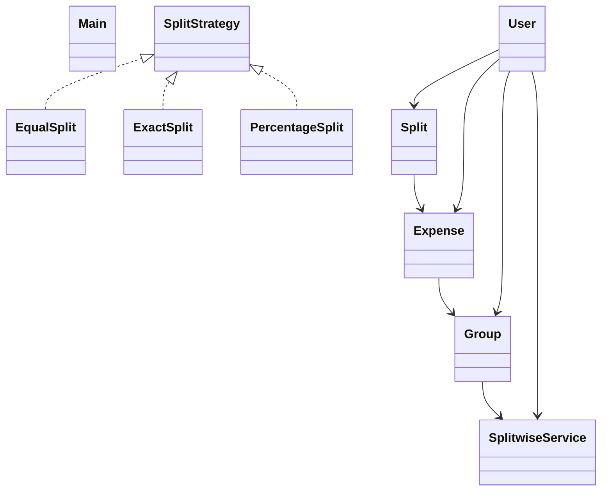

# Low-Level Design: Splitwise

**Difficulty:** Medium ⚡  
**Interview duration:** 45–60 min  
**Code status:** ✅ Reference Java included (§3)  
**Companion code:** `LLD/Splitwise`  

---

## How to present in an interview

Present in this order — interviewers expect **flow first**, then **model**, then **code**:

1. **Core flow** — main use cases as numbered steps (happy path + key branches).
2. **Entities & relationships** — nouns and verbs from the flow; who owns whom.
3. **Reference implementation** — classes that map 1:1 to the model (only after flow is agreed).

Do not open with a class diagram or code dumps before the flow is clear.

---

## 1. Core flow

### 1.1 Split expense

1. User creates **group** with members.
2. User adds **expense** with amount and **split strategy** (equal / exact / %).
3. **SplitwiseService** updates pairwise balances / settlements.

---

## 2. Entities & relationships

_Deduced from the flows above — each entity should appear in at least one step._

| Entity | Responsibility | Key fields / collaborators |
|--------|----------------|----------------------------|
| **User** | Member | name, email, balance map |
| **Group** | Expense pool | members |
| **Expense** | Spend event | amount, paidBy, splits |
| **Split** | Per-user share | user, amount |
| **SplitStrategy** | Algorithm | Equal, Exact, Percentage |
| **SplitwiseService** | Ledger | add expense, show balances |

### Relationships

- Group **1—*** User; Expense **1—*** Split
- Expense delegates split computation to SplitStrategy

### Class diagram



---

## 3. Reference implementation (Java)

Companion project: **`LLD/Splitwise/`**. Copies below for browsing on GitHub (logical order, not A–Z).

**Run locally:**
```bash
cd LLD/Splitwise
javac src/*.java
java -cp src Main
```

| # | Source |
|---|--------|
| 1 | [`SplitStrategy.java`](code/08_splitwise_lld/SplitStrategy.java) |
| 2 | [`Expense.java`](code/08_splitwise_lld/Expense.java) |
| 3 | [`Group.java`](code/08_splitwise_lld/Group.java) |
| 4 | [`EqualSplit.java`](code/08_splitwise_lld/EqualSplit.java) |
| 5 | [`ExactSplit.java`](code/08_splitwise_lld/ExactSplit.java) |
| 6 | [`PercentageSplit.java`](code/08_splitwise_lld/PercentageSplit.java) |
| 7 | [`Split.java`](code/08_splitwise_lld/Split.java) |
| 8 | [`User.java`](code/08_splitwise_lld/User.java) |
| 9 | [`SplitwiseService.java`](code/08_splitwise_lld/SplitwiseService.java) |
| 10 | [`Main.java`](code/08_splitwise_lld/Main.java) |

